# Getting started with F5 BIG-IP Virtual Edition on AWS

## Tasks Included

In this hands-on lab you will perform the following tasks:

- **Task 1: Getting started with the AWS Console**
- **Task 2: Accessing the F5 Dashboard**
- **Task 3: Configuring F5 Advanced Web Application firewall**

## F5 BIG-IP Virtual Edition

The BIG-IP Virtual Edition (VE) is the industry’s most trusted and comprehensive app delivery and security solution. Providing everything from intelligent traffic management and visibility, to app security, access, and optimization, BIG-IP VE ensures your apps are fast, available, and secure wherever they are deployed.
BIG-IP Virtual Edition includes:
Local Traffic Manager (LTM)
Access Policy Manager (APM)
Advanced WAF
Network Firewall (AFM)

F5 Advanced WAF is an application-layer security platform protecting against application attacks. The industry-leading F5 Advanced WAF provides robust web application firewall protection by securing applications against threats including layer 7 DDoS attacks, malicious bot traffic, all OWASP top 10 threats, and API protocol vulnerabilities. The F5 Advanced WAF leverages behavioral analytics, automated learning capabilities, and risk-based policies to secure your website, mobile apps, and APIs—whether in a native or hybrid Azure environment

## Architecture Diagram
   
   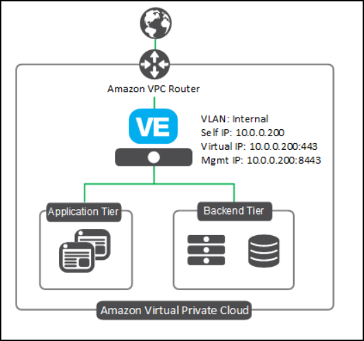

# 01: Getting started with the AWS console

## Overview

In this task, you will deploy F5 BIG-IP Virtual Edition and a web server. 

## Task 1: Getting started with the AWS

1. In a browser, open a new tab and sign in to the **AWS Console** using the sign-in link provided in the **Environment details** tab 
   
  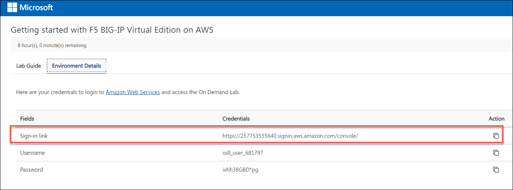

1. On the **Sign in as IAM User** blade, you will see a Sign-in screen,  enter the following email/username and then click on **Sign in**.  

   * **Azure Username/Email**:  <inject key="AzureAdUserEmail"></inject> 
   * **Azure Password**:  <inject key="AzureAdUserPassword"></inject>

   **Note**: Refer to the **Environment Details** tab for any other lab credentials/details.
        
   

1. Now you will be able to view the home page of the AWS console
   
    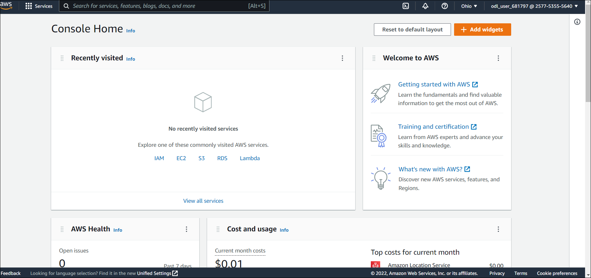

1. Ensure to switch to the **Ohio** region at the top right corner.
   
    

1. Search for **key pairs** and select **Key Pairs** from the EC2 feature

    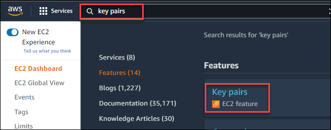
 
1. On the **Create key pair** blade provide the name as **F5-Server-test** and click on **Create key pair**

   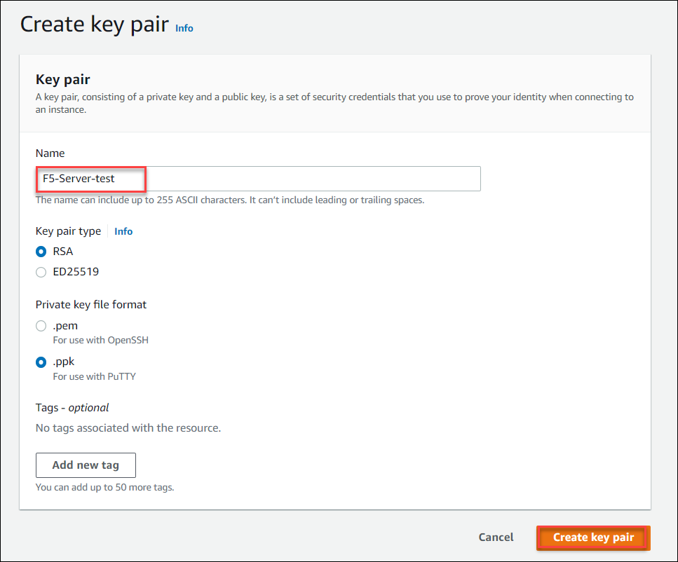
    
1. After the keypair is created successfully, it will be downloaded to your machine. Ensure to save it safely as it will be used in further steps

1. Navigate to https://aws.amazon.com/marketplace/ and search for **F5 BIG-IP Virtual Edition - GOOD (PAYG, 25Mbps)**

1. Select the Marketplace image and click on **Continue to subscribe**
   
   
    
1. Under the **Subscribe to this software** section click on **Accept Terms** and accept the terms and conditions
   
   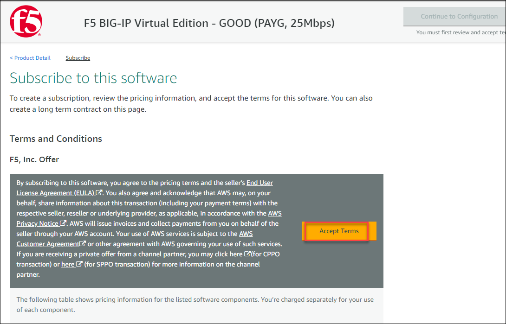
   
1. Now search for **Cloud Formation** and select **stacks**

     

1. Select **Create stack**

   
      
1. On the **Create stack** blade, provide the **Amazon S3 URL** as https://bigipf5good.s3.amazonaws.com/Testing-BigIP.yml and click on **Next**

   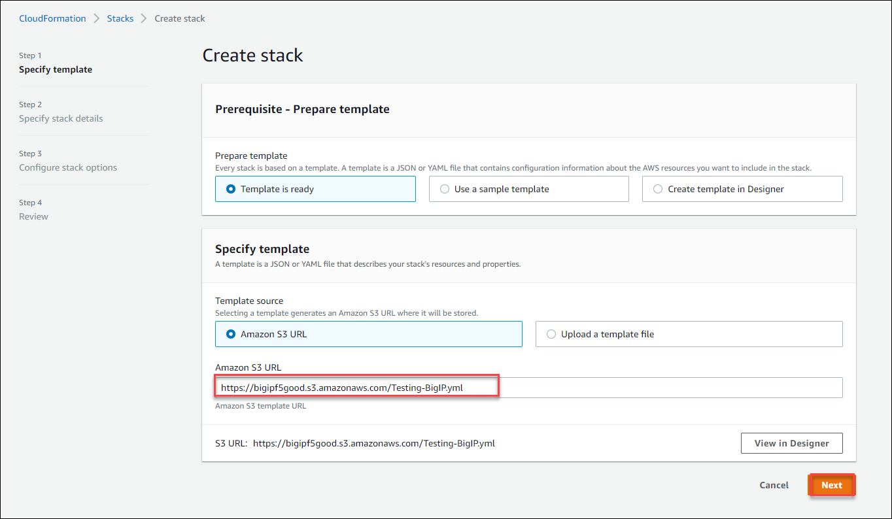
      
1. In the **Specify stack details** section enter the stack name as **f5deployment** and leave other parameters as default
   
   

1. In the **Network Configuration** section, select the option as follows: 
   - Select the existing **VPC ID** 
   - Select the existing subnets for BIGIP external interface Subnet ID, BIGIP internal interface Subnet ID, and BIGIP management interface Subnet ID

   
 
1. Leave the other configurations to be set to default values and click on **Next**

1. Click on **Next** again

1. On the review stack page, scroll down to the bottom and check the two options and click on **Create stack**
   
   

1. Wait for 3 minutes for the deployment to be completed.

1. Now on the **Stacks** page ensure the status shows as **CREATE_COMPLETE** for all the stacks.
   

1. You can also view the stack progress of the main deployment only by turning the toggle off of the **view nested** option
   
  
1. Search for **EC2** and select **Instances** to view the deployed F5 instance and web server instance
   
   

1. On the instances page, click on each instance and review the configurations.
   
   

1. Click on the Web server instance, from the **Security** tab select the security group 
 
   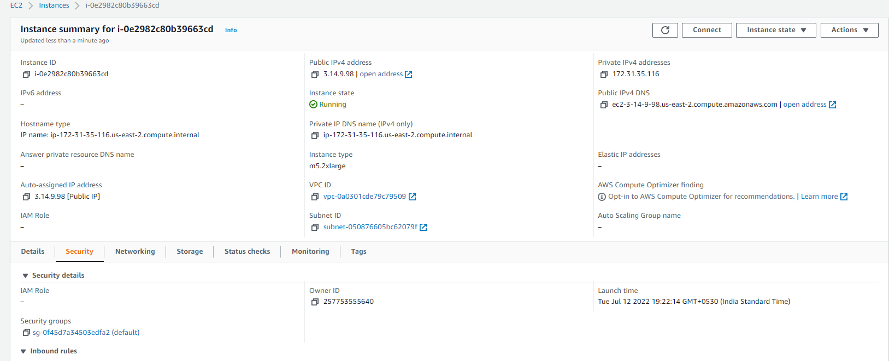

1. Now from the security group page select **Edit inbound rules** 
   
   

1. Click on **add rule** and add the port 80 

   

1. Click on **Save rules**

1. Click on the F5 instance scroll down to the bottom and select the security group 
   
   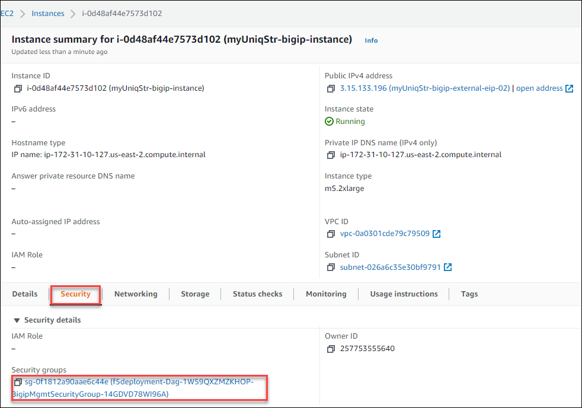

1. Now from the security group page select **Edit inbound rules** 

1. Click on **add rule** and add the ports 8443 and 443 if it's not been added already

1. Click **Save rules** 

## Overview 

In this task, you will access the F5 Big IP dashboard by using the Public Ip address.

## Task 2: Accessing the F5 Dashboard

1. Open **Putty** from your machine
   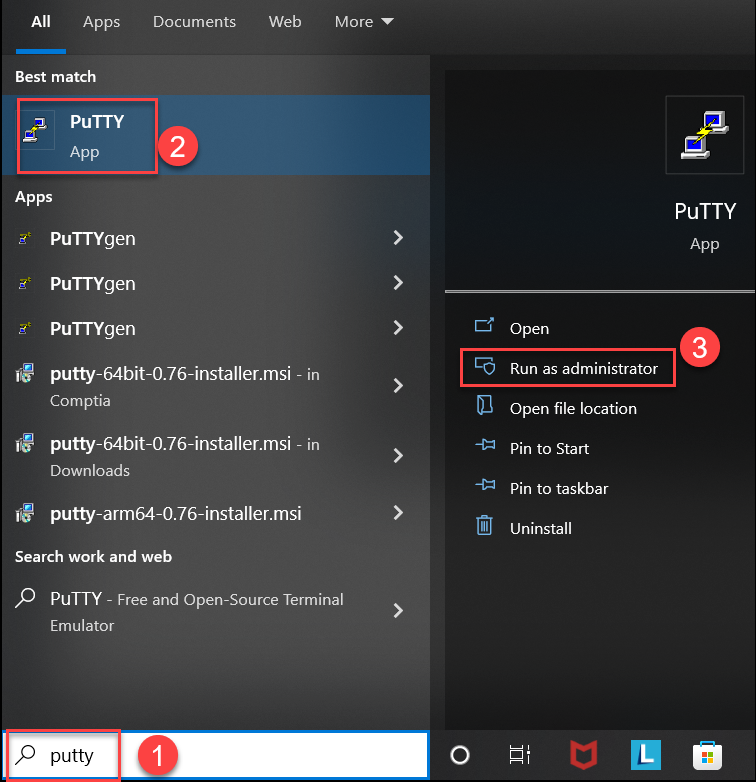
   
   NOTE: If you don't have putty installed, you can download putty from this link: https://www.chiark.greenend.org.uk/~sgtatham/putty/latest.html

1. Navigate to the **Cloudformation->stacks** and copy the public IP address of the F5 instance from the output section
   
   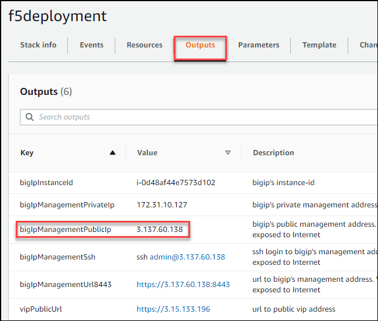

1. Provide the F5 Public ip under **Hostname** and expand **SSH** by clicking on **+**
   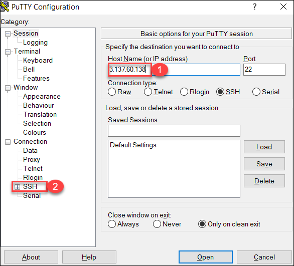

1. Click on the **Auth** option and click on **Browse** under **Private key file for authentication**
   - Select the downloaded key pair file and click on **Open**

   
    
1. If a pop window of **Putty Security Alert** appears, click on **Yes** to open a command prompt

1. From the command prompt, log in as **admin**
   
   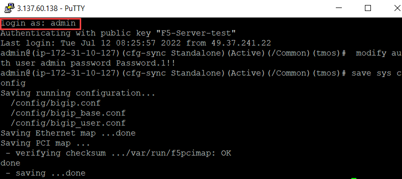

1. Run the following commands to set a password for the F5 instance
   ```
   modify auth user admin password <yourpasswordhere>
   save sys config
   ```
   Note: Replace <yourpasswordhere> placeholder with the password value that you would want to set
 
1. Open a new tab in the browser and log in to the BIG-IP Configuration utility by using **HTTPS** with the **F5 Public IP**. Append a **colon** and the port number **8443** to the IP address as shown below. This port 8443 allows management traffic to reach BIG-IP VE. Press **Enter** key.

    
   
   NOTE: You can also get it by navigating to the Cloudformation->stacks and copying the management portal URL of the F5 instance from the output section
    
1. A page shown below will appear. Click on **Advanced** on the web page.

    
     
1. Click on the link **Continue to XXXXXX(unsafe)** on the page as shown below. 

    
    
1. You will be redirected to the **F5 BIG-IP** Login page.

    
    
1. Enter the username as **admin** and the password you have set in the previous steps and then click on **Log in**.  
    
    
 
1. Now, you will be able to see the F5 dashboard. 
 
    
   

# 03: Configuring F5 Advanced Web Application firewall

## Overview

In this task, you will configure the F5 Advanced Web Application firewall hosted on Azure to publish IIS-based websites.

## Task 1: Access the Webserver

1. Open a new tab in the browser and attempt to access the web server via HTTP to the same IP address as the F5 
   ```
   http://<f5publicip>
   ```

    
    
    NOTE: Replace the public IP of F5 in the placeholder <f5publicip>
    
2. You won't be able to access the webserver because the F5 is not yet configured to respond to port 80.

## Task 2: Configuring F5 Advanced Web Application firewall  

### Exercise 1: Creating a pool and adding members to it

In this exercise, BIG-IP VE routes traffic to a pool. This pool should contain your application servers.

1. Switch back to F5 dashboard tab, On the **Main** tab, click **Local Traffic -> Pools -> Pool List**.

    
    
1. Click **Create** to create the Pool.    
        
    

1. In the **Name** field, type **f5pool**. Names must begin with a letter, be fewer than 63 characters, and can contain only letters, numbers, and the underscore (_) character. For **Health Monitors**, move **HTTP** from the **Available** to the **Active** list by clicking on <<.

      

1. In the **New Members** section, in the **Address** field, type the Public IP address of the Web server which you copied in the previous task **(1)**.
   
1. In the **Service Port** field, select **http** as service port **(2)** and Click **Add** **(3)**.

      **Note**: The list now contains the member **(4)**
        
    Click **Finished** **(5)**.
   
    
    
1. Refresh the page and verify if the created pool's status is shown as **Available** (indicated in green) 
   
   
    
### Exercise 2: Creating a virtual server

In this exercise, A virtual server listens for packets destined for the external IP address. You must create a virtual server that points to the pool you created.

1. On the **Main** tab, click **Local Traffic -> Virtual Servers-> Virtual Server List**

    
    
1. Click **Create** to create the Virtual Server.  

    
    
1. In the **General Properties** section, configure as below:

   - Name: **Demo-Website** (Or your custom service name)
   - Destination Address/Mask: **0.0.0.0/0**
   - Service port: **80**
   - State: Leave the default

    
 
1. Scroll down to the **Configuration** section, configure as below:

   - Source Address Translation: Select **Auto Map**

    

1. Again, scroll down to the **Resource** section, configure it as below and click on **Finished**.

   - Default Pool: Select the Pool which you created in the previous exercise
    
    
  
1. Verify if the created Virtual server's status is shown as **Available** (indicated in green) 
    
   
    
1.  Open a new tab in the browser and copy-paste the following to access the webserver.
    ```
     http://<f5publicip>
     ```
    
1. The request will be forwarded to the backend web server as configured and You should be able to see the webserver in the browser.
    
    

# Conclusion

Congratulations, You have completed this lab. In this lab, you were able to publish a Web Application hosted behind an F5 advanced Web application firewall   
