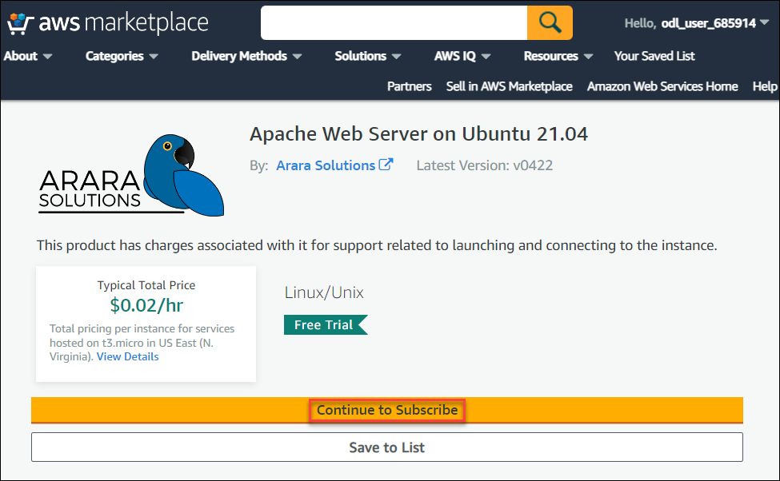
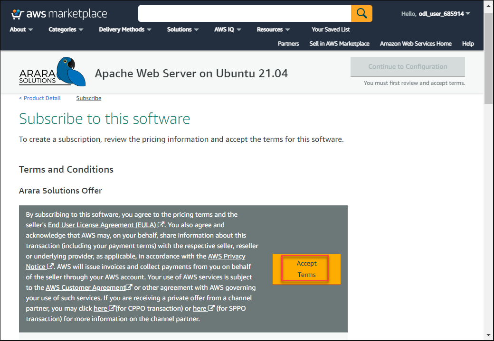
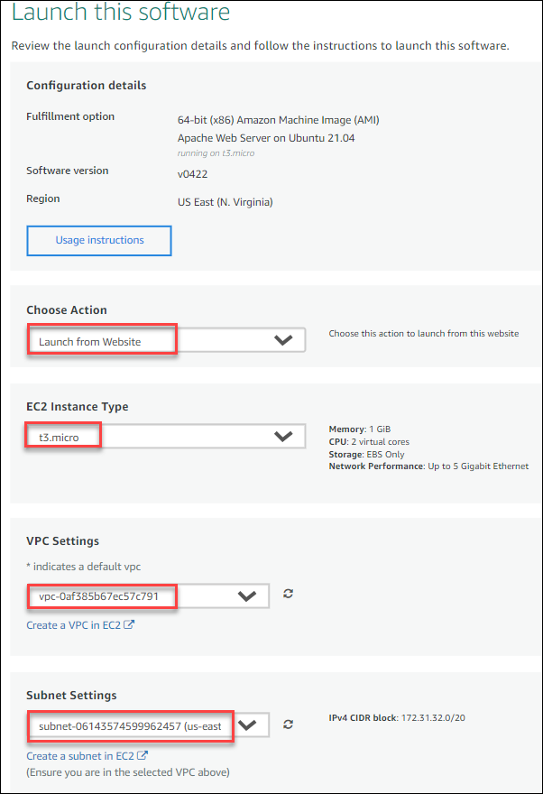
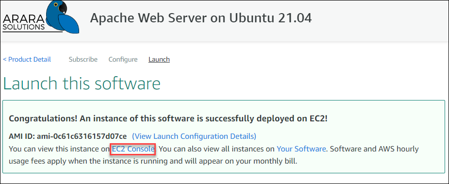
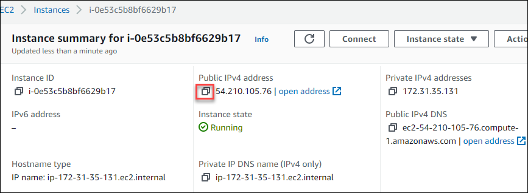

# Getting started with Fortinet FortiGate Next-Generation Firewall

## Overview

The Fortinet FortiGate Next-Generation Firewall (NGFW) combines security and networking services to enable both content and network protection in 
an Amazon Web Services (AWS) environment. Fortinet designed this solution to inspect traffic as it enters and leaves the network, while simultaneously 
providing integrated security capabilities. The FortiGate NGFW can enable these security features without degrading performance and adversely affecting 
the end-user experience.

The FortiGate NGFW is part of the broader Fortinet Security Fabric architecture, designed to provide broad visibility and control of an organization’s
entire digital attack surface and automated operations, orchestration, and response. AI/ML, along with continuous threat intelligence provided by 
FortiGuard Labs security services, help to create and automate policies driving how the FortiGate NGFW responds to evolving threats. 

## Tasks Included
  
* **01 - Login to AWS console**
* **02 - Deploying the FortiGate Next-Generation Firewall solution and Web server**
* **03 - Accessing the FortiGate Dashboard**    
* **04 - Configure FortiGate for Web Traffic**
* **05 - Access the Webserver**

## Overview

In this task, you will deploy Fortinet FortiGate Next-Generation Firewall and a Apache web server. 

## Task 1: Login to AWS console

1. In a browser, open a new tab and sign in to the **AWS Console** using the sign-in link provided in the **Environment details** tab 
   
  

2. On the **Sign in as IAM User** blade, you will see a Sign-in screen,  enter the following email/username and then click on **Sign in**.  

   * **Azure Username/Email**:  <inject key="AzureAdUserEmail"></inject> 
   * **Azure Password**:  <inject key="AzureAdUserPassword"></inject>

   **Note**: Refer to the **Environment Details** tab for any other lab credentials/details.
        
   

3. Now you will be able to view the home page of the AWS console
   
    
    
4. Ensure to use the **N.Virginia** region at the top right corner for performing the lab.
   
    
  
## Task 2: Deploying the FortiGate Next-Generation Firewall solution and Web server**

1. Search for **key pairs** and select **Key Pairs** from the EC2 feature

    
 
2. On the **Create key pair** blade provide the name as **keypair-XXXXXX** and click on **Create key pair**

   
 
3. Navigate to https://aws.amazon.com/marketplace/ , search and select the Marketplace image **Apache Web Server on Ubuntu 21.04**  
   
   

4. Click on **Continue to subscribe**
   
   
    
5. Under the **Subscribe to this software** section click on **Accept Terms** to accept the terms and conditions
   
   
   
  >NOTE: Your subscription to this product will be pending and may take a few minutes.

6. After the subscription process is complete, click on **Continue to Configuration**
   
   
   
7. On the **Configure this software** blade review the configurations and click **Continue to Launch** to launch the software
   
     
 
8. Next, on the **Launch this Software** blade, select the following :
    - Choose Action : Launch from Website
    - EC2 instance type: Leave the option set to default
    - VPC Settings : Leave the option set to default VPC
    - Subnet Settings : Leave the option set to default
    
     

9. Scroll down and under **Security Group Settings** select **Create New Based on Seller Settings**
   
     

10. Under the **Create New Based on Seller Settings** provide the Security group name, description and Click on **Save** 

    
   
11. Under the **Key Pair Settings** section select the existing key pair and click on **Launch**
   
    

12. Once the instance is deployed successfully you will get a message as follows, Click on **EC2 Console**
    
     

13. You will be naviagated to the **Instances** Page

14. On the instances page, name the instance you just created as **Web Server** 

     
    
15. Ensure the instance is **Running** and the status shows as **2/2 checks passed**
   
    
   
16. Copy the Public ip address of the Apache web server in a notepad as it will be required in the further tasks.
    
    
