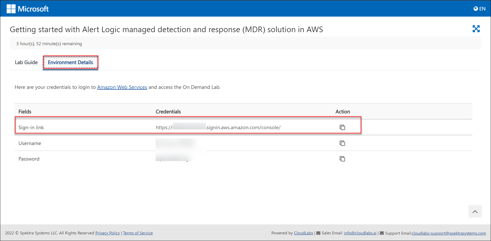
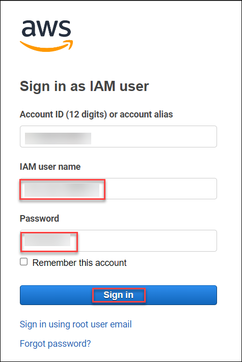
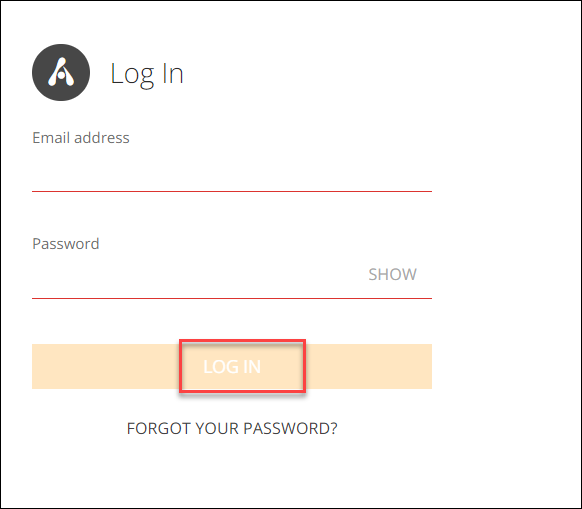
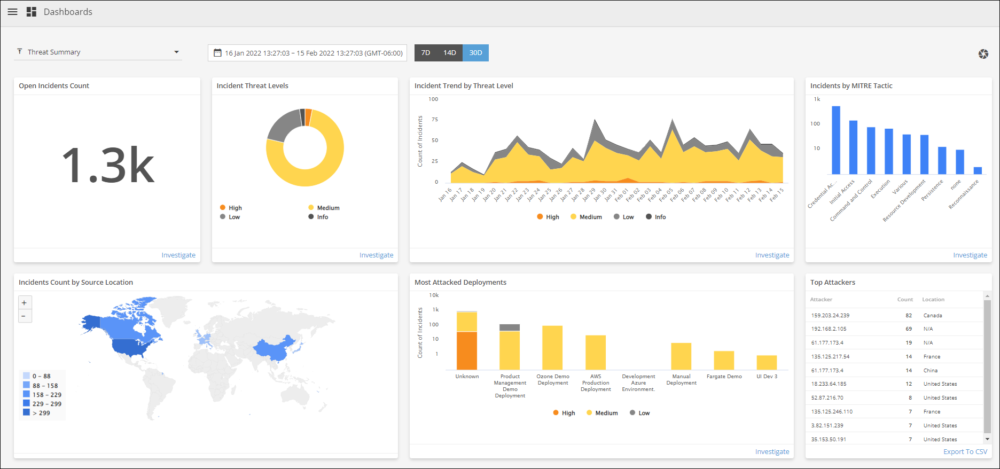

# Getting started with Alert Logic managed detection and response (MDR) solution in AWS

## Overview

Alert Logic MDR is a fully managed cloud-based suite of security and compliance solutions, delivered as-a-service for AWS, on-premises and hybrid infrastructures. AlertLogic makes it easy for any organization to secure their assets and data.
- Protect sensitive data on AWS, on-premises and hybrid infrastructures with a single solution 
- Integration of network, application and system protection to deliver deeper insight into threats 
- Managed and monitored 24/7 by our 150 + security experts (SOC)
- Subscription model pricing custom fit based on your needs

## Pre-requisites

1. Access to required subscription of Alert Logic and a AlertLogic account
2. An AWS account with necessary permissions
3. Deployment of AWS resources using CloudFormation template (CFT)
4. Role assignment to protect the AWS deployment that is an AWS cross-account role to allow Alert Logic access to your AWS account

## Tasks Included
  
* **01 - Login to AWS console**
* **02 - Identify different threats, alerts in AlertLogic console**

## 01: Login to AWS console

1. In a browser, open a new tab and sign in to the **AWS Console** using the sign-in link provided in the **Environment details** tab 
   
   

2. On the **Sign in as IAM User** blade, you will see a Sign-in screen,  enter the following email/username and then click on **Sign in**.  

   * **AWS Username/Email**:  <inject key="AzureAdUserEmail"></inject> 
   * **AWS Password**:  <inject key="AzureAdUserPassword"></inject>

   **Note**: Refer to the **Environment Details** tab for any other lab credentials/details.
        
   

3. Now you will be able to view the home page of the AWS console
   
    
    
4. Ensure to use the **N.Virginia** region at the top right corner for performing the lab.
   
    
      
## 02 - Identify different threats, alerts in Alertlogic console

1. In a browser, open a new tab and sign in to the **AlertLogic Console** using the sign-in link https://console.alertlogic.com/#/login
   
   

2. On the **Login** blade, you will see a Log in screen,  enter the email address and Password then click on **Log in**.  

3. Now you will be able to view the home page of the Alert Logic console
   
4. In the dashboard, Threat Summary provides graphical information on incidents, including data points such as Open Incident Count, Incidents Count by Source Location, Incidents by MITRE Tactic, and Top Attackers
   
    
    
 NOTE: The Reports tab provides access to data related to exposures and incidents Alert Logic found within your deployments. Report data is cached and refreshed every 30 minutes. As a result, reports can take up to 30 minutes to reflect the latest data seen in the console
      
## Conclusion 
In this hands on lab, you learned how to use AlertLogic's MDR solution to identify threats and protect AWS workloads. 
