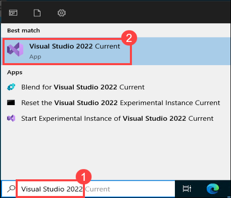
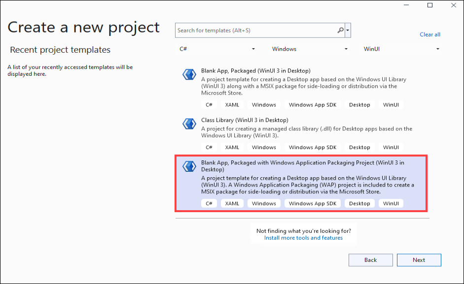
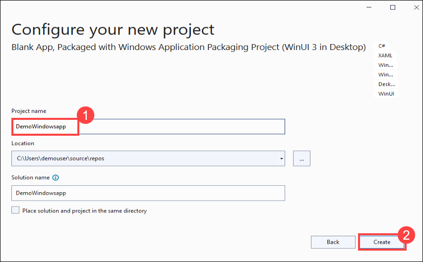
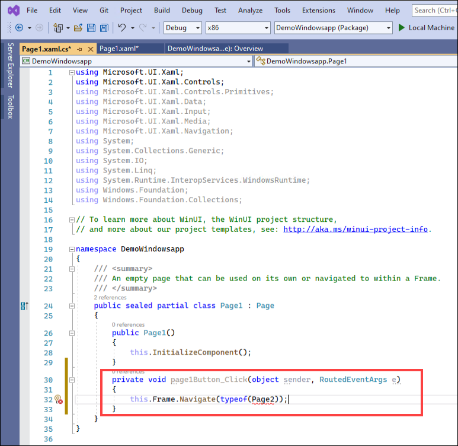
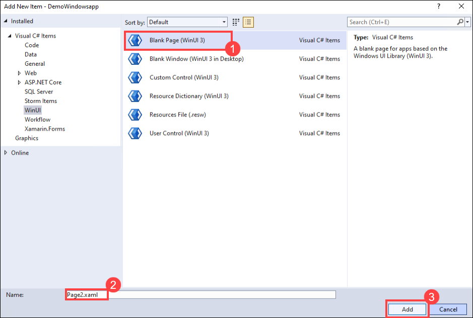
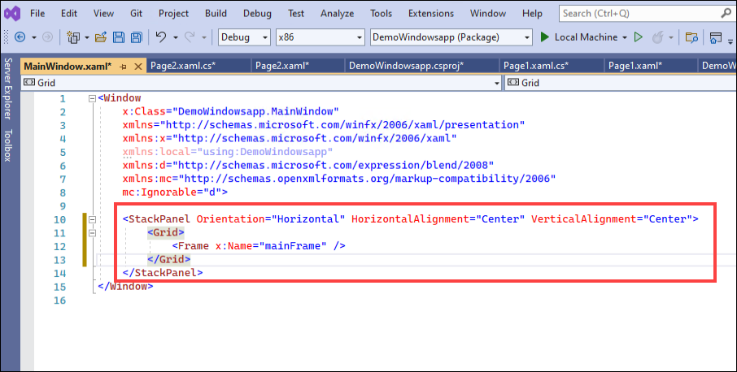

# Exercise 2: Build a sample C# WinUI 3 App 

**Packaged apps** are packaged using MSIX. MSIX is a package format that gives end-users an easy way to install, uninstall, and update their Windows apps using a modern UI.

In this exercise, you will build a packaged C# Windows Desktop application using the built-in template and configure it with two pages, buttons, event handlers, and navigation.

> You can find more references about building  packaged and unpackaged WinUI 3 apps from here: `https://docs.microsoft.com/en-us/windows/apps/winui/winui3/create-your-first-winui3-app?pivots=winui3-packaged-csharp`


1. Go to the **Start** button in the VM, search for **Visual Studio 2022** there and select **Visual Studio 2022 Current** to open it.

   

1. On the Sign in to Visual Studio click on **Sign in** and complete the Sign-in process by using the below credentials.

   

    * Azure Username/Email: <inject key="AzureAdUserEmail"></inject> 
    * Azure Password: <inject key="AzureAdUserPassword"></inject>

1. On the Visual Studio blade, click on **Start Visual Studio** to start the Visual Studio.

   

1. On the **Get Started** blade of Visual Studio, select **Create a new project** to create a new project. 

   

1. On the **Create a new project** blade, select **C# (1)** under **All languages**, **Windows (2)** under **All platforms**, and **WinUI (3)** under **All project types** from the project drop-down filters.

   

1. Select **Blank App, Packaged with Windows Application Packaging Project (WinUI 3 in Desktop)** template from the available project templates.

   

   >**Blank App, Packaged with Windows Application Packaging Project (WinUI 3 in Desktop)**: Creates a desktop C# .NET app with a WinUI-based user interface. The generated solution includes a separate Windows Application Packaging Project that is configured to build the app into an MSIX package.

1. Click on **Next** to enter the project details.

1. On the **Configure your new project** blade, enter the below value for **Project name (1)** field and click on **Create (2)**.

   ```
   DemoWindowsapp
   ```
   
   

1. In the following dialog box, set the Target version to **Windows 10, version 2004 (build 19041) (1)** and Minimum version to **Windows 10, version 1809 (build 17763) (2)** and then click on **OK (3)**.

   

1. On the **Settings** tab, toggle the Developer mode to **On** to enable the Developer mode and click on **Yes** on the **Use Developer features** pop-up to allow installing and running apps outside of the Microsoft store.

   
   
   

1. Close the **Settings** tab by clicking on **X** and review the **project** generated by Visual Studio.

   

   > Info: This project is generated only if you use the **Blank App, Packaged with Windows Application Packaging Project (WinUI 3 in Desktop)** project template. This project is a Windows Application Packaging Project that is configured to build the app into an MSIX package. This project contains the package manifest for your app, and it is the startup project for your solution by default.

1. To add a new item to your app project, right-click the **DemoWindowsapp** project node in Solution Explorer and select **Add** then **New Item**.

   
   
1. On the **Add New** Item dialog box, select the **WinUI** tab.

   

1. Select the **Blank Page (WinUI 3) (1)**, name it as **Page1.xaml (2)** and click on **Add (3)**.

   

1. Once the **Page1** is added, the file will be opened by default. Replace the existing **Grid** section with the below content.

   ```
   <Grid 
    Padding="8,8,8,8"
    HorizontalAlignment="Center">
        <Grid.RowDefinitions>
            <RowDefinition Height="auto"/>
            <RowDefinition Height="*"/>
            <RowDefinition Height="auto"/>
            <RowDefinition Height="*"/>
        </Grid.RowDefinitions>
        <TextBlock
			Grid.Row="0"
			FontSize="36"
			FontWeight="Bold"
			TextAlignment="Center"
			TextWrapping="WrapWholeWords"                
			Text="Welcome to Page 1" />
        <Button 
			Grid.Row="2"
			HorizontalAlignment="Center"
			x:Name="page1Button" 
			Click="page1Button_Click">Go to Page 2</Button>
   </Grid>
   ```
   
   After adding the content, your screen will look like the below screenshot.

   

1. Open the file **Page1.xaml.cs** and enter the below content after **Page1** method inside the **Page1** class to create the method that navigates to Page2 when the Page1 button is clicked.

   ```
    private void page1Button_Click(object sender, RoutedEventArgs e)
        {
            this.Frame.Navigate(typeof(Page2));
        }
    ```    

    After adding the content, your screen will look like the below screenshot.
    
    
    
    > Info: The above method will navigate the current frame to Page2 when the Page1 button is clicked. You'll create a second page called Page2 and create the same layout and button click handler in the below steps. But this time navigate back to Page 1.


1. To add a second page to your app project, right-click the **DemoWindowsapp** project node in Solution Explorer and select **Add** then **New Item**.

   
   
1. In the Add New Item dialog box, select the **WinUI** tab.

   

1. Select the **Blank Page (WinUI 3) (1)**, name it as **Page2.xaml (2)** and click on **Add (3)**.

   

1. Once the **Page2** is added, the file will be opened by default. Replace the existing **Grid** section with the below content.

   ```
   <Grid 
    Padding="8,8,8,8"
    HorizontalAlignment="Center">
        <Grid.RowDefinitions>
            <RowDefinition Height="auto"/>
            <RowDefinition Height="*"/>
            <RowDefinition Height="auto"/>
            <RowDefinition Height="*"/>
        </Grid.RowDefinitions>
        <TextBlock
			Grid.Row="0"
			FontSize="36"
			FontWeight="Bold"
			TextAlignment="Center"
			TextWrapping="WrapWholeWords"                
			Text="Welcome to Page 2" />
        <Button 
			Grid.Row="2"
			HorizontalAlignment="Center"
			x:Name="page2Button" 
			Click="page2Button_Click">Go to Page 1</Button>
   </Grid>
   ```

   After adding the content, your screen will look like the below screenshot.

   
   
   
1. Open the file **Page2.xaml.cs** and enter the below content after **Page2** method inside the **Page2** class to create the method that navigates to Page1 when the Page2 button is clicked.

   ```
   private void page2Button_Click(object sender, RoutedEventArgs e)
   {
    this.Frame.Navigate(typeof(Page1));
   }
   ```
   
   After adding the content, your screen will look like the below screenshot.   
   
   
    
   > Next, modify the MainWindow layout to add the frame element referenced by our pages.

   
1. Open **MainWindow.xaml** and replace the existing **StackPanel** layout with the below content that adds a simple Frame element called **mainFrame**.

   ```
   <Grid>
    <Frame x:Name="mainFrame" />
   </Grid>
   ```
   
    After adding the content, your screen will look like the below screenshot.
    
    
 
1. Open **MainWindow.xaml.cs** and remove the method **myButton_Click**.

    

1. Finally, add the following line inside the **MainWindow** method to load Page1 into the mainFrame when the MainWindow is initialized.

    ```
    mainFrame.Navigate(typeof(Page1));
    ```    
    
    After adding the content, your screen will look like the below screenshot.   
    
    

### Summary

In this exercise, you have built a packaged C# Windows Desktop application using the built-in template and configured it to navigate between the pages.
