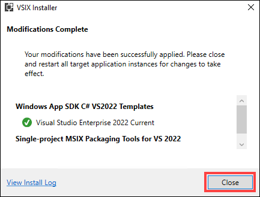
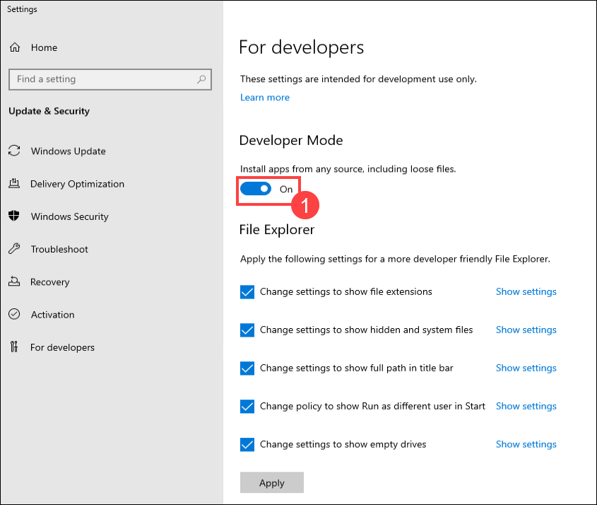
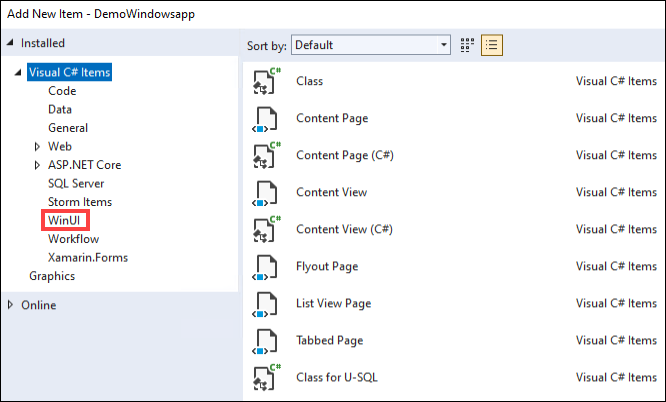
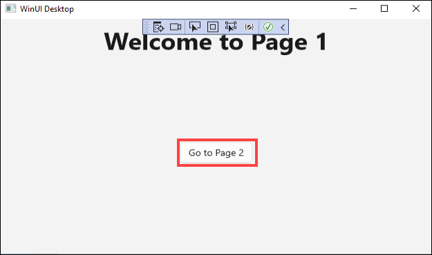
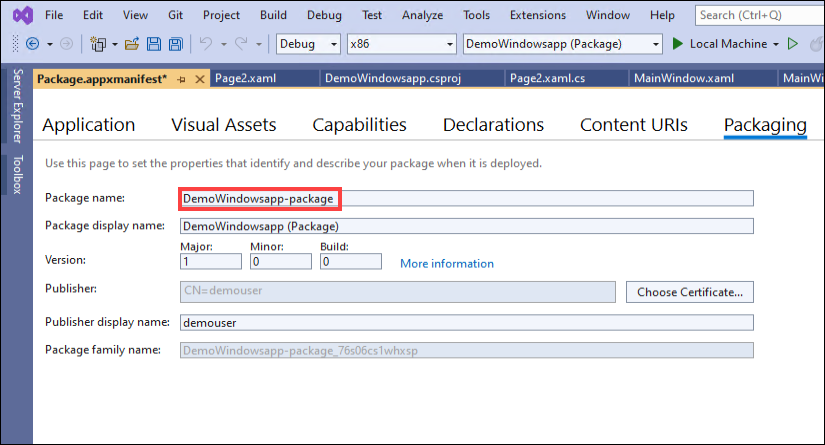
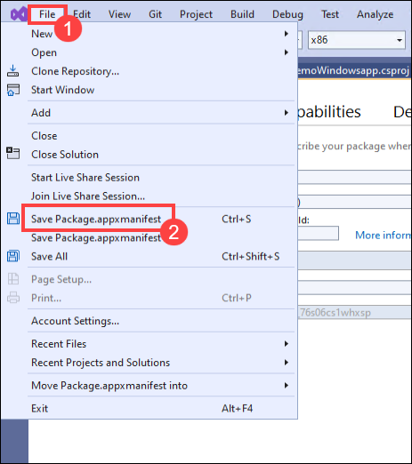
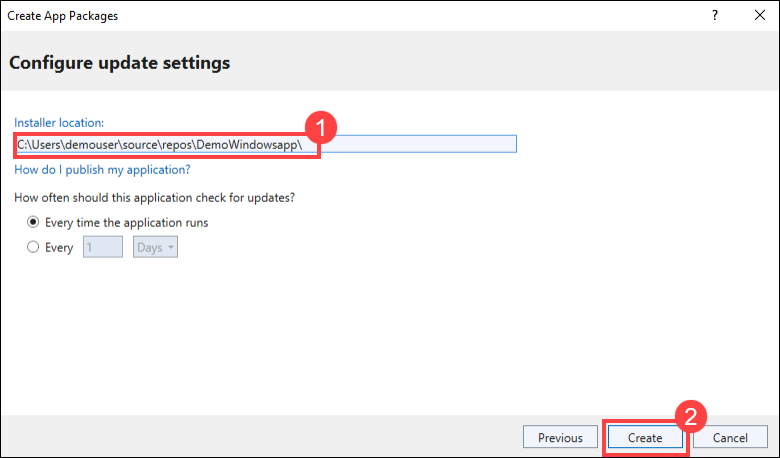

# Exercise 1: Intall the C# and C++ Windows App SDK extension for Visual Studio 

In this exercise, you will install the C# and C++ Windows App SDK extensions that allows to create the applications in Visual Studio.

1. From the Virtual Machine, open file explorer and navigate to the path `C:\LabFiles` to select the C# extension file.

1. Double click on the **WindowsAppSDK.Cs.Extension.Dev17.Standalone** file to open the VSIX installer.

   

1. Wait until the VSIX installer is initialized, once it is done click on **Modify** to accept the license terms and installation of pre-requisites (if any).

   

1. Once the extension is installed, click on on the VSIX installer blade to close it.

   

   > Please note that installation process takes 4-5 minutes to complete.
   
1. Navigate back to file eplorer and double click on the **WindowsAppSDK.Cpp.Extension.Dev17.Standalone** file to open the VSIX installer of C++ extension.

   

1. Wait until the VSIX installer is initialized, once it is done click on **Modify** to accept the license terms and installation of pre-requisites (if any).

   

1. Once the extension is installed, click on on the VSIX installer blade to close it.

   
   
   > Please note that installation process takes 4-5 minutes to complete.


# Exercise 2: Build a sample C# WinUI 3 App 

1. Go to **Start** button in the VM, search for **Visual Studio 2022** there and select **Visual Studio 2022 Current** to open it.

   

1. On the Sign in to Visual Studio click on **Sign in** and complete the Sign in process by using the below credentials.

   

    * Azure Username/Email: <inject key="AzureAdUserEmail"></inject> 
    * Azure Password: <inject key="AzureAdUserPassword"></inject>

1. On the **Get Started** blade of Visual Studio, select **Create a new project** to create a new project. 

   

1. On the **Create a new project** blade, select **C# (1)** under **All languages**, **Windows (2)** under **All platforms**, and **WinUI (3)** under **All project types** from the project drop-down filters.

   

1. Select **Blank App, Packaged with Windows Application Packaging Project (WinUI 3 in Desktop)** template from the available project templates.

   

1. Click on **Next** to enter the project details.

1. On the **Configure your ne project** blade, enter the below value for **Project name (1)** field and click on **Create (2)**.

   ```
   DemoWindowsapp
   ```
   
   

1. In the following dialog box, set the Target version to **Windows 10, version 2004 (build 19041) (1)** and Minimum version to **Windows 10, version 1809 (build 17763) (2)** and then click **OK (3)**.

   

1. If you receive a pop-up to enable the Developer mode, toggle the Developer mode to **On** and click on **Yes** to allow installing and running apps outside from the Microoft store.

   
   
   

1. Minimise the **Settings** tab and review the **project** generated by Visual Studio.

   

   > Info: This project is generated only if you use the **Blank App, Packaged with Windows Application Packaging Project (WinUI 3 in Desktop)** project template. This project is a Windows Application Packaging Project that is configured to build the app into an MSIX package. This project contains the package manifest for your app, and it is the startup project for your solution by default.

1. To add a new item to your app project, right-click the **DemoWindowsapp** project node in Solution Explorer and select **Add** then **New Item**.


1. In the Add New Item dialog box, select the **WinUI** tab.

   

1. Select the **Blank Page (WinUI 3) (1)**, name it as **Page1.xaml (2)** and click on **Add (3)**.

   

1. Once the **Page1** is added, the file will be opened by default. Replace the existing **Grid** section with the below content.

   ```
   <Grid 
    Padding="8,8,8,8"
    HorizontalAlignment="Center">
        <Grid.RowDefinitions>
            <RowDefinition Height="auto"/>
            <RowDefinition Height="*"/>
            <RowDefinition Height="auto"/>
            <RowDefinition Height="*"/>
        </Grid.RowDefinitions>
        <TextBlock
			Grid.Row="0"
			FontSize="36"
			FontWeight="Bold"
			TextAlignment="Center"
			TextWrapping="WrapWholeWords"                
			Text="Welcome to Page 1" />
        <Button 
			Grid.Row="2"
			HorizontalAlignment="Center"
			x:Name="page1Button" 
			Click="page1Button_Click">Go to Page 2</Button>
   </Grid>
   ```

1. Open the file **Page1.xaml.cs** and enter the below content after **Page1** method inside the **Page1** class to create the method.

   ```
    private void page1Button_Click(object sender, RoutedEventArgs e)
        {
            this.Frame.Navigate(typeof(Page2));
        }
    ```    

    After adding the content, your screen ill look like below screenshot.
    
    
    
    > Info: The above method will navigate the current frame to Page2 when the Page1 button is clicked. You ill create a second page called Page2 and create the same layout and button click handler in the below steps. But this time navigate back to Page 1.


1. To add a second page to your app project, right-click the **DemoWindowsapp** project node in Solution Explorer and select **Add** then **New Item**.

1. In the Add New Item dialog box, select the **WinUI** tab.

1. Select the **Blank Page (WinUI 3) (1)**, name it as **Page2.xaml (2)** and click on **Add (3)**.

   

1. Once the **Page2** is added, the file will be opened by default. Replace the existing **Grid** section with the below content.

   ```
   <Grid 
    Padding="8,8,8,8"
    HorizontalAlignment="Center">
        <Grid.RowDefinitions>
            <RowDefinition Height="auto"/>
            <RowDefinition Height="*"/>
            <RowDefinition Height="auto"/>
            <RowDefinition Height="*"/>
        </Grid.RowDefinitions>
        <TextBlock
			Grid.Row="0"
			FontSize="36"
			FontWeight="Bold"
			TextAlignment="Center"
			TextWrapping="WrapWholeWords"                
			Text="Welcome to Page 2" />
        <Button 
			Grid.Row="2"
			HorizontalAlignment="Center"
			x:Name="page2Button" 
			Click="page2Button_Click">Go to Page 1</Button>
   </Grid>
   ```

1. Open the file **Page2.xaml.cs** and enter the below content after **Page2** method inside the **Page2** class to create the method.

   ```
   private void page2Button_Click(object sender, RoutedEventArgs e)
   {
    this.Frame.Navigate(typeof(Page1));
   }
   ```
   
   After adding the content, your screen ill look like below screenshot.   
   
   
    
   > Next, modify the MainWindow layout to add the frame element referenced by our pages.

   
1. Open **MainWindow.xaml** and replace the existing **StackPanel** layout with the below content that adds a simple Frame element called **mainFrame**.

   ```
   <Grid>
    <Frame x:Name="mainFrame" />
   </Grid>
   ```
   
    After adding the content, your screen will look like below screenshot.
    
    
 
1. Open **MainWindow.xaml.cs** and remove the method **myButton_Click**.

1. Finally, add the following line inide the **MainWindow** method to load Page1 into the mainFrame when the MainWindow is initialized.

    ```
    mainFrame.Navigate(typeof(Page1));
    ```    
    
    After adding the content, your screen will look like below screenshot.   
    
    

# Exercise 3: Build and run the application

1. Right-click the **DemoWindowsapp** project node in Solution Explorer and click on **Build** to build the application.

1. Once the build is suceeded, you will receive a **succeeded** message in the output window.

   

1. Press **F5** or select the **green Start arrow** button on the Visual Studio toolbar to run the application.

   

1. When the application is launched, Page1 will be loaded by default as you have configured the **MainWindow** method earlier to load Page1.

   

1. Now, click on **Go to Page 2** button to navigate to Page2.

   

1. Next, Page2 will be loaded on the application. You can navigate back to Page1 by cliccking **Go to Page 1** button.

1. Click on **X** on the Page 2 to close the page and stop the application.


# Exercise 4: Package the application and deploy it

## Configure your project

1. In Solution Explorer, expand the project node of your application project.

1. Double-click the Package.appxmanifest file. If the manifest file is already open in the XML code view, Visual Studio prompts you to close the file.

1. Select the Packaging tab and enter the below name for the package publishing data. 

   
   
   > This is where you can choose which certificate to use to sign your app. All MSIX apps must be signed with a certificate.

1. Save your **Package.appxmanifest** file after you have made the necessary edits for your app.

   

## Generate an app package

1. In Solution Explorer, open the solution for your application project.

1. Right-click the project and choose Publish->Create App Packages (before Visual Studio 2019 version 16.3, the Publish menu is named Store).

1. Select **Sideloading** in the first page of the wizard and then click **Next**.

   

1. On the Select signing method page, select **No, skip packaging signing** and then click Next.
 
    

   > You can whether to skip packaging signing or select a certificate for signing. select a certificate from your local certificate store, select a certificate file, or create a new certificate. For an MSIX package to be installed on an end user's machine, it must be signed with a cert that is trusted on the machine.

1. On the **Select and Configure Packages** dialog, select the architecture configurations (x86, x64) to ensure that your app can be deployed to the widest range of devices.

   

1. On the **Configure update settings** blade, enter the below value in the **Intaller location** field and click on **Create**.

   ```
   C:\Users\demouser\source\repos\DemoWindowsapp\
   ```

   

1. Wait until the package is created. When your app has been successfully packaged, you will be presented with the below page.

   

1. 
