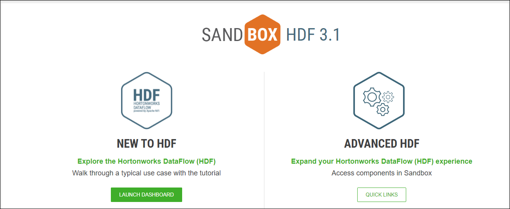
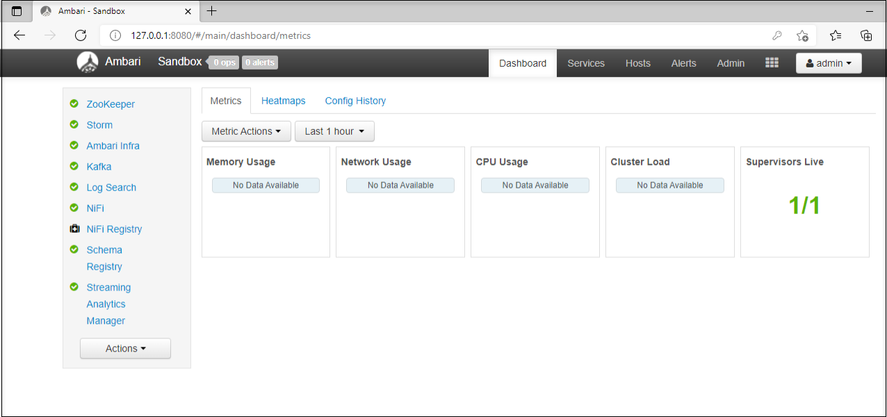
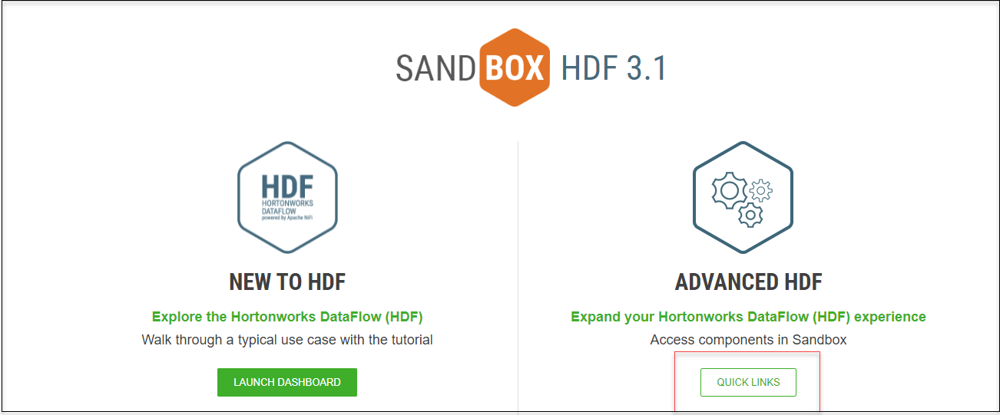
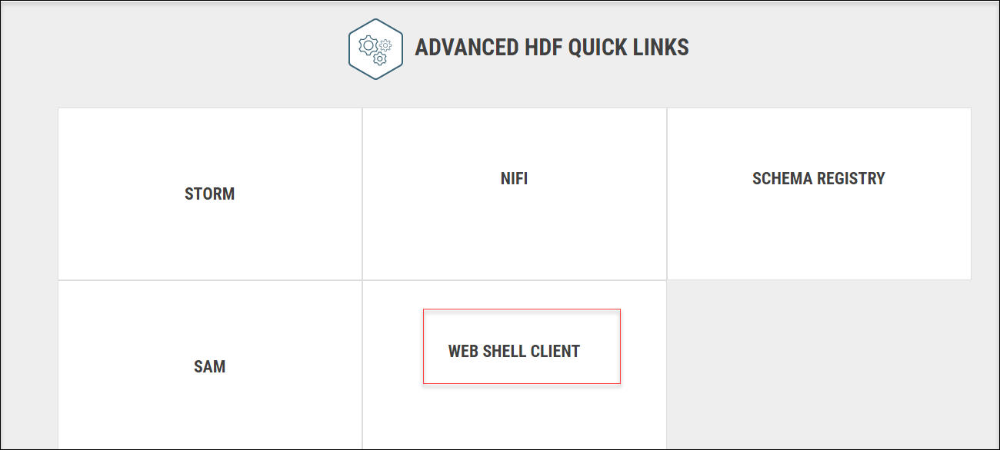

# HortonWorks DataFlow and Ambari Server

## Overview 

### Hortonworks DataFlow (Data-In-Motion)

Cloudera DataFlow which is formerly known as Hortonworks DataFlow (HDF) is a scalable, real-time streaming analytics platform that ingests and analyzes data for key insights and immediate actionable intelligence. DataFlow addresses the key challenges enterprises face with data-in-motion real-time stream processing of data at high volume and high scale, data provenance, and ingestion from IoT devices, edge applications, and streaming sources.

### Ambari Server

Apache Ambari is an open-source administration tool deployed on top of Hadoop clusters, and it is responsible for keeping track of the running applications and their status.
Apache Ambari can be referred to as a web-based management tool that manages, monitors, and provisions the health of Hadoop clusters. It provides a highly interactive dashboard that allows administrators to visualize the progress and status of every application running over the Hadoop cluster. Its flexible and scalable user interface allows a range of tools such as Pig, MapReduce, Hive, etc. to be installed on the cluster and administers their performances in a user-friendly fashion.

### Module 1 : Set up a lab for big data analytics using Docker deployment of HortonWorks DataFlow

This lab explains you to set up a big data analytics class. It assists the user in dealing with massive volumes of data and applies machine learning and statistical learning methods to obtain data insights. A key objective of this lab is to learn how to use data analytics technologies, such as Apache Hadoop's open-source software package, which provides tools for storing, managing, and processing massive data.

In this lab, we will use Hortonworks DataFlow (HDF), a popular commercial version of Hadoop provided by Cloudera. We are using HDF Sandbox 3.0.1, which is a free, simplified version of the platform that is used to design for learning and experimentation purpose.

### Task 1 : Getting Started with the HDF Sandbox

In the following task, you will be able to start the HDF SandBox and verify the status of the SandBox.

1. On the environment provided, select the **Git Bash** from the **Type here to search**.

1. In the Git Bash, run the following commands to start the **HDF SandBox**

```
docker start sandbox-hdf
```
```
docker start sandbox-proxy
```

```
docker ps
```
   
### Task 2 : Accessing the SandBox welcome page

In the following task, you will be able to explore the SandBox Welcome page.

1. Navigate to the browser,  and enter the localhost or the IP address 127.0.0.1:1080. This will be navigating to the **Sandbox Welcome Page** 

1. The SandBox Welcome page is also known as the **Splash Page**.

   

1. On the **SandBox Welcome page**, select **Launch Dashboard**.

1. This will be navigated to the Sign-In Page of the **Ambari Dashboard**. 

1. In the **Sign-In Page** of the Ambari Dashboard, use the following credentials that are provided below.

   - Username : admin
               
   - Password : admin

### Task 3 : Accessing the Ambari Dashboard

In the above task, you have learned how to login to Ambari Dashboard through SandBox Welcome page and in this task you will learn how to login to Ambari Dashboard by using its Port Number.

1. On the environment provided, Launch the browser.

1. Enter the following IP address 127.0.0.1:8080. It will navigate to the **Ambari Sign-In** Page.

1. On the **Ambari Sign-In** page, use the following credentials to log in.

   - UserName : `admin`
   
   - Password : `admin`

1. Once you have logged in, you will be able to explore the various features of the Ambari Dashboard.

  

## Task 4 : Verify the status of the Ambari Server

In this task you find the status of the Ambari server.

1. Navigate to the browser, enter the following ip address 127.0.0.1:1080. 

1. Under the **Advanced HDF**, select **Quick Links**. This will be redirected to the **Advanced HDF Quick Links** Page

    

1. In the **Advanced HDF Quick Links** page, select **Web Shell Client**.

    

1. This will be redirected to **Shell in a box** page where you need to provide the username and password that is mentioned below.

   - Username : `root`
   - Password : `hadoop`
   
    
   
1. In the **Shell in a box** page, enter the following command, to get the status of the **Ambari Server**

     `````
     sudo ambari-server status
     `````
     
 
1. Click on **Next** from the bottom right corner and follow the instructions to perform the lab 
