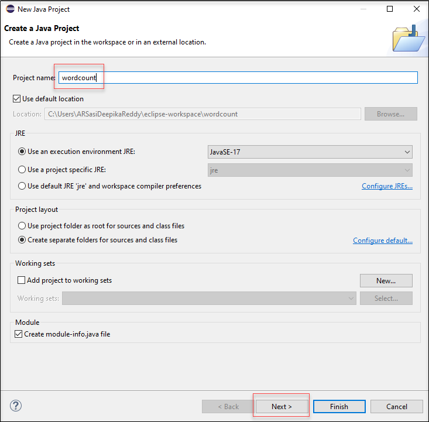
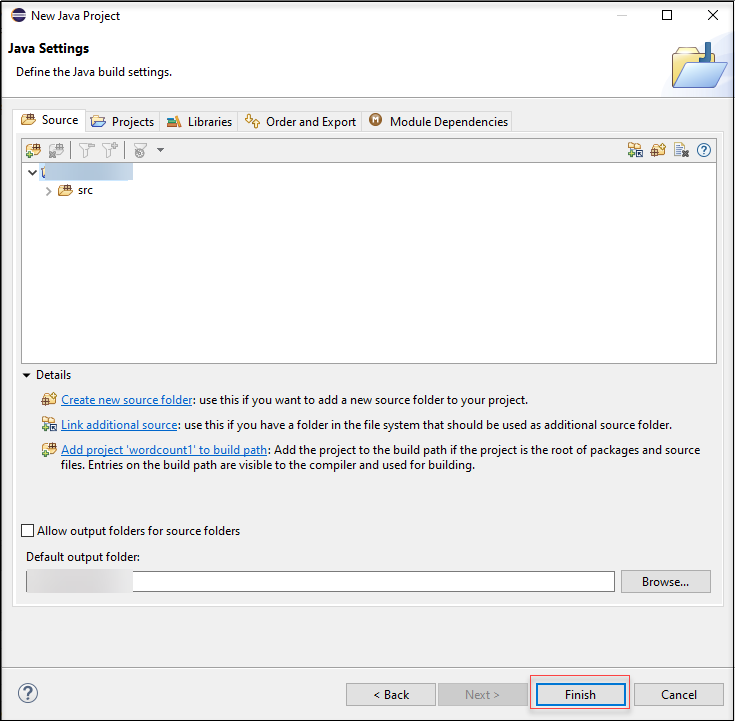
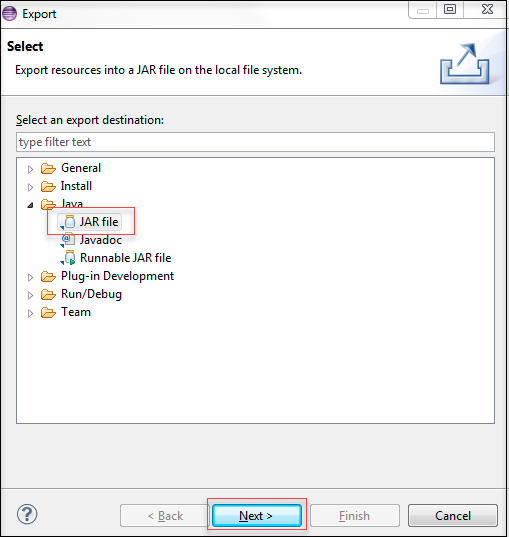
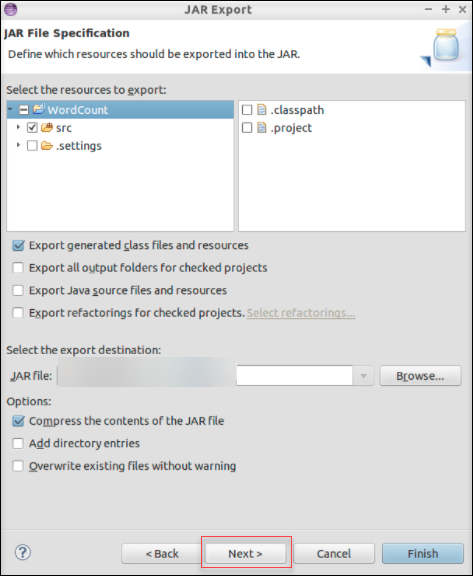

# Hadoop and MapReduce

## Overview

### Hadoop

Hadoop is an Apache open source framework that allows distributed processing of large datasets across clusters of computers using simple programming models. The Hadoop framework application works in an environment that provides distributed storage and computation across clusters of computers. Its framework is based on Java programming with some native code in C and shell scripts.

### MapReduce

MapReduce is a processing technique and a program model for distributed computing based on java. The MapReduce algorithm contains two important tasks, namely Map and Reduce. Map takes a set of data and converts it into another set of data, where individual elements are broken down into tuples (key/value pairs). Secondly, reduce task, which takes the output from a map as an input and combines those data tuples into a smaller set of tuples. As the sequence of the name MapReduce implies, the reduce task is always performed after the map job.

### Exercise 3 : Running Hadoop Application on Eclipse

### Task 1 : Running Hadoop Application

In this task you will get to know how to run Hadoop Application through Eclipse.

1. On the environment provided, Launch **Eclipse**. If it asks to select workspace then select the default location and click on **Launch**.

1. Once it is launched, on the top left select **File**, select **New** and then choose **Java Project**.

1. On the **New Java Project**, provide the name **WordCount** under the project name and click on **Next**.
  
     

1. Notice that a folder called **src** will be automatically created, which is used to store source files and click on **Finish**

     

1. Create a package called **polyu.bigdata** under the src folder, by selecting **File** and select **New** and select **Package** and provide the name as **polyu.bigdata** in the dialogue box and click on **Finish**.

     

1. Create a class called WordCount, by selecting File **New** and **Class** and assigning name as **WordCount** in the dialogue box and then copy the code below to WordCount.java and save it.
    ```````
    package polyu.bigdata;

    import java.io.IOException;
    import java.util.StringTokenizer;

    import org.apache.hadoop.conf.Configuration;
    import org.apache.hadoop.fs.Path;
    import org.apache.hadoop.io.IntWritable;
    import org.apache.hadoop.io.Text;
    import org.apache.hadoop.mapreduce.Job;
    import org.apache.hadoop.mapreduce.Mapper;
    import org.apache.hadoop.mapreduce.Reducer;
    import org.apache.hadoop.mapreduce.lib.input.FileInputFormat;
    import org.apache.hadoop.mapreduce.lib.output.FileOutputFormat;

    public class WordCount {

      //Mapper which implement the mapper() function
      public static class TokenizerMapper extends Mapper<Object, Text, Text, IntWritable> {

        private final static IntWritable one = new IntWritable(1);
        private Text word = new Text();

        public void map(Object key, Text value, Context context) throws IOException, InterruptedException {
          StringTokenizer itr = new StringTokenizer(value.toString());
          while (itr.hasMoreTokens()) {

            word.set(itr.nextToken());
            context.write(word, one);
          }
        }
      }
      //Reducer which implement the reduce() function
      public static class IntSumReducer extends Reducer<Text, IntWritable, Text, IntWritable> {
        private IntWritable result = new IntWritable();

        public void reduce(Text key, Iterable<IntWritable> values, Context context) throws IOException, InterruptedException {
          int sum = 0;
          for (IntWritable val : values) {
            sum += val.get();
          }
          result.set(sum);
          context.write(key, result);
        }
      }
      //Driver class to specific the Mapper and Reducer
      public static void main(String[] args) throws Exception {
        Configuration conf = new Configuration();
        Job job = Job.getInstance(conf, "word count");
        job.setJarByClass(WordCount.class);
        job.setMapperClass(TokenizerMapper.class);
        job.setReducerClass(IntSumReducer.class);
        job.setOutputKeyClass(Text.class);
        job.setOutputValueClass(IntWritable.class);
        job.setMapOutputKeyClass(Text.class);
        job.setMapOutputValueClass(IntWritable.class);
        FileInputFormat.addInputPath(job, new Path(args[0]));
        FileOutputFormat.setOutputPath(job, new Path(args[1]));
        System.exit(job.waitForCompletion(true) ? 0 : 1);
      }
    }
    ```````
 
1. Notice that there are some red wavy lines underneath imported packages, which indicates the error Fail to import class and also the dependency errors. 
     
     
      
1. Right click on the **WordCount project** and select **Properties**.

1. Once the dialog box opens, select Java Build Path and select **Libraries**,select **Add External JARs**, select jars **hadoop-common-2.6.3.jar** and **hadoop-mapreduce-client-core-2.6.3.jar** and select **Apply and Close**

     

1. Now verify that red wavy lines should disappear now, which means the dependency errors are solved.

### Task 2 : Export Jar Files

In this task, you will learn how to export jar files.

1. Now right click **WordCount** project, then click **Export**, then select **JAR** and click on **Next**.
      
      
      

1. Make sure you select the choose all export destination in src folder. Select the export destination to the location where you need to place the file and then click Finish, the jar file will be exported successfully.

### Task 3 : Start Hadoop, Check Hadoop status and Upload data to Hadoop File System(HDFS)

In this task, you will start the Hadoop and will verify the status of Hadoop and download the output folder from HDFS 

1. To run Hadoop application, the Hadoop system must be started first.
   ``````
   cd C:\Users\labuser\hadoop-3.2.1\sbin\start-all.sh
   ``````

1. On the microsoft edge in the desktop vm, and access the following urls, to view the running status of Hadoop.
    ```````
    http://localhost:8088
    http://localhost:50070
    ```````
  
1. Before executing the word count program, we also need a text file to process, download this hadoop.txt from [File](http://www.cse.cuhk.edu.hk/~ericlo/teaching/bigdata/lab/2-HadoopMR/HadoopMR/hadoop.txt) and save the file locally.

1. Create folder for data on HDFS and run the commands in the terminal
     ``````
     cd C:\Users\labuser\Downloads\hadoop-3.2.1\bin\hadoop fs -mkdir -p /Users/labuser/bigdata/wordcount/input
     ``````

1. Upload the data to HDFS

    ```````
    cd C:\Users\labuser\Downloads\hadoop-3.2.1\bin\hadoop fs -put ~/hadoop.txt /Users/labuser/bigdata/wordcount/input
    ```````
   
1. Execution Hadoop Application, to run the program
    ```````
     cd C:\Users\labuser\Downloads\hadoop-3.2.1\bin\hadoop jar ~/wordcount.jar polyu.bigdata.WordCount /Users/labuser/bigdata/wordcount/input /Users/labuser/bigdata/wordcount/output
    ```````
    
1. Open microsoft edge and verify the status of hadoop.
     ``````
     http://localhost:8088 
     ``````
1. To check the output, we need to first download the output folder from HDFS by using the command below.
     ``````
     cd C:\Users\labuser\Downloads\hadoop-3.2.1\bin\hadoop fs -get /Users/labuser/bigdata/wordcount/output ~/
     ``````
     
The end result is you will get the folder which is downloaded in Outputs folders which provides the word count of the entire text that you have provided while performing the lab

The final output of performing this lab is you will learn how to perform Hadoop Application through Eclipse.  
 

