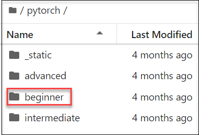

# Execute Jupyter Notebooks with Python

## Overview

In this task you will learn about:

   - Torch.Autograd
   - Tensors, Functions and Computational graph
   - Computing Gradients
   - Disabling Gradient Tracking
   - More on Computational Graphs
   - Optional Reading: Tensor Gradients and Jacobian Products

### Task 1: Execute Jupyter Notebooks with Python

1. In the Jupyter lab, in the left pane, Navigate to the **Pytorch** folder.

   

1. Inside the Pytorch folder, Navigate to **Beginner -> Basics** folder.

   
   
   

1. Under the **Basics** folder, Select the **autograd_tutorial.html** file to execute on the right side of the JupyterLab portal.

   
   
1. Execute each cell one at a time by clicking on it and selecting the execute button.

   
   
   **Note** : You can run the notebook document step-by-step (one cell at a time) by pressing ctrl + enter for running the particular cell or shift + enter to run the current cell.

## Summary

In this exercise, you have learned that PyTorch has a built-in differentiation engine called torch.autograd. It supports the automatic computation of gradient for any computational graph and Computing Gradients is used to optimize weights of parameters in the neural network, we need to compute the derivatives of our loss function concerning parameters. 

