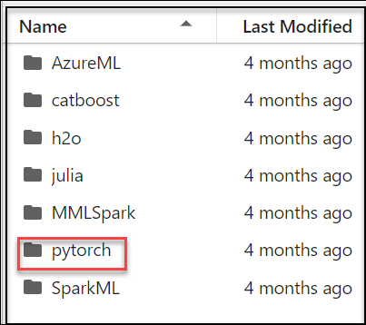
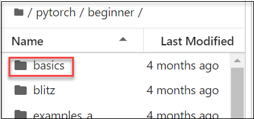
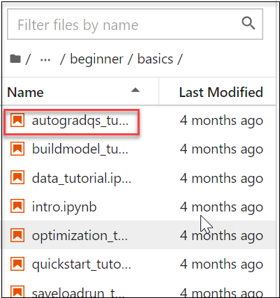

## Task 2: Execute Notebooks

Here, When training neural networks, the most frequently used algorithm is back propagation. In this algorithm, parameters (model weights) are adjusted according to the gradient of the loss function with respect to the given parameter.To compute those gradients, PyTorch has a built-in differentiation engine called torch.autograd. It supports automatic computation of gradient for any computational graph.  In this task you will learn about:

   - Torch.Autograd
   - Tensors, Functions and Computational graph
   - Computing Gradients
   - Disabling Gradient Tracking
   - More on Computational Graphs
   - Optional Reading: Tensor Gradients and Jacobian Products

1. In the Jupyter lab, in the left pane, select to **Pytorch** folder and double-click on it to open.

   

1. Inside the Pytorch folder, select the **Beginner** folder and double-click on it to open and select the **Basics** folder inside it.

   
   
   

1. In the **Basics** folder, Select **autograd_tutorial.html** file and double-click to open it on the right side of the Jupyter lab portal.

   
   
1. Execute each cell one at a time by clicking on it and selecting the execute button.

   
   
   **Note** : You can run the notebook document step-by-step (one cell a time) by pressing crtl + enter for running the particular cell or shift + enter to run the current cell.
