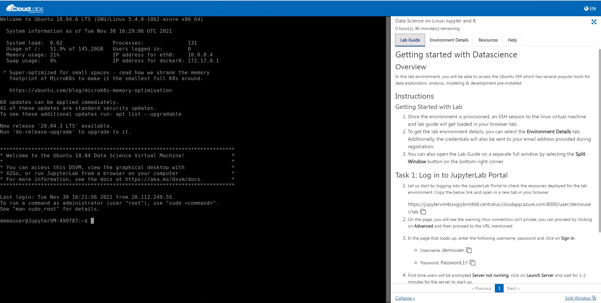
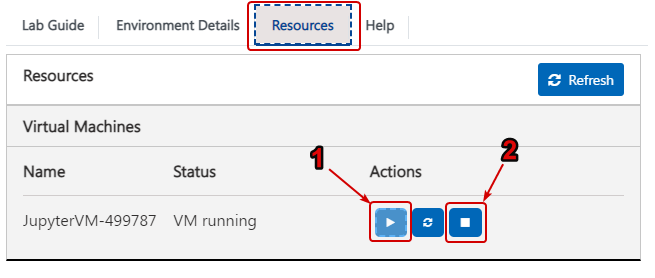
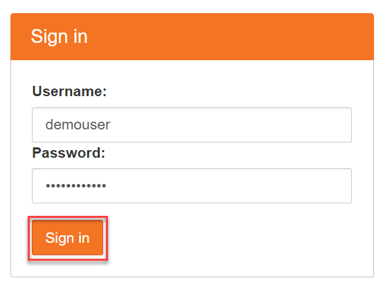
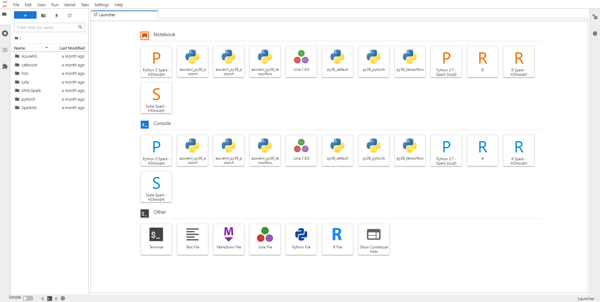

# Getting started with Data Science Lab Environment

## Overview

In this lab environment, you will access the **Ubuntu VM** which has several popular tools for Data Exploration, Analysis, Modeling & Development Pre-Installed.

### JupyterLab
JupyterLab is the latest web-based interactive development environment for notebooks, code, and data. Its flexible interface allows users to configure and arrange workflows in data science, scientific computing, computational journalism, and machine learning. A modular design invites extensions to expand and enrich functionality.

### Jupyter Notebook
The Jupyter Notebook is the original web application for creating and sharing computational documents. It offers a simple, streamlined, document-centric experience.

After completing this, you will learn how to:

- Log in to JupyterLab Portal
- Execute Notebooks

## Instructions

### Getting started with the Lab environment

1. Once the environment is provisioned, an SSH session to the Linux virtual machine and lab guide will get loaded in your browser tab. 
   
   

2. To get the lab environment details, you can select the **Environment Details** tab. Additionally, the credentials will also be sent to your email address provided during registration.

   
   
3. You can also open the Lab Guide on a separate full window by selecting the **Split Window** button on the bottom right corner.

   

4. You can **start(1)** or **stop(2)** the Virtual Machine from the **Resources** tab.

   
   
   
## Task 1: Log in to JupyterLab Portal

1. Let us start by logging into the JupyterLab Portal to check the resources deployed for the lab environment. Copy and paste the link below into a new tab in your browser.

   <inject key="Jupyter Lab Environment" enableCopy="true" />

1. On the page, you will see the warning Your connection isn't private, you can proceed by clicking on **Advanced** and then proceed to the URL mentioned.

   

1. On the page that loads up, enter the following username, password and click on **Sign in**. 

   * Username: <inject key="Jupyter Lab Username"></inject>

   * Password: <inject key="Jupyter Lab Password"></inject>

   

1. First-time users will be prompted **Server not running**, click on **Launch Server** and wait for 1-2 minutes for the server to start up.

1. Once the Jupyter Lab loads up, you will see the File System on the left and Launcher on the right. There are a lot of samples loaded up for the various technologies.

   

## Task 2: Execute Notebooks

Here, When training neural networks, the most frequently used algorithm is back propagation. In this algorithm, parameters (model weights) are adjusted according to the gradient of the loss function with respect to the given parameter.To compute those gradients, PyTorch has a built-in differentiation engine called torch.autograd. It supports automatic computation of gradient for any computational graph. 

1. In the Jupyter lab, in the left pane, select to **Pytorch** folder and double-click on it to open.

   

1. Inside the Pytorch folder, select the **Beginner** folder and double-click on it to open and select the **Basics** folder inside it.

   
   
   

1. In the **Basics** folder, Select **autograd_tutorial.html** file and double-click to open it on the right side of the Jupyter lab portal. In this file you will learn about:
   - Torch.Autograd
   - Tensors, Functions and Computational graph
   - Computing Gradients
   - Disabling Gradient Tracking
   - More on Computational Graphs
   - Optional Reading: Tensor Gradients and Jacobian Products

   

1. Execute each cell one at a time by clicking on it and selecting the execute button.

   

## Summary

In this exercise, you have signed in to the JupyterLab Portal and learned how to use Notebook to run the code and get the desired results.
