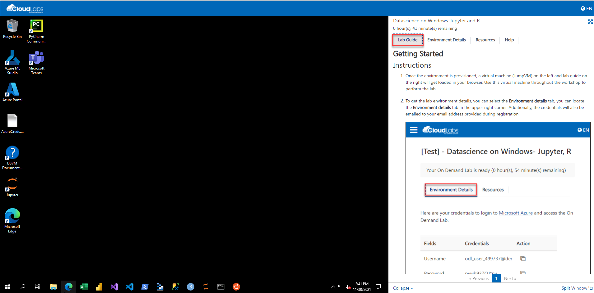
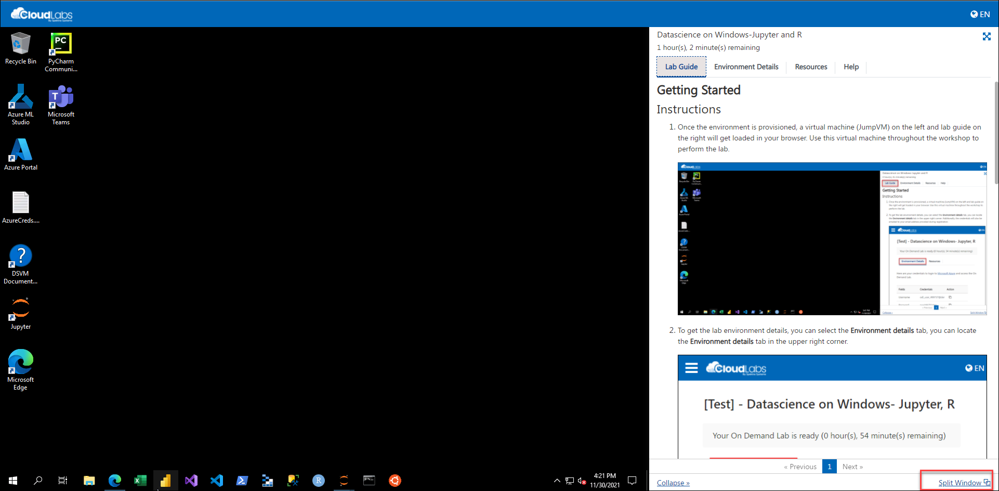

# Getting started with Datascience

## Overview

In this lab environment, you will be able to access the windows VM which has several popular tools for data exploration, analysis, modeling & development pre-installed.

## Instructions

1. Once the environment is provisioned, a virtual machine (JumpVM) on the left and lab guide on the right will get loaded in your browser. Use this virtual machine throughout the workshop to perform the lab.

   

2. To get the lab environment details, you can select the **Environment details** tab, you can locate the **Environment details** tab in the upper right corner.
   
   

3. You can also open the Lab Guide on a separate full window by selecting the **Split Window** button on the bottom right corner.
   
   
 
4. You can **start(1)** or **stop(2)** the Virtual Machine from the **Resources** tab.

   
   
## Access the JupyterLab Application

1. In the virtual machine, double click on the **Jupyter** icon on the desktop to start the Jupyter Notebook.

2. This will open up a command prompt and a browser will automatically load and navigate you to the JupyterLab application.

   
   
3. Once the Jupyter Lab loads up, you will see the File System on the left and Launcher on the right. 

   

4. Navigate to the /notebooks directory for example notebooks that are pre-packaged. There are a lot of samples loaded up for the various technologies. You can navigate through the notebooks and perform any exercise with the environment.
   
 ## Summary
 
 In this environment, you have accessed the JupyterLab application and reviewed the environment.

   

