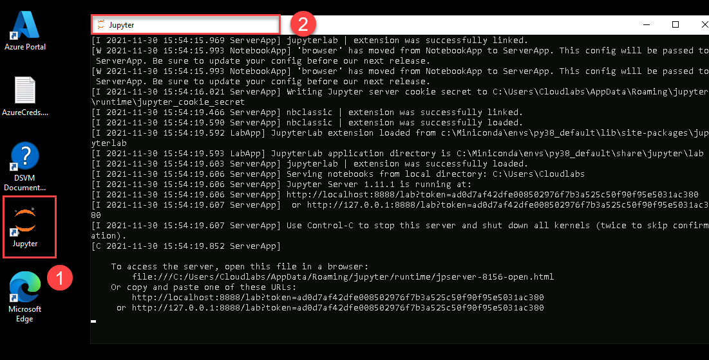
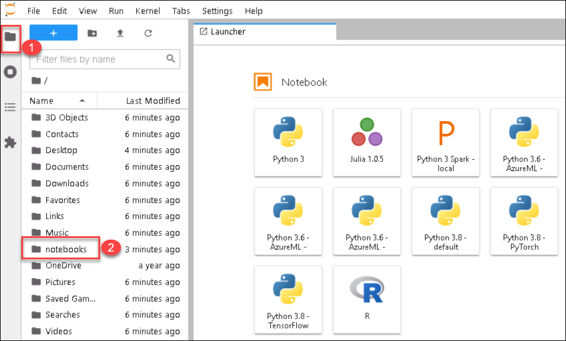

# Getting started with Data Science on AWS

## Overview

In this lab environment, you will access the Windows Data Science VM which has several popular tools for data exploration, analysis, modeling & development pre-installed.

This Windows VM is preinstalled with a collection of tools commonly used for data analytics and machine learning.

The VM image makes it easy to get started doing data science in minutes, without having to install and configure each of the tools individually. You can easily stop it when it's not in use. The DSVM resource is both elastic and cost-efficient.

### JupyterLab
JupyterLab is the latest web-based interactive development environment for notebooks, code, and data. Its flexible interface allows users to configure and arrange workflows in data science, scientific computing, computational journalism, and machine learning. A modular design invites extensions to expand and enrich functionality.

### Jupyter Notebook
The Jupyter Notebook is the original web application for creating and sharing computational documents. It offers a simple, streamlined, document-centric experience.

After completing this lab, you will learn how to:

- Log in to JupyterLab Portal
- Execute Notebooks
- Verify the notebook execution output

## Instructions

1. Once the environment is provisioned, a virtual machine (JumpVM) on the left and lab guide on the right will get loaded in your browser. Use this virtual machine throughout the workshop to perform the lab.

   

2. To get the lab environment details, you can select the **Environment details** tab, you can locate the **Environment details** tab in the upper right corner.
   
   

3. You can also open the Lab Guide on a separate full window by selecting the **Split Window** button on the bottom right corner.
   
   
 
4. You can **start(1)** or **stop(2)** the Virtual Machine from the **Resources** tab.

   
   
## Access the JupyterLab Application

1. In the virtual machine, double click on the **Jupyter** icon on the desktop to start the Jupyter Notebook.

2. This will open up a command prompt and a browser will automatically load and navigate you to the JupyterLab application.

   
   
3. Once the Jupyter Lab loads up, you will see the File System on the left and **Launcher** on the right. 

   
   
4. Navigate to the **/notebooks** directory which has a lot of sample notebooks loaded up for the various technologies and are pre-provisioned within the lab environment.

   
   
  
 ## Summary
 
 In this lab environment, you have accessed the JupyterLab application and explored many notebooks.

   

