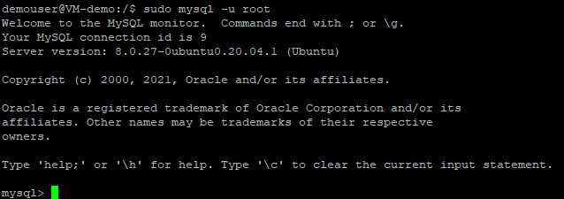
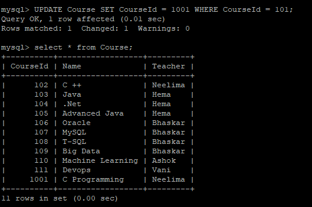

# Exercise 1: MYSQL Learning


## Database: A database is merely a structured collection of data.
The data relating to each other by nature. Therefore, we use the term relational database.
A table contains columns and rows. It is like a spreadsheet.
A table may relate to another table using a relationship, e.g., one-to-one and one-to-many relationships.

## SQL(structured query language) – the language of the relational database
SQL is the standardized language used to access the database. ANSI/SQL defines the SQL standard.
SQL contains three parts:
   - **Data definition language** includes statements that help you define the database and its objects, e.g., tables, views, triggers, stored procedures, etc.
   - **Data manipulation language** contains statements that allow you to update and query data.
   - **Data control language** allows you to grant the permissions to a user to access specific data in the database.

## MySQL

The daughter’s name of the MySQL’s co-founder is **Monty Widenius**. The name of MySQL is the combination of My and SQL, MySQL.

MySQL is a database management system that allows you to manage relational databases. It is open source software backed by Oracle. It means you can use MySQL without paying a dime. Also, if you want, you can change its source code to suit your needs. Even though MySQL is open source software, you can buy a commercial license version from Oracle to get premium support services. MySQL is pretty easy to master in comparison with other database software like Oracle Database, or Microsoft SQL Server.


### Task 1: Connect to MySQL server(In Ubuntu VM)

A database is a separate application that stores a collection of data. Each database has one or more distinct APIs for creating, accessing, managing, searching and replicating the data it holds. Nowadays, we use relational database management systems (RDBMS) to store and manage huge volume of data. This is called relational database because all the data is stored into different tables and relations are established using primary keys or other keys known as Foreign Keys.

1. To connect to the MySQL Server, use this command:

   ```
     sudo mysql -u root
   ```
   
   
1. The following command will be prompted if you successfully connected to the MySQL server:

   `mysql>`

1. Use the SHOW DATABASES to display all databases in the current server. The output for the above command will be shown as below:
    
    ```
    show databases;
    ```
    
    
1. Use the following commands for creating a sample database **demo** and we will be using it in further steps of this task.
    ```
    CREATE DATABASE demo;
    ```
   The following message will be prompted after running the above command successfully.
   
   `Query OK, 1 row affected (0.02 sec)`
   
1. Run the following command for using the database **demo** which we created in the above step. After running the command you will be prompted with a message saying **Database changed**.
   
   ```
   USE demo;
   ```
1. **DROP DATABASE** command is used for deleting the databases in MySQL. After running the following command the database **demo** which we created at the step 6 will be deleted. The query will resuls with a message saying **Query OK, 0 rows affected (0.03 sec)**.
   
   ```
   DROP DATABASE demo;
   ```

### Task 2: CRUD(Create, Read, Update and Delete) operations in MySQL

MySQL provides a set of some basic but most essential operations that will help you to easily interact with the MySQL database and these operations are known as CRUD operations. 
Let us start with the understanding of CRUD operations in SQL with the help of examples. We will be writing all the queries in the supporting examples using the MySQL database.

1. Run the below commands to create a new database named **sample** and creating a table using **CREATE TABLE** command inside the **sample** database.
   
   ```
   CREATE DATABASE sample;
   USE sample;
   CREATE TABLE sample_table ( id smallint unsigned not null auto_increment, name varchar(20) not null, constraint pk_example primary key (id) );
   ```
   
   
1. **INSERT INTO** command is used for adding the data to the table which we created in the above step. The below command will add the data to the **sample_table**.
   
   ```
   INSERT INTO sample_table ( id, name ) VALUES ( 1, 'Sample data1' );
   INSERT INTO sample_table ( id, name ) VALUES ( 2, 'Sample data2' );
   INSERT INTO sample_table ( id, name ) VALUES ( 3, 'Sample data3' );
   ```
   
   
1. In order to view the data created inside the **sample_table**, run the following command and you will be prompted with a table with two fields **id** and **name**.
   
   ```
   SELECT * FROM sample_table;
   ```
   
   
1. With the below command we are only selecting the **name** field from the above table.
   
   ```
   SELECT name FROM sample_table;
   ```
   
   
1. To update values in the multiple columns of the table, you need to specify the assignments in the SET clause. For example, the following statement updates data in **name** field with **id=2**.
   
   ```
    UPDATE sample_table SET name = 'Hill' WHERE id = 2;
   ```
   
   
   Run the below command to view the changes to the table after running update command.
    
    ```
     SELECT * FROM sample_table;
    ```
    
    
1. To delete the data inside the above table, we are using **DELETE FROM** command with **WHERE** clause to delete the specific row of data inside the table.
   
   ```
   DELETE FROM sample_table WHERE id=3;
   ```
   Run the below command to view the changes to the table after running **DELETE FROM** command.The above command will delete the data with id=3.
    ```
     SELECT * FROM sample_table;
    ```
    
    
1. **DROP TABLE** command is used to delete the complete table inside database. you will be prompted with a `Query OK, 0 rows affected (0.30 sec)` message after running the following command.
   
   ```
    DROP TABLE sample_table;
    ```
### Task 3: Clauses in MySQL

Clause is defined as a set of rules, that makes to understand the concepts of MySQL command in Database.

1. Create a new table **course** and insert the different values to the table. We will use this table in further steps for learning the clauses in MYSQL.
   
   ```
   CREATE TABLE Course
   (
    CourseId INT PRIMARY KEY,
    Name NVARCHAR(50) NOT NULL,
    Teacher NVARCHAR(256) NOT NULL
   );
   ```
   ```
   INSERT INTO Course ( CourseId, Name, Teacher ) VALUES ( 101, 'C Programming', 'Neelima' );
   INSERT INTO Course ( CourseId, Name, Teacher ) VALUES ( 102, 'C ++', 'Neelima' );
   INSERT INTO Course ( CourseId, Name, Teacher ) VALUES ( 103, 'Java', 'Hema' );
   INSERT INTO Course ( CourseId, Name, Teacher ) VALUES ( 104, '.Net', 'Hema' );
   INSERT INTO Course ( CourseId, Name, Teacher ) VALUES ( 105, 'Advanced Java', 'Hema' );
   INSERT INTO Course ( CourseId, Name, Teacher ) VALUES ( 106, 'Oracle', 'Bhaskar' );
   INSERT INTO Course ( CourseId, Name, Teacher ) VALUES ( 107, 'MySQL', 'Bhaskar' );
   INSERT INTO Course ( CourseId, Name, Teacher ) VALUES ( 108, 'T-SQL', 'Bhaskar' );
   INSERT INTO Course ( CourseId, Name, Teacher ) VALUES ( 109, 'Big Data', 'Bhaskar' );
   INSERT INTO Course ( CourseId, Name, Teacher ) VALUES ( 110, 'Machine Learning', 'Ashok' );
   INSERT INTO Course ( CourseId, Name, Teacher ) VALUES ( 111, 'Devops', 'Vani' );
   ```
1. In the below query we have used **select**, **from**, **where** clauses. Select clauses is used to mention the required fields from the table(s). In **from** clause, source table(s) will be mentioned from where data is going to be fetched. **Where** clause is used to restrict the data while fetching data from source table(s)(the table mentioned in the from clause) based on the field.
 
   ```
   SELECT Name, Teacher FROM Course WHERE Teacher='Hema';
   ```
   
   
1. The following clause **GROUP BY** is used to aggregate the data from the **Course** table.
   
   ```
   SELECT count(CourseId) N_subjects, Teacher FROM Course GROUP BY Teacher;
   ```
   
   
1. **HAVING** clause is used to restrict the data upon data aggregation(along with GROUP BY).
   > Note: **HAVING** clause works only with the **GROUP BY** clause.
  
    ```
    SELECT count(CourseId) N_subjects, Teacher FROM Course GROUP BY Teacher HAVING count(CourseId) > 1;
    ```
    
    
1. **ORDER By** clause is used to order the data based on the required field from the source table.

   ```
   SELECT Name, Teacher, CourseId FROM Course ORDER BY Teacher;
   ```
   
   
1. Below is the query with all the clauses.
   
   ```
   SELECT count(CourseId) N_subjects, Teacher FROM Course WHERE Teacher != 'Hema' GROUP BY Teacher HAVING count(CourseId) > 1 ORDER BY Teacher;
   ```
   

### Task 4: Update, Delete and Replace commands in MySQL


1. **Update** command is used to update the data in the table. The following query replaces course ID 101 with 1001 inside **Course** table.
   
   ```
   UPDATE Course SET CourseId = 1001 WHERE CourseId = 101;
   ```
   
   
1. Replace command is used to replace all occurrences of a substring within a string, with a new substring. The following query replaces the Name Bhaskar with John.
   
   ```
   SELECT CourseId, Name, Teacher, REPLACE (Teacher, 'Bhaskar', 'John') Teacher_New FROM Course;
   ```
   
   
1. Delete statement is used to delete the records based on the given condition from the table. The below command deletes the Teacher Neelima from course table.

   ```
   DELETE FROM Course WHERE Teacher = 'Neelima';
   ```
   

### Task 5: Joins in MySQL

