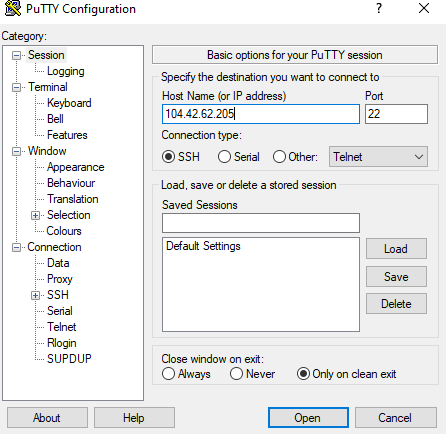
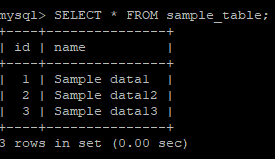
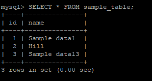

# Exercise 1: MYSQL Learning


## Database: A database is merely a structured collection of data.

Data is a collection of a distinct small unit of information. It can be used in a variety of forms like text, numbers, media, bytes, etc. it can be stored in pieces of paper or electronic memory, etc.

A database is an organized collection of data, so that it can be easily accessed and managed. You can organize data into tables, rows, columns, and index it to make it easier to find relevant information.


## SQL(structured query language) – the language of the relational database
SQL or Structured Query Language is used to operate on the data stored in a database. SQL depends on relational algebra and tuple relational calculus.
SQL contains three parts:
   - **Data definition language** DDL is abbreviation of Data Definition Language. It is used to create, modify and destroy the structure of database objects in database.
   - **Data manipulation language** DML is abbreviation of Data Manipulation Language. It is used to retrieve, modify, add, and delete data in database.
   - **Data control language** DCL is abbreviation of Data Control Language. It is used to create roles, permissions, and referential integrity as well it is used to control access to database by securing it.
   - **Transaction Control Language** TCL is abbreviation of Transactional Control Language. It is used to manage different transactions occurring within a database.


## MySQL

MySQL is a relational database management system (RDBMS) developed by Oracle that is based on structured query language (SQL). It stores that information in separate “tables” and connects it with “keys”, which is why it’s relational. When your Website needs to access the information, it sends a request to the MySQL database server using SQL (this is the client-server model). MySQL uses something called the client-server model. The server part is where your data actually resides. In order to access this data, you need to request it. That’s where the client comes in. Using SQL programming language we mentioned earlier, the client sends a request to the database server for the data that the client needs.


### Task 1: Connect to MySQL server(In Ubuntu VM)

A database is a separate application that stores a collection of data. Each database has one or more distinct APIs for creating, accessing, managing, searching and replicating the data it holds. Nowadays, we use relational database management systems (RDBMS) to store and manage huge volume of data. This is called relational database because all the data is stored into different tables and relations are established using primary keys or other keys known as Foreign Keys.

1. Copy the IP address from Environment details page. Add **Host Name/IP address** and click on **open** to connect to Linux virtual machine from putty.

1. Search **Putty** inside the Jump VM by searching in the windows search bar.

1. Add **Host Name/IP address** and click on **open** to connect to Linux virtual machine from putty.

   

1. Enter the following query to connect to the MySQL Server from putty.

   ```
   sudo mysql -u root
   ```
   
   
1. The following command will be prompted if you successfully connected to the MySQL server:

   `mysql>`

1. Enter the below query in putty and click **Enter** to view all databases in the current server. The output for the following command will be simlar to below screenshot.
    
    ```
    show databases;
    ```
    
    
1. Create a sample database named **demo** using the following query. We will be using it in further steps of this task.
    ```
    CREATE DATABASE demo;
    ```
   An Output message will be prompted  as shown below after running the above command successfully which says `Query OK, 1 row affected (0.02 sec)`.
   
   
   
1. Run the below query for using the database **demo** which we created in the previous step. After running the command you will be prompted with a message saying **Database changed**.
   
   ```
   USE demo;
   ```
   
   
1. The database **demo** which we created at the step 7 will be deleted after running the following query. The query will give an output message which says **Query OK, 0 rows affected (0.03 sec)**. **DROP DATABASE** command is used for deleting the databases in MySQL. 
   
   ```
   DROP DATABASE demo;
   ```
   

### Task 2: CRUD(Create, Read, Update and Delete) operations in MySQL

MySQL provides a set of some basic but most essential operations that will help you to easily interact with the MySQL database and these operations are known as CRUD operations. 
Let us start with the understanding of CRUD operations in SQL with the help of examples. We will be writing all the queries in the supporting examples using the MySQL database.

1. Run the below commands to create a new database named **sample** and creating a table using **CREATE TABLE** command inside the **sample** database.
   
   ```
   CREATE DATABASE sample;
   USE sample;
   CREATE TABLE sample_table ( id smallint unsigned not null auto_increment, name varchar(20) not null, constraint pk_example primary key (id) );
   ```
   
   
1. **INSERT INTO** command is used for adding the data to the table which we created in the above step. The below command will add the data to the **sample_table**.
   
   ```
   INSERT INTO sample_table ( id, name ) VALUES ( 1, 'Sample data1' );
   INSERT INTO sample_table ( id, name ) VALUES ( 2, 'Sample data2' );
   INSERT INTO sample_table ( id, name ) VALUES ( 3, 'Sample data3' );
   ```
   
   
1. In order to view the data created inside the **sample_table**, run the following command and you will be prompted with a table with two fields **id** and **name**.
   
   ```
   SELECT * FROM sample_table;
   ```
   
   
1. With the below command we are only selecting the **name** field from the above table.
   
   ```
   SELECT name FROM sample_table;
   ```
   
   
1. To update values in the multiple columns of the table, you need to specify the assignments in the SET clause. For example, the following statement updates data in **name** field with **id=2**.
   
   ```
    UPDATE sample_table SET name = 'Hill' WHERE id = 2;
   ```
   
   
   Run the below command to view the changes to the table after running update command.
    
    ```
     SELECT * FROM sample_table;
    ```
    
    
1. To delete the data inside the above table, we are using **DELETE FROM** command with **WHERE** clause to delete the specific row of data inside the table.
   
   ```
   DELETE FROM sample_table WHERE id=3;
   ```
   Run the below command to view the changes to the table after running **DELETE FROM** command.The above command will delete the data with id=3.
    ```
     SELECT * FROM sample_table;
    ```
    
    
1. **DROP TABLE** command is used to delete the complete table inside database. you will be prompted with a `Query OK, 0 rows affected (0.30 sec)` message after running the following command.
   
   ```
    DROP TABLE sample_table;
    ```
### Task 3: Clauses in MySQL

Clause is defined as a set of rules, that makes to understand the concepts of MySQL command in Database.

1. Create a new table **course** and insert the different values to the table. We will use this table in further steps for learning the clauses in MYSQL.
   
   ```
   CREATE TABLE Course
   (
    CourseId INT PRIMARY KEY,
    Name NVARCHAR(50) NOT NULL,
    Teacher NVARCHAR(256) NOT NULL
   );
   ```
   ```
   INSERT INTO Course ( CourseId, Name, Teacher ) VALUES ( 101, 'C Programming', 'Neelima' );
   INSERT INTO Course ( CourseId, Name, Teacher ) VALUES ( 102, 'C ++', 'Neelima' );
   INSERT INTO Course ( CourseId, Name, Teacher ) VALUES ( 103, 'Java', 'Hema' );
   INSERT INTO Course ( CourseId, Name, Teacher ) VALUES ( 104, '.Net', 'Hema' );
   INSERT INTO Course ( CourseId, Name, Teacher ) VALUES ( 105, 'Advanced Java', 'Hema' );
   INSERT INTO Course ( CourseId, Name, Teacher ) VALUES ( 106, 'Oracle', 'Bhaskar' );
   INSERT INTO Course ( CourseId, Name, Teacher ) VALUES ( 107, 'MySQL', 'Bhaskar' );
   INSERT INTO Course ( CourseId, Name, Teacher ) VALUES ( 108, 'T-SQL', 'Bhaskar' );
   INSERT INTO Course ( CourseId, Name, Teacher ) VALUES ( 109, 'Big Data', 'Bhaskar' );
   INSERT INTO Course ( CourseId, Name, Teacher ) VALUES ( 110, 'Machine Learning', 'Ashok' );
   INSERT INTO Course ( CourseId, Name, Teacher ) VALUES ( 111, 'Devops', 'Vani' );
   ```
1. In the below query we have used **select**, **from**, **where** clauses. Select clauses is used to mention the required fields from the table(s). In **from** clause, source table(s) will be mentioned from where data is going to be fetched. **Where** clause is used to restrict the data while fetching data from source table(s)(the table mentioned in the from clause) based on the field.
 
   ```
   SELECT Name, Teacher FROM Course WHERE Teacher='Hema';
   ```
   
   
1. The following clause **GROUP BY** is used to aggregate the data from the **Course** table.
   
   ```
   SELECT count(CourseId) N_subjects, Teacher FROM Course GROUP BY Teacher;
   ```
   
   
1. **HAVING** clause is used to restrict the data upon data aggregation(along with GROUP BY).
   > Note: **HAVING** clause works only with the **GROUP BY** clause.
  
    ```
    SELECT count(CourseId) N_subjects, Teacher FROM Course GROUP BY Teacher HAVING count(CourseId) > 1;
    ```
    
    
1. **ORDER By** clause is used to order the data based on the required field from the source table.

   ```
   SELECT Name, Teacher, CourseId FROM Course ORDER BY Teacher;
   ```
   
   
1. Below is the query with all the clauses.
   
   ```
   SELECT count(CourseId) N_subjects, Teacher FROM Course WHERE Teacher != 'Hema' GROUP BY Teacher HAVING count(CourseId) > 1 ORDER BY Teacher;
   ```
   

### Task 4: Update, Delete and Replace commands in MySQL


1. **Update** command is used to update the data in the table. The following query replaces course ID 101 with 1001 inside **Course** table.
   
   ```
   UPDATE Course SET CourseId = 1001 WHERE CourseId = 101;
   ```
   
   
1. Replace command is used to replace all occurrences of a substring within a string, with a new substring. The following query replaces the Name Bhaskar with John.
   
   ```
   SELECT CourseId, Name, Teacher, REPLACE (Teacher, 'Bhaskar', 'John') Teacher_New FROM Course;
   ```
   
   
1. Delete statement is used to delete the records based on the given condition from the table. The below command deletes the Teacher Neelima from course table.

   ```
   DELETE FROM Course WHERE Teacher = 'Neelima';
   ```
   

### Task 5: Joins in MySQL

MySQL JOINS are used to retrieve data from multiple tables. A MySQL JOIN is performed whenever two or more tables are joined in a SQL statement. There are different types of MySQL joins:

   - MySQL INNER JOIN (or sometimes called simple join)
   - MySQL LEFT OUTER JOIN (or sometimes called LEFT JOIN)
   - MySQL RIGHT OUTER JOIN (or sometimes called RIGHT JOIN)
    
1. We need two tables for performing the actions in MySQL using Joins. Let us create one more table named **Qualification** and add the data to the table.
   
   ```
   CREATE TABLE Qualification
   (
    Qualification Varchar(20),
    Teacher_Name VARCHAR(50) PRIMARY KEY,
    Year_of_Passed DATE 
   );
   ```
   ```
   INSERT INTO Qualification( Qualification, Teacher_Name, Year_of_Passed ) VALUES ( 'MCA', 'Neelima', '2015-04-30' );
   INSERT INTO Qualification( Qualification, Teacher_Name, Year_of_Passed ) VALUES ( 'BCA', 'Hema', '2012-06-30' );
   INSERT INTO Qualification( Qualification, Teacher_Name, Year_of_Passed ) VALUES ( 'MCA', 'Bhaskar', '2012-04-10' );
   INSERT INTO Qualification( Qualification, Teacher_Name, Year_of_Passed ) VALUES ( 'PHD', 'John', '2019-01-04' );
   INSERT INTO Qualification( Qualification, Teacher_Name, Year_of_Passed ) VALUES ( 'MCA', 'Vani', '2017-04-30' );
   INSERT INTO Qualification( Qualification, Teacher_Name, Year_of_Passed ) VALUES ( 'MSC', 'Ashok', '2014-07-30' );
   ```
1. Inner join is used to join both the tables. Data qualified only when the data exist in both the tables.(Based on the given fields). Run the following query to perform **INNER JOIN** operation on the tables **Course** and **Qualification**.
   > Note: In general, primary key fields will be used to join the tables.
   ```
   SELECT CourseId, Name, Teacher, Qualification, Year_of_Passed FROM Course A INNER JOIN Qualification B on A.Teacher  = B.Teacher_Name;
   ```
   
   
1. Run the below query and observe the **Left outer join** operation. Left outer join is used to qualify all the records from the left table(Course) and only matched records from the right table(Qualification).
   ```
   SELECT CourseId, Name, Teacher, Qualification, Year_of_Passed FROM Course A LEFT OUTER JOIN Qualification B on A.Teacher  = B.Teacher_Name;
   ```
   
   
1. **Right outer join** is used to qualify all the records from the Right table(Qualification) and only matched records from the left table(Course).
   
   ```
   SELECT CourseId, Name, Teacher, Qualification, Year_of_Passed FROM Course A RIGHT OUTER JOIN Qualification B on A.Teacher  = B.Teacher_Name;
   ```
   
