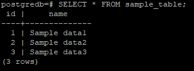
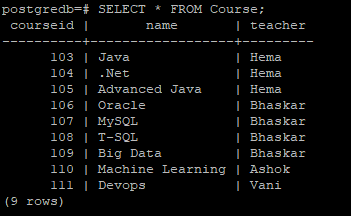

# Exercise 2: PostgreSQL Learning


## Database: A database is merely a structured collection of data.
Each POSTGRESQL server controls access to a number of databases. Databases are storage areas used by the server to partition information.

## PostgreSQL – POSTGRESQL is the most advanced open source database server.

PostgreSQL is a powerful, open source object-relational database system. It has more than 15 years of active development and a proven architecture that has earned it a strong reputation for reliability, data integrity, and correctness. PostgreSQL runs on all major operating systems, including Linux, UNIX (AIX, BSD, HP-UX, SGI IRIX, Mac OS X, Solaris, Tru64), and Windows.

## PostgreSQL

### Task 1:

1. Run the following queries in putty to connect to the PostgreSQL Server which has been isntalled inside the Jump VM.

   ```
   sudo su postgres
   psql
   ```
   
   
1. The following command will be prompted on screen if you successfully connected to the MySQL server

   `postgres=#`

1. Enter **\l** to display all defualt databases in the current server. The output for the below command will be similar to below screenshot.
    
    ```
    \l
    ```
    
    
1. Run the following commands for creating a sample database **postgredb**. We will be using this database in further steps of this task.

    ```
    CREATE DATABASE postgredb;
    ```
    
   
1. Run the following command for using the database **postgredb** which we created in the above step. After running the command you will be prompted with a message saying **You are now connected to database "postgredb" as user "postgres"**.
   
   ```
   \c postgredb
   ```
   
   
1. **DROP DATABASE** command is used for deleting the databases in PostgreSQL. We are not dropping the database now as we will be using it in further tasks.


### Task 2: Table creation and Insert commands

1. Run the below commands to create a table using **CREATE TABLE** command inside the **postgredb** database.
   
   ```
   CREATE TABLE sample_table(id int, name varchar(15));
   ```
   
   
1. **INSERT INTO** command is used for adding the data to the table which we created in the above step. The below command will add the data to the **sample_table**.
   
   ```
   INSERT INTO sample_table ( id, name ) VALUES ( 1, 'Sample data1' );
   INSERT INTO sample_table ( id, name ) VALUES ( 2, 'Sample data2' );
   INSERT INTO sample_table ( id, name ) VALUES ( 3, 'Sample data3' );
   ```
   
   
1. In order to view the data created inside the **sample_table**, run the following command and you will be prompted with a table with two fields **id** and **name**.
   
   ```
   SELECT * FROM sample_table;
   ```
   
   
1. With the below command we are only selecting the **name** field from the above table.
   
   ```
   SELECT name FROM sample_table;
   ```
   
   
1. To update values in the multiple columns of the table, you need to specify the assignments in the SET clause. For example, the following statement updates data in **name** field with **id=2**.
   
   ```
   UPDATE sample_table SET name = 'Hill' WHERE id = 2;
   ```
   
   
   Run the below command to view the changes to the table after running update command.
    
    ```
    SELECT * FROM sample_table;
    ```
    
    
1. To delete the data inside the above table, we are using **DELETE FROM** command with **WHERE** clause to delete the specific row of data inside the table.
   
   ```
   DELETE FROM sample_table WHERE id=3;
   ```
   
   
   Run the below command to view the changes to the table after running **DELETE FROM** command.The above command will delete the data with id=3.
    ```
    SELECT * FROM sample_table;
    ```
    
    
1. **DROP TABLE** command is used to delete the complete table inside database. you will be prompted with a `DROP TABLE` message after running the following command.
   
    ```
    DROP TABLE sample_table;
    ```
    
    
### Task 3: Clauses in PostgreSQL

Clause is defined as a set of rules, that makes to understand the concepts of PostgreSQL command in Database.

1. Create a new table **course** and insert the different values to the table. We will use this table in further steps for learning the clauses in MYSQL.
   
   ```
   CREATE TABLE Course
   (
   CourseId INT PRIMARY KEY,
   Name VARCHAR(50),
   Teacher VARCHAR(256)
   );
   ```
   ```
   INSERT INTO Course ( CourseId, Name, Teacher ) VALUES ( 101, 'C Programming', 'Neelima' );
   INSERT INTO Course ( CourseId, Name, Teacher ) VALUES ( 102, 'C ++', 'Neelima' );
   INSERT INTO Course ( CourseId, Name, Teacher ) VALUES ( 103, 'Java', 'Hema' );
   INSERT INTO Course ( CourseId, Name, Teacher ) VALUES ( 104, '.Net', 'Hema' );
   INSERT INTO Course ( CourseId, Name, Teacher ) VALUES ( 105, 'Advanced Java', 'Hema' );
   INSERT INTO Course ( CourseId, Name, Teacher ) VALUES ( 106, 'Oracle', 'Bhaskar' );
   INSERT INTO Course ( CourseId, Name, Teacher ) VALUES ( 107, 'MySQL', 'Bhaskar' );
   INSERT INTO Course ( CourseId, Name, Teacher ) VALUES ( 108, 'T-SQL', 'Bhaskar' );
   INSERT INTO Course ( CourseId, Name, Teacher ) VALUES ( 109, 'Big Data', 'Bhaskar' );
   INSERT INTO Course ( CourseId, Name, Teacher ) VALUES ( 110, 'Machine Learning', 'Ashok' );
   INSERT INTO Course ( CourseId, Name, Teacher ) VALUES ( 111, 'Devops', 'Vani' );
   ```
   Run the following query to check the created table **Course**.
   
   ```
   SELECT * FROM Course;
   ```
   
   
   
1. In the below query we have used **Select**, **From**, **Where** clauses. Select clauses is used to mention the required fields from the table. In **From** clause, source table will be mentioned from where data is going to be fetched. **Where** clause is used to restrict the data while fetching data from source table (the table mentioned in the from clause) based on the field.
 
   ```
   SELECT Name, Teacher FROM Course WHERE Teacher='Hema';
   ```
   
   
1. The following clause **GROUP BY** is used to aggregate the data from the **Course** table.
   
   ```
   SELECT count(CourseId) N_subjects, Teacher FROM Course GROUP BY Teacher;
   ```
   
   
1. **HAVING** clause is used to restrict the data upon data aggregation(along with GROUP BY).
   > Note: **HAVING** clause works only with the **GROUP BY** clause.
  
    ```
    SELECT count(CourseId) N_subjects, Teacher FROM Course GROUP BY Teacher HAVING count(CourseId) > 1;
    ```
    
    
1. **ORDER By** clause is used to order the data based on the required field from the source table.

   ```
   SELECT Name, Teacher, CourseId FROM Course ORDER BY Teacher;
   ```
   
   
1. Using **With** clause  we can create a temporary table and perform required aggregations and filters.

   ```
   With temp_course AS ( SELECT COUNT(CourseId) N, Teacher FROM Course GROUP BY Teacher)
   (SELECT * FROM temp_course WHERE N > 1);
   ```
   
   
1. Below is the query with all the clauses.
   
   ```
   SELECT count(CourseId) N_subjects, Teacher FROM Course WHERE Teacher != 'Hema' GROUP BY Teacher HAVING count(CourseId) > 1 ORDER BY Teacher;
   ```
   
   

### Task 4: Update, Delete and Replace commands in PostgreSQL

1. **Update** command is used to update the data in the table. The following query replaces course ID 101 with 1001 inside **Course** table.
   
   ```
   UPDATE Course SET CourseId = 1001 WHERE CourseId = 101;
   ```
   
   
1. **Replace** command is used to replace all occurrences of a substring within a string, with a new substring. The following query replaces the Name Bhaskar with John.
   
   ```
   SELECT CourseId, Name, Teacher, REPLACE (Teacher, 'Bhaskar', 'John') Teacher_New FROM Course;
   ```
   
   
1. Delete statement is used to delete the records based on the given condition from the table. The below command deletes the Teacher Neelima from course table.

   ```
   DELETE FROM Course WHERE Teacher = 'Neelima';
   ```
   
   
   
   

### Task 5: Joins in MySQL

PostgreSQL join is used to combine columns from one (self-join) or more tables based on the values of the common columns between related tables. The common columns are typically the primary key columns of the first table and foreign key columns of the second table.
    
1. We need two tables for performing the actions in MySQL using Joins. Let us create one more table named **Qualification** and add the data to the table.
   
   ```
   CREATE TABLE Qualification
   (
    Qualification Varchar(20),
    Teacher_Name VARCHAR(50) PRIMARY KEY,
    Year_of_Passed DATE 
   );
   ```
   ```
   INSERT INTO Qualification( Qualification, Teacher_Name, Year_of_Passed ) VALUES ( 'MCA', 'Neelima', '2015-04-30' );
   INSERT INTO Qualification( Qualification, Teacher_Name, Year_of_Passed ) VALUES ( 'BCA', 'Hema', '2012-06-30' );
   INSERT INTO Qualification( Qualification, Teacher_Name, Year_of_Passed ) VALUES ( 'MCA', 'Bhaskar', '2012-04-10' );
   INSERT INTO Qualification( Qualification, Teacher_Name, Year_of_Passed ) VALUES ( 'PHD', 'John', '2019-01-04' );
   INSERT INTO Qualification( Qualification, Teacher_Name, Year_of_Passed ) VALUES ( 'MCA', 'Vani', '2017-04-30' );
   INSERT INTO Qualification( Qualification, Teacher_Name, Year_of_Passed ) VALUES ( 'MSC', 'Ashok', '2014-07-30' );
   ```
1. Inner join is used to join both the tables. Data qualified only when the data exist in both the tables.(Based on the given fields). Run the following query to perform **INNER JOIN** operation on the tables **Course** and **Qualification**.
   > Note: In general, primary key fields will be used to join the tables.
   ```
   SELECT CourseId, Name, Teacher, Qualification, Year_of_Passed FROM Course A INNER JOIN Qualification B on A.Teacher  = B.Teacher_Name;
   ```
   
   
1. Run the below query and observe the **Left outer join** operation. Left outer join is used to qualify all the records from the left table(Course) and only matched records from the right table(Qualification).
   ```
   SELECT CourseId, Name, Teacher, Qualification, Year_of_Passed FROM Course A LEFT OUTER JOIN Qualification B on A.Teacher  = B.Teacher_Name;
   ```
   
   
1. **Right outer join** is used to qualify all the records from the Right table(Qualification) and only matched records from the left table(Course).
   
   ```
   SELECT CourseId, Name, Teacher, Qualification, Year_of_Passed FROM Course A RIGHT OUTER JOIN Qualification B on A.Teacher  = B.Teacher_Name;
   ```
   


