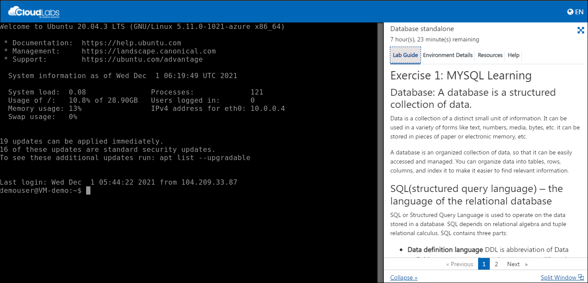
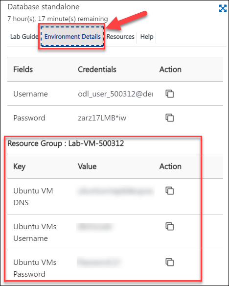
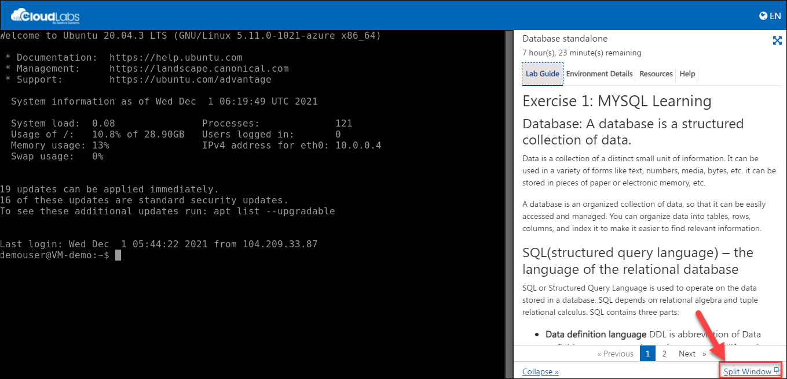
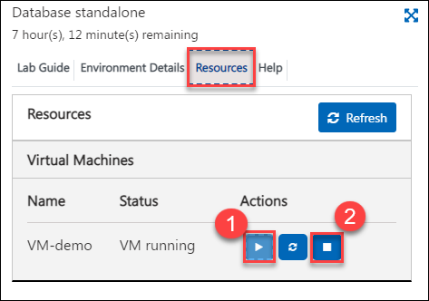

# Getting started with Database Standalone

## Overview

In this lab environment, you will be able to access the Ubuntu VM which has several popular database servers pre-installed for stroring data, Adding, modifying, deleting rows (records) and columns, Searching and filtering records and Running queries.

In this lab, we are going to learn the basic concepts of the following databases.

   - MySQL
   - PostgreSQL
   - MongoDB

## Instructions

### Getting started with the Lab environment

1. Once the environment is provisioned, an SSH session to the Linux virtual machine and lab guide will get loaded in your browser tab. 
   
   

2. To get the lab environment details, you can select the **Environment Details** tab. Additionally, the credentials will also be sent to your email address provided during registration.

   
   
3. You can also open the Lab Guide on a separate full window by selecting the **Split Window** button on the bottom right corner.

   

4. You can **start(1)** or **stop(2)** the Virtual Machine from the **Resources** tab.

   
   
## Summary

In this exercise, you have reviewed the environment.
