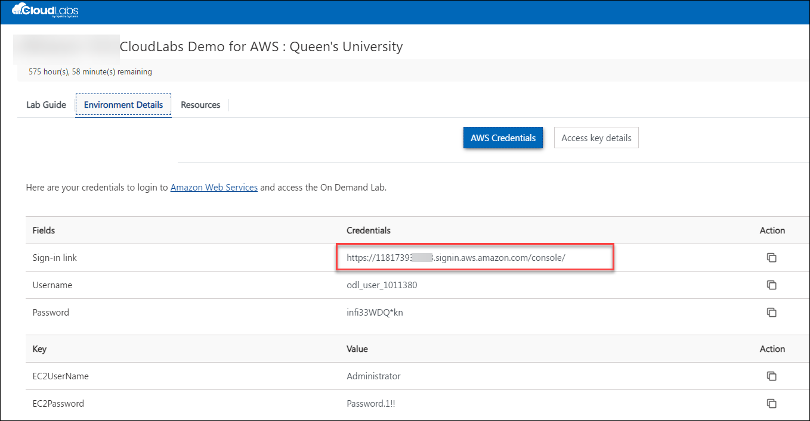
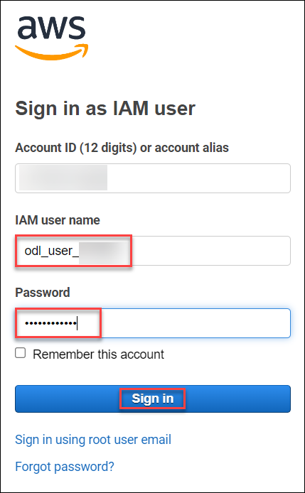
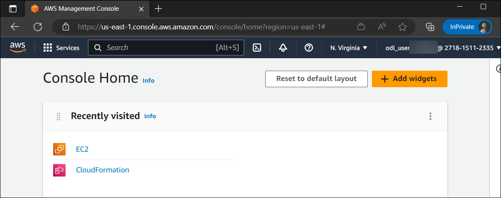
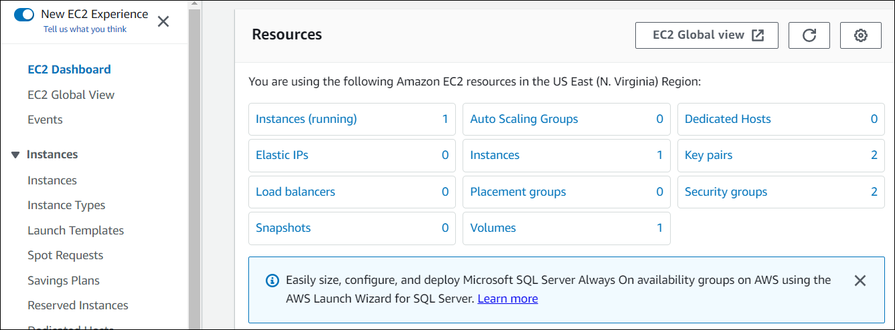
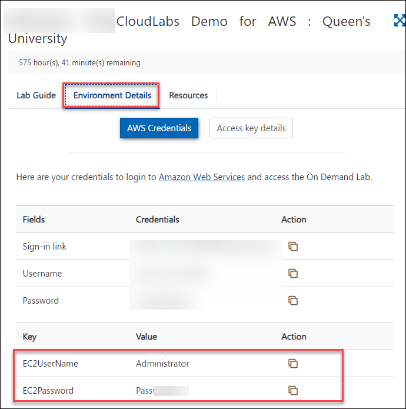
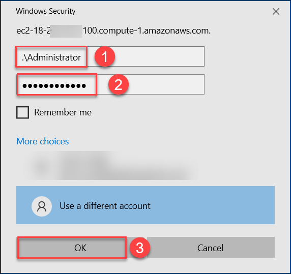
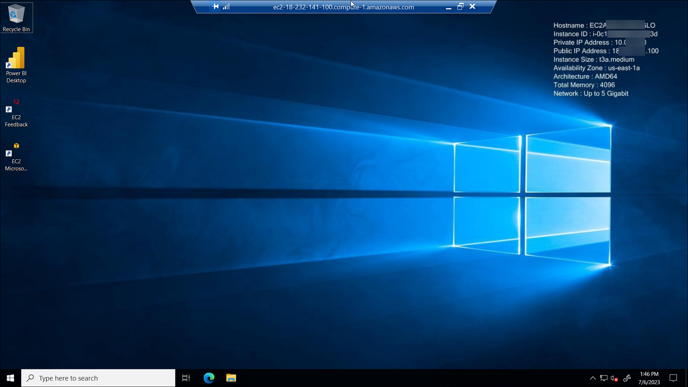

# CloudLabs Demo: Queen's University

## Overview
This lab environment has a Windows EC2 instance with a PowerBI desktop pre-deployed in AWS.

## Getting started

1. In a browser, open a new tab and sign in to the **AWS Console** using the **Sign-in link** provided in the **Environment details** tab 
   
   

2. On the **Sign in as IAM User** blade, you will see a Sign-in screen,  enter the following email/username and then click on **Sign in**.  

   * **AWS Username/Email**:  <inject key="AzureAdUserEmail"></inject> 
   * **AWS Password**:  <inject key="AzureAdUserPassword"></inject>

   **Note**: Refer to the **Environment Details** tab for any other lab details.
        
   

3. Now you will be able to view the home page of the AWS console
   
    

4. Ensure to switch to the **N.Virginia** region at the top right corner.
  
5. Search for **EC2** and click **EC2** from the Services section.

   

7. You will be navigated to the **EC2 Dashboard** page

   

8. Select **Instances(running)** from the EC2 dashboard

    

9. Select the instance that is listed within the Instances section.

    

10. Copy either the **Public IPv4 address** or **Public IPv4 DNS**. This will be required to connect to your EC2 instance

    

11. From your local computer, search for **RDP** and paste the copied **IP address or DNS** from the above step and Click on **Connect**

    

12. Provide the EC2 instance credentials as mentioned in the **Environment details** page and click on **OK**
    **Note**: Refer to the **Environment Details** tab for the credentials
    

    

14. If you get a pop-up, click on **Yes**

    

16. Now, you will be connected to the EC2 instance
    

17. Perform the tasks within the EC2 instance as required.
