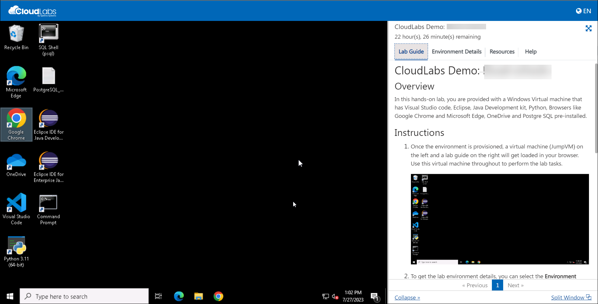

# CloudLabs Demo: Duval schools

## Overview
In this hands-on lab, you are provided with a **Windows Virtual machine** that has Visual Studio code, Eclipse, Java Development kit, Python, Browsers like Google Chrome and Microsoft Edge, OneDrive and Postgre SQL pre-installed.

## Instructions

1. Once the environment is provisioned, a **virtual machine** (JumpVM) on the left and a lab guide on the right will get loaded in your browser. Use this virtual machine throughout to perform the lab tasks.

   

2. To get the lab environment details, you can select the **Environment details** tab, you can locate the **Environment details** tab in the upper right corner.
   
   

3. You can also open the Lab Guide on a separate full window by selecting the **Split Window** button on the bottom right corner.
   
4. You can **start(1)** or **stop(2)** the Virtual Machine from the **Resources** tab. You can also monitor the uptime remaining for your VM from here.

   
    
5. You can perform the required tasks using the applications provided.

