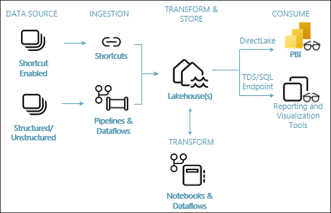
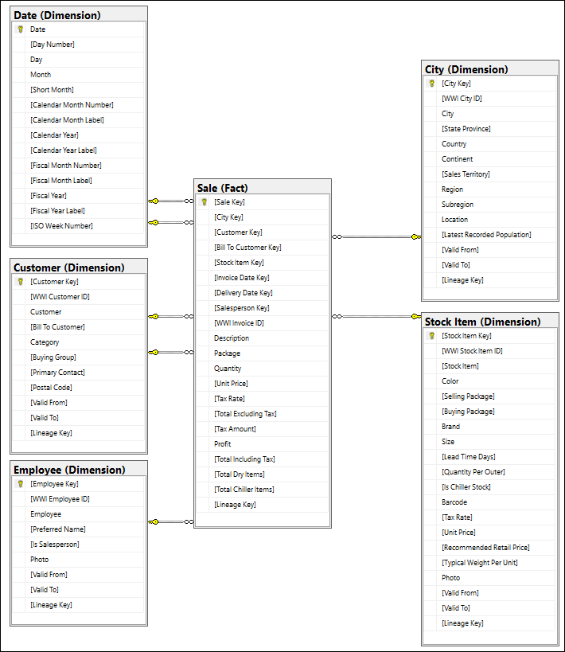
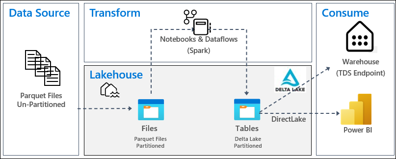
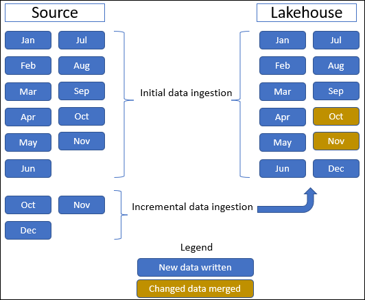

# Lakehouse end-to-end scenario

Traditionally, organizations have been building modern data warehouses for their transactional and structured data analytics needs. And data lakehouses for big data (semi/unstructured) data analytics needs. These two systems ran in parallel, creating silos, data duplication, and increased total cost of ownership.

Fabric with its unification of data store and standardization on Delta Lake format allows you to eliminate silos, remove data duplication, and drastically reduce the total cost of ownership.

With the flexibility offered by Fabric, you can implement either lakehouse or data warehouse architectures or combine them together to get the best of both with simple implementation. 

In this **hands-on lab**, you're going to take an example of a retail organization and build its lakehouse from start to finish. It uses the medallion architecture where the bronze layer has the raw data, the silver layer has the validated and deduplicated data, and the gold layer has highly refined data. You can take the same approach to implement a lakehouse for any organization from any industry.

This hands-on lab explains how a developer at the fictional Wide World Importers company from the retail domain completes the following steps:

**Build and implement an end-to-end lakehouse for your organization:**
- Create a Fabric workspace.
- Create a lakehouse.
- Ingest data, transform data, and load it into the lakehouse. You can also explore the OneLake, OneCopy of your data across lakehouse mode and SQL endpoint mode.
- Connect to your lakehouse using TDS/SQL endpoint and Create a Power BI report using DirectLake to analyze sales data across different dimensions.
- Optionally, you can orchestrate and schedule data ingestion and transformation flow with a pipeline.

## Architecture 

The following image shows the **lakehouse end-to-end architecture**. The components involved are described in the following list.

**Data sources:** Fabric makes it quick and easy to connect to Azure Data Services, as well as other cloud-based platforms and on-premises data sources, for streamlined data ingestion.

**Ingestion:** You can quickly build insights for your organization using more than 200 native connectors. These connectors are integrated into the Fabric pipeline and utilize the user-friendly drag-and-drop data transformation with dataflow. Additionally, with the Shortcut feature in Fabric you can connect to existing data, without having to copy or move it.

**Transform and store:** Fabric standardizes on Delta Lake format. This means all the Fabric engines can access and manipulate the same dataset stored in OneLake without duplicating data. This storage system provides the flexibility to build lakehouses using a medallion architecture or a data mesh, depending on your organizational requirement. You can choose between a low-code or no-code experience for data transformation, utilizing either pipelines/dataflows or notebook/Spark for a code-first experience.

**Consume:** Power BI can consume data from the Lakehouse for reporting and visualization. Each Lakehouse has a built-in TDS/SQL endpoint, for easy connectivity and querying of data in the Lakehouse tables from other reporting tools. Additionally, when a Lakehouse is created, a corresponding secondary item called a Warehouse is automatically generated with the same name as the Lakehouse. It provides users with the TDS/SQL endpoint functionality.

## Sample Dataset
This lab uses the [**Wide World Importers (WWI)**](https://learn.microsoft.com/en-us/sql/samples/wide-world-importers-what-is?view=sql-server-ver16&preserve-view=true) sample database. For the lakehouse end-to-end scenario, we have generated sufficient data to explore the scale and performance capabilities of the Fabric platform.

Wide World Importers (WWI) is a wholesale novelty goods importer and distributor operating from the San Francisco Bay area. As a wholesaler, WWI's customers mostly include companies who resell to individuals. WWI sells to retail customers across the United States including specialty stores, supermarkets, computing stores, tourist attraction shops, and some individuals. WWI also sells to other wholesalers via a network of agents who promote the products on WWI's behalf. To learn more about their company profile and operation, see Wide World Importers' sample databases for Microsoft SQL.

In general, data is brought from transactional systems or line-of-business applications into a lakehouse. However, for the sake of simplicity in this tutorial, we use the dimensional model provided by WWI as our initial data source. We use it as the source to ingest the data into a lakehouse and transform it through different stages (Bronze, Silver, and Gold) of a medallion architecture.

## Data model
While the WWI dimensional model contains numerous fact tables, for this tutorial, we use the Sale fact table and its correlated dimensions. The following example illustrates the WWI data model:

## Data and transformation flow
As described earlier, we're using the sample data from Wide World Importers (WWI) sample data to build this end-to-end lakehouse. In this implementation, the sample data is stored in an Azure Data storage account in Parquet file format for all the tables. However, in real-world scenarios, data would typically originate from various sources and in diverse formats.

The following image shows the source, destination, and data transformation:

**Data Source:** The source data is in Parquet file format and in an unpartitioned structure. It's stored in a folder for each table. In this tutorial, we set up a pipeline to ingest the complete historical or one-time data to the lakehouse.

In this lab, we use the Sale fact table, which has one parent folder with historical data for 11 months (with one subfolder for each month) and another folder containing incremental data for three months (one subfolder for each month). During the initial data ingestion, 11 months of data are ingested into the lakehouse table. However, when the incremental data arrives, it includes updated data for Oct and Nov, and new data for Dec. Oct and Nov data is merged with the existing data and the new Dec data is written into the lakehouse table as shown in the following image:

**Lakehouse:** In this lab, you create a lakehouse, ingest data into the files section of the lakehouse, and then create delta lake tables in the Tables section of the lakehouse.

**Transform:** For data preparation and transformation, you see two different approaches. We demonstrate the use of Notebooks/Spark for users who prefer a code-first experience and use pipelines/dataflow for users who prefer a low-code or no-code experience.

**Consume:** To demonstrate data consumption, you see how you can use the DirectLake feature of Power BI to create reports, dashboards and directly query data from the lakehouse. Additionally, we demonstrate how you can make your data available to third-party reporting tools by using the TDS/SQL endpoint. This endpoint allows you to connect to the warehouse and run SQL queries for analytics.

