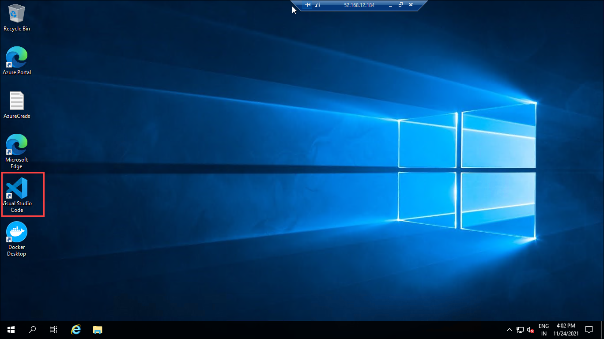
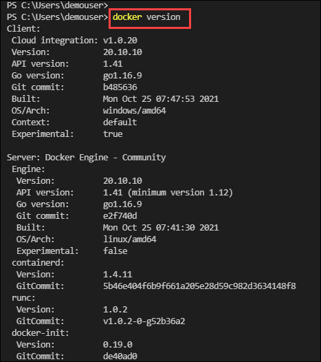
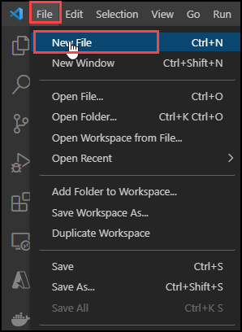
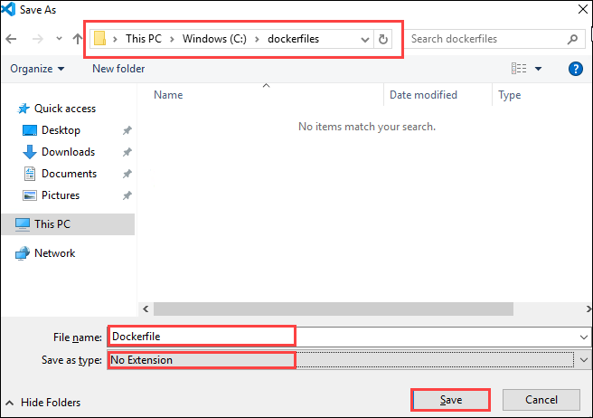
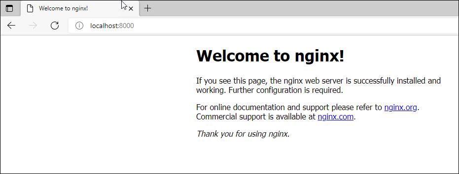
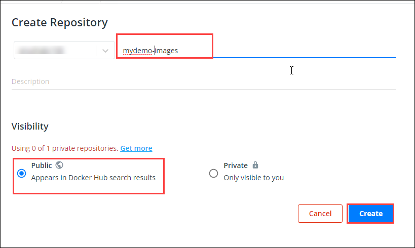
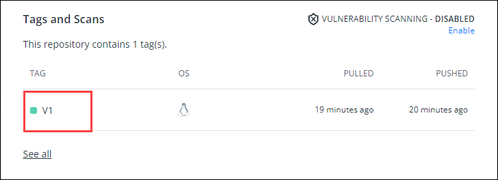

###  Docker 

### Overview

Docker is an open platform for developing, shipping, and running applications. Docker enables you to separate your applications from your infrastructure so you can deliver software quickly. With Docker, you can manage your infrastructure in the same ways you manage your applications. By taking advantage of Docker’s methodologies for shipping, testing, and deploying code quickly, you can significantly reduce the delay between writing code and running it in production.

Docker provides the ability to package and run an application in a loosely isolated environment called a container. The isolation and security allow you to run many containers simultaneously on a given host. Containers are lightweight and contain everything needed to run the application, so you do not need to rely on what is currently installed on the host. You can easily share containers while you work, and be sure that everyone you share with gets the same container that works in the same way.

Docker streamlines the development lifecycle by allowing developers to work in standardized environments using local containers which provide your applications and services. Containers are great for continuous integration and continuous delivery (CI/CD) workflows.

### Instructions

### Exercise 1: Getting started with Docker

1. On the LabVM provided to you, from the left click on **Visual Studio code**  and open it.

   


2. In the **Visual Studio code** notice docker has been already installed.

   

3. Now to run docker commands open Terminal by clicking on **Terminal (1)** and **New Terminal (2)**.

   

4. In the terminal type  ```docker``` and hit enter. This will list the available commands.

   

5. Now run the below command to get the docker version information.  This command will render all the version information of the docker installed in an easy to read layout.

   ```
     docker version
   ```
   

6. Type the following command to get system-wide information regarding the Docker installation.  The information displayed includes the kernel version, number of containers, and images. As we have not yet created any containers or images you will receive the container and images count as zero.

   ```
     docker info
   ```
   
   


### Exercise 2:  Working with Docker Containers

A Docker container image is a lightweight, standalone, executable package of software that includes everything needed to run an application: code, runtime, system tools, system libraries and settings.


1. In the terminal run the below command to list all of the containers. This command will list all the containers that are present in your docker.

   ```
   docker ps -a
   ```
   
   > **Note**: 
     - As we have not created any docker containers the command will return an empty list. 
     - ```docker ps``` command will list only running containers
   
2. Now to create a docker container run the below command. The command does the following
 
   -  This command runs a container named test using the ubuntu:18.04 image
   
   -  -i keeps STDIN open even if not attached
   
   -  -t Allocate a pseudo-TTY

   -  **syntax**: docker run --name your_container_name -i -t image 

   ```
   docker run --name test -i -t ubuntu:18.04 /bin/bash
   ```
   
   
  
3. Notice that you are logged in to the container. 

   


4. Now, inside the container run the following command to verify the operating system you are working on.

   ```
   cat /etc/*release*
   ```
   
   
   
5. Exit the container by running the below command.

   ```
   exit
   ```
   
5. Enter the below command to show the list of running containers and observe your container is not listed this is because the container is in the stopped state.

   ```
   docker ps 
   ```

   
   
6. Start your container by running the below command:

    ```
    docker container start test
    ```
   
   
   
7. In the terminal run ```docker ps``` and verify your container status is up.

   
   
8. Rename your container from test to prod by running the below command:

   ```
   docker container rename test prod
   ```
   - syntax: **docker container rename your_container_name new_name**
   
9. Run the docker list command and observe your container is renamed to prod.

   

10. Now run the below command to get the process details of the container.

    ```
    docker top prod
    ```
   
    
    
11. Run the below commands to create a bash session into the container and create files in the container.

    ```
    docker exec -it prod bash 
    ```
    
12. Now inside the container create a file named temp1 by running the below command:

     ```
     touch temp1
     ```
     
13. Verify that you are able to see your newly created file and exit from the container:

    ```
    ls -l
    ```
    
    ```
    exit
    ```   
    
    
14. Now copy the  temp file which you create inside the container to  the host machine by running the below command

    ```
    docker cp prod:/temp1  c:\users\demouser
    ```
    
15. In your terminal run the list command and verify the file has been copied from your container to the host machine.

    ```
    ls
    ```
    


### Exercise 3: Working with Docker images

A Docker image is a file used to execute code in a Docker container. Docker images act as a set of instructions to build a Docker container, like a template. Docker images also act as the starting point when using Docker. An image is comparable to a snapshot in virtual machine (VM) environments.

A Docker image contains application code, libraries, tools, dependencies and other files needed to make an application run. When a user runs an image, it can become one or many instances of a container.

1. In your terminal run the below command to list all the images that are present in your system. Notice your ubuntu image is listed.

   ```
   docker image ls
   ```
   
      
2. Now pull an **Ubuntu:latest** image from the docker hub by running the below command:

   ```
   docker pull ubuntu:latest
   ```
   
   
3. In Visual studio code click on **File** and select **New file**.

   

4. In the file add the folowing content and save the file in **`c:/dockerfiles`** folder. Provide the file name as **Dockerfile** and select type as **No extension** then click on **Save**.

   ```
   # Each instruction in this file generates a new layer that gets pushed to your local image cache
   #
 
   #
   # Lines preceeded by # are regarded as comments and ignored
   #
 
   #
   # The line below states we will base our new image on the Latest Official Ubuntu 
   FROM ubuntu:latest

   #
   # Update the image to the latest packages
   RUN apt-get update && apt-get upgrade -y
 
   #
   # Install NGINX to test.
   RUN apt-get install nginx -y
 
   #
   # Expose port 80
   EXPOSE 80
 
   #
   # Last is the actual command to start up NGINX within our Container
   CMD ["nginx", "-g", "daemon off;"]
   ```
   
   
   
   **Note**: Please check that the file Dockerfile has no file extension like .txt
   
5. In the terminal navigate to **c:\dockerfiles** and build the container image using the docker build command.

   ```
   cd c:/dockerfiles
   ```

   ```
   docker build -t nginx-site .
   ```
   
   
   
6. Run ```docker images``` command and verify your image is created.

    ```
    docker images
    ```
   
    
    
7. Now that you have an image ready, create and run a container from the image using the below command. 

   ```
   docker run -d -p 8000:80 --name my-running-site nginx-site
   ```
   
   
  
   
8. Open edge browser in your LabVm and browse to http://localhost:8000.

   ```
   http://localhost:8000
   ```

9. Verify that you are able to see the nginx web page.

   


10. You have successfully built an image from dockerfile and created a container from the image with the nginx website hosted on it. 

#### Push image to Docker hub

> **Note**: You need to have a Docker account to push images to docker hub. If you don't have please create one account https://hub.docker.com/


11. Now login to the Docker Hub using the below command. When prompted enter your docker username and password.

    ```
    docker login
    ```
    
    
    
12. In edge browser login to docker hub **https://hub.docker.com/**, navigate to **Repositories** section and create an repository with the name **`mydemo-images`**.

    
    
    

13. Use the docker tag command to give your image a new name. Be sure to replace YOUR-USER-NAME with your Docker ID.

    ```
    docker tag  nginx-site YOUR-USER-NAME/Repository-Name:V1
    ```
    
    
    
14.  Push your image to the repository you created

     ```
     docker push YOUR-USER-NAME/Repository-Name:V1
     ```
     
    
15. After pushing the image navigate back to your repository in docker hub and verify your able to see the image that you pushed in the previous step.

    
    
### Exercise 4: Docker compose

Docker Compose is a tool that was developed to help define and share multi-container applications. With Compose, we can create a YAML file to define the services and with a single command, can spin everything up or tear it all down.

The big advantage of using Compose is you can define your application stack in a file, keep it at the root of your project repo (it’s now version controlled), and easily enable someone else to contribute to your project. 


1. In the terminal verify the installation of docker-compose by running the below command

   ```
   docker-compose version
   ```
   
   


2. In Visual studio code click on File and select New file.


3. In the file add the folowing content and save the file in **c:/dockercomposefiles** folder. Provide the file name as **docker-compose.yml** and select type as **YAML** then click on **Save**.

   ```
   version: "3.4"
   services:
     web:
       image: nginx
       ports:
       - 9090:80
       
     database:
       image: redis
   ```

4. Now in your terminal run the below command and verify if the docker-compose file is valid.

   ```
   cd c:\dockercomposefiles
   docker-compose config
   ```
   
   
5. Run the docker-compose file to run containers using the below command:

   ```
   docker-compose up
   ```
   
   
   
6. Open a new tab in edge browser and navigate to ```localhost:9090``` and verify nginx application is working on localhost port 9090.

   

7. Open a new **Terminal**, list the containers and verify you are able to see **nginx** and **redis** containers. 

   ```
   docker ps -a
   ```
   

8. Now stop the application by running the below command. 

    ```
    cd c:\dockercomposefiles
    docker-compose down
    ```
    
    
9. Navigate back to browser and open **`localhost:9090`** and notice the nginx application is down.
   
10. Now scale the number of containers for service by using the below command

    ```
    docker-compose up -d --scale web=4
    ```
    
    
    
11. Run docker ps -a and verify the web container count is increased to 4.

    ```
    docker ps -a
    ````
    

### Exercise 5: Docker Network 

Docker includes support for networking containers through the use of network drivers. By default, Docker provides two network drivers for you, the bridge and the overlay drivers. You can also write a network driver plugin so that you can create your own drivers but that is an advanced task.

Docker Network Types:

Docker comes with network drivers geared towards different use cases. The most common network types being:  bridge,  overlay, none and  macvlan.

- **bridge**: The default network driver. If you don’t specify a driver, this is the type of network you are creating. Bridge networks are usually used when your applications run in standalone containers that need to communicate.

- **host**: For standalone containers, remove network isolation between the container and the Docker host, and use the host’s networking directly

- **overlay**: Overlay networks connect multiple Docker daemons together and enable swarm services to communicate with each other. You can also use overlay networks to facilitate communication between a swarm service and a standalone container, or between two standalone containers on different Docker daemons. This strategy removes the need to do OS-level routing between these containers. See overlay networks.

- **ipvlan**: IPvlan networks give users total control over both IPv4 and IPv6 addressing. The VLAN driver builds on top of that in giving operators complete control of layer 2 VLAN tagging and even IPvlan L3 routing for users interested in underlay network integration. See IPvlan networks.

- **macvlan**: Macvlan networks allow you to assign a MAC address to a container, making it appear as a physical device on your network. The Docker daemon routes traffic to containers by their MAC addresses. Using the macvlan driver is sometimes the best choice when dealing with legacy applications that expect to be directly connected to the physical network, rather than routed through the Docker host’s network stack. See Macvlan networks.

- **none**: For this container, disable all networking. Usually used in conjunction with a custom network driver. none is not available for swarm services. See disable container networking.

- **Network plugins**: You can install and use third-party network plugins with Docker. These plugins are available from Docker Hub or from third-party vendors. See the vendor’s documentation for installing and using a given network plugin.

In this exercise you will how to create and inspect network in docker, add containers in the network using docker commands.

#### Task 1: Create a container on the default network

In this task you will create a docker container and inspect in which network the conatier is created

1. In your terminal, run the command **`docker network ls`** to view existing container networks on the current Docker host. Every installation of the Docker Engine automatically includes three default networks **none**, **host**, **bridge** and notice that the **bridge** network and the **host** network have the same name as their respective drivers.

   ```
   docker network ls
   ```

2. Now run the below command to get the network configuration details of the bridge. The **`docker network inspect`** command is used to view network configuration details. These details include; name, ID, driver, IPAM driver, subnet info, connected containers, and more.

    ```
    docker network inspect bridge
    ```
    
    
    
3. Run the below command to create a container and verify in which network the container is created.

    ```
    docker run -itd --name db ubuntu
    ```

    
    
4. Run **`docker network inspect bridge`** and notice you are able to see the newly created container listed. While creating a container if a driver is not specified docker by default launches the container in **bridge** network.

   ```
   docker network inspect bridge
   ```
   

#### Task 2:  Create your own network and add containers to the network

In this task you will create a network, create containers in the network and test network connectivity between containers.

1. Create your own bridge network by running the below command:

   ```
   docker network create -d bridge my_bridge
   ```
   
   
2. Run **`docker network ls`** and verify your network is listed.

    ```
    docker network ls
    ```
    
    
3. Now inspect your network and note there are no containers associated with it.

    ```
    docker network inspect my_bridge
    ```
    
    
 5. Now connect your **`db`** container with the network you created.

    ```
    docker network connect my_bridge db
    ```
    
6. Inspect your container and verify it's connected to my_bridge network.

   ```
   docker inspect --format='{{json .NetworkSettings.Networks}}'  db
   ```
   

7. Create a new container without specifying the network.

   ```
   docker run -itd --name web ubuntu
   ```
   
   
8. Now, open a shell to your running **db** container:

   ```
   docker container exec -it db bash
   ```

9. Run the following commands to install ping in your container:

   ```
   apt-get update -y
   apt-get install iputils-ping -y
   ```

10. Ping the name of your container.

    ```
    ping web
    ```
    
    
11. After a bit, use CTRL-C to end the ping and notice that the ping failed, this is because the two containers are running on different networks. Then, use the exit command to close the container.

    ```
    exit
    ```
    
12. Docker networking allows you to attach a container to as many networks as you like. You can also attach an already running container. Now attach your running web app container to the my_bridge.

    ```
    docker network connect my_bridge web
    ```
    
13. Now open a shell into the **db** application again and try the ping command. This time notice the ping is working.

    ```
    docker container exec -it db bash
    ```
    
    ```
    ping web
    ```
    
    
### Exercise 6: Working with docker volumes

Docker has two options for containers to store files in the host machine, so that the files are persisted even after the container stops: volumes, and bind mounts.

- **Volumes**: Created and managed by Docker. Volumes are stored in a part of the host filesystem, managed by Docker (/var/lib/docker/volumes/ on Linux). Non-Docker processes should not modify this part of the filesystem. 

   When you create a volume, it is stored within a directory on the Docker host. When you mount the volume into a container, this directory is what is mounted into the container. This is similar to the way that bind mounts work, except that volumes are managed by Docker and are isolated from the core functionality of the host machine.
   
- **Bind mounts**: Bind mounts may be stored anywhere on the host system. They may even be important system files or directories. Non-Docker processes on the Docker host or a Docker container can modify them at any time.
   
   When we use a bind mount, a file or directory on the host machine is mounted into a container. The file or directory is referenced by its full path on the host machine. The file or directory does not need to exist on the Docker host already. It is created on-demand if it does not yet exist.

In this exercise, you will learn how to create volumes in docker, how to mount a volume to a container and share volumes with the containers.

1. Create a new volume by running the below command. Docker automatically creates a directory for the volume on the host under the **`/var/lib/docker/volume/path`**.

   - docker volume create volume_name 

     ```
     docker volume create myvol1
     ```
     
   
2. In your terminal **run** the following command to list the volumes and verify your volume is listed.

    ```
    docker volume list
    ```
   
   
   
3. Now **create** a Docker container with the **Ubuntu** base Image and mount the **myvol1** volume to that container.

   ```
   docker run -it  -v myvol1:/shared-volume --name vol-container-01 ubuntu
   ```
   
   
4. Inside the container **create** a file and add content to the file.

   ```
   ls
   cd /shared-volume
   echo "This is volume1 file" > volume.txt
   ```

   
   
   
5. Run **`ls`** and verify your file exists and exit the container.

   ```
   ls
   exit
   ```
   
6. Create another Docker container called **vol-container-01** and mount the same Docker volume called **myvol1** inside the container.

   ```
   docker run -it  -v myvol1:/shared-volume --name vol-container-02 ubuntu
   ```
   
 
7. Now inside the new container navigate to the **shared-volume** directory and list the files. You will find the **file1.txt** file that you had created in the same volume but mounted in **my-container-01** earlier and it also has the same content inside it. This is because the volume is shared among the two containers.
   
   ```
   ls
   ```
   
   
