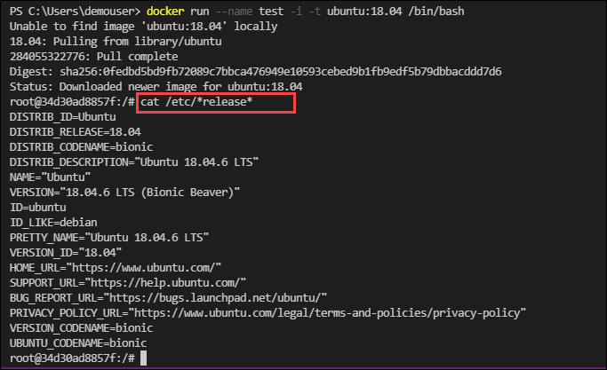
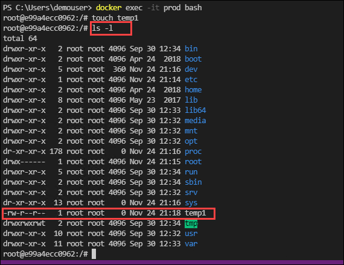

### Exercise 2:  Working with Docker Containers:

A Docker container image is a lightweight, standalone, executable package of software that includes everything needed to run an application: code, runtime, system tools, system libraries and settings.
 
In this exercise, you will work on creating containers and run basic commands to list the containers and it's info. You will also perform basic operations on container such a start, stop and renaming it. You will then connect to the container and perform basic operations.


1. In the terminal run the below command to list all of the containers. This command will list all the containers that are present in your docker.

   ```
   docker ps -a
   ```
   
   > **Note**: 
     - As we have not created any docker containers the command will return an empty list. 
     - ```docker ps``` command will list only running containers
   
2. Now to create a docker container run the below command. The command does the following
 
   -  This command runs a container named test using the ubuntu:18.04 image
   
   -  -i keeps STDIN open even if not attached
   
   -  -t Allocate a pseudo-TTY

   -  **syntax**: docker run --name <your_container_name> -i -t image 

   ```
   docker run --name test -i -t ubuntu:18.04 /bin/bash
   ```
   
   
  
3. Notice that you are logged in to the container. 

   


4. Now, inside the container run the following command to verify the operating system you are working on.

   ```
   cat /etc/*release*
   ```
   
   
   
5. Exit the container by running the below command.

   ```
   exit
   ```
   
5. Enter the below command to show the list of running containers and observe your container is not listed this is because the container is in the stopped state.

   ```
   docker ps 
   ```

   
   
6. Start your container by running the below command:

   - docker container start <your_container_name>

     ```
     docker container start test
     ```
   
     
   
7. In the terminal run ```docker ps``` and verify your container status is up.

   
   
8. Rename your container from test to prod by running the below command:

   - docker container rename <your_container_name> <new_name>

     ```
     docker container rename test prod
     ```
   
9. Run the docker list command and observe your container is renamed to prod.

   

10. Now run the below command to get the process details of the container.

    ```
    docker top prod
    ```
   
    
    
11. Run the below commands to create a bash session into the container and create files in the container.

    - docker exec -it <your_container_name> bash

      ```
      docker exec -it prod bash 
      ```
    
12. Now inside the container create a file named temp1 by running the below command:

     ```
     touch temp1
     ```
     
13. Verify that you are able to see your newly created file and exit from the container:

    ```
    ls -l
    ```
    
    ```
    exit
    ```   
    
    
14. Now copy the  temp file which you create inside the container to  the host machine by running the below command:

    - docker cp <your_container_name>:/<source_path>  <your_destination_path>

      ```
      docker cp prod:/temp1  c:\users\demouser
      ```
    
15. In your terminal run the list command and verify the file has been copied from your container to the host machine.

    ```
    ls
    ```
    


Click on **Next** at the bottom of lab guide to move to the next exercise.
