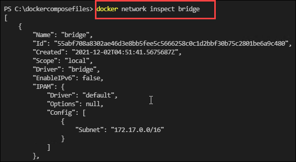
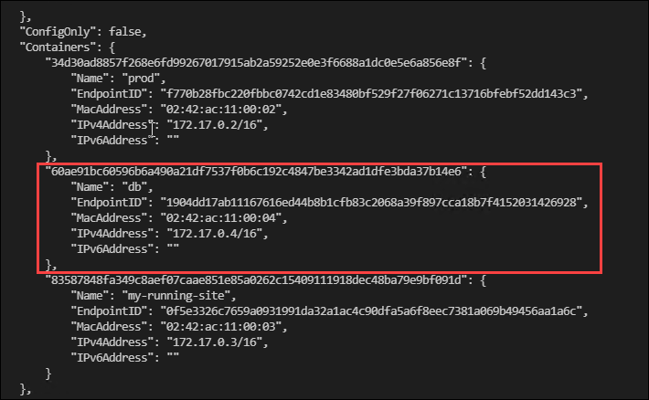
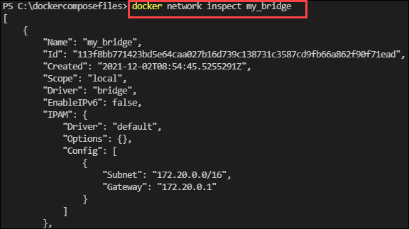

### Exercise 5: Docker Network 

Docker includes support for networking containers through the use of network drivers. By default, Docker provides two network drivers for you, the bridge and the overlay drivers. You can also write a network driver plugin so that you can create your own drivers but that is an advanced task.

Docker Network Types:

Docker comes with network drivers geared towards different use cases. The most common network types being:  bridge,  overlay, none and macvlan.

- **bridge**: The default network driver. If you don’t specify a driver, this is the type of network you are creating. Bridge networks are usually used when your applications run in standalone containers that need to communicate.

- **host**: For standalone containers, remove network isolation between the container and the Docker host, and use the host’s networking directly

- **overlay**: Overlay networks connect multiple Docker daemons together and enable swarm services to communicate with each other. You can also use overlay networks to facilitate communication between a swarm service and a standalone container, or between two standalone containers on different Docker daemons. This strategy removes the need to do OS-level routing between these containers. See overlay networks.

- **ipvlan**: IPvlan networks give users total control over both IPv4 and IPv6 addressing. The VLAN driver builds on top of that in giving operators complete control of layer 2 VLAN tagging and even IPvlan L3 routing for users interested in underlay network integration. See IPvlan networks.

- **macvlan**: Macvlan networks allow you to assign a MAC address to a container, making it appear as a physical device on your network. The Docker daemon routes traffic to containers by their MAC addresses. Using the macvlan driver is sometimes the best choice when dealing with legacy applications that expect to be directly connected to the physical network, rather than routed through the Docker host’s network stack. See Macvlan networks.

- **none**: For this container, disable all networking. Usually used in conjunction with a custom network driver. none is not available for swarm services. See disable container networking.

- **Network plugins**: You can install and use third-party network plugins with Docker. These plugins are available from Docker Hub or from third-party vendors. See the vendor’s documentation for installing and using a given network plugin.

In this exercise, you will learn how to create and inspect the network in docker, add containers in the network using docker commands.

#### Task 1: Create a Container on the default network

In this task, you will create a docker container and inspect in which network the container is created

1. In your terminal, run the command **docker network ls** to view existing container networks on the current Docker host. Every installation of the Docker Engine automatically includes three default networks **none**, **host**, **bridge** and notice that the **bridge** network and the **host** network have the same name as their respective drivers.

   ```
   docker network ls
   ```

2. Now run the below command to get the network configuration details of the bridge. The **docker network inspect** command is used to view network configuration details. These details include; name, ID, driver, IPAM driver, subnet info, connected containers, and more.

    ```
    docker network inspect bridge
    ```
    
    
    
3. Run the below command to create a container and verify in which network the container is created.

    - docker run -itd --name <your_container_name> <imgae>
   
      ```
      docker run -itd --name db ubuntu
      ```

      
    
4. Run **docker network inspect bridge** and notice you are able to see the newly created container listed. While creating a container if a driver is not specified docker by default launches the container in **bridge** network.

   ```
   docker network inspect bridge
   ```
   

#### Task 2:  Create your own network and add containers to the network

In this task, you will create a network, create containers in the network and test network connectivity between containers.

1. Create your own bridge network by running the below command:
   
   - docker network create -d bridge <your_network_name>

     ```
     docker network create -d bridge my_bridge
     ```
   
     
   
2. Run **docker network ls** and verify your network is listed.

    ```
    docker network ls
    ```
    
    
3. Now inspect your network and note there are no containers associated with it.
   
   - docker network inspect <your_network_name>

     ```
     docker network inspect my_bridge
     ```
     
    
 5. Now connect your **db** container with the network you created.

    - docker network connect <your_network_name> <your_container_name>
   
      ```
      docker network connect my_bridge db
      ```
    
6. Inspect your container and verify it's connected to the **my_bridge network**.
   
   -  docker inspect --format='{{json .NetworkSettings.Networks}}' <your_container_name>

      ```
      docker inspect --format='{{json .NetworkSettings.Networks}}'  db
      ```
      

7. Create a new container without specifying the network.

   ```
   docker run -itd --name web ubuntu
   ```
   
   
8. Now, open a shell to your running **db** container:
   

   ```
   docker container exec -it db bash
   ```

9. Run the following commands to install ping in your container:

   ```
   apt-get update -y
   apt-get install iputils-ping -y
   ```

10. Ping the name of your container.

    ```
    ping web
    ```
    
    
11. After a bit, use CTRL-C to end the ping and notice that the ping failed, this is because the two containers are running on different networks. Then, use the exit command to close the container.

    ```
    exit
    ```
    
12. Docker networking allows you to attach a container to as many networks as you like. You can also attach an already running container. Now attach your running web app container to the my_bridge.

    ```
    docker network connect my_bridge web
    ```
    
13. Now open a shell into the **db** application again and try the ping command. This time notice the ping is working.

    ```
    docker container exec -it db bash
    ```
    
    ```
    ping web
    ```
    
