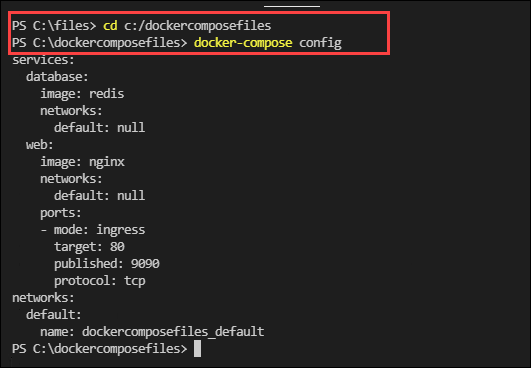

### Exercise 4: Docker Compose:

Docker Compose is a tool that was developed to help define and share multi-container applications. With Compose, we can create a YAML file to define the services and with a single command, can spin everything up or tear it all down.

The big advantage of using Compose is you can define your application stack in a file, keep it at the root of your project repo (it’s now version controlled), and easily enable someone else to contribute to your project. 

In this exercise, you will learn how to work with Docker Compose. You will create a Docker Compose file which will host nginx service on localhost and also you will also use docker compose commands scale up the application. 

1. In the terminal verify the installation of **docker compose** by running the below command:

   ```
   docker-compose version
   ```
   
   


2. In Visual studio code click on **File** and select **New file**.


3. In the file add the folowing content and save the file in **c:/dockercomposefiles** folder. Provide the file name as **docker-compose.yml** and select type as **YAML** then click on **Save**.

   ```
   version: "3.4"
   services:
     web:
       image: nginx
       ports:
       - 9090:80
       
     database:
       image: redis
   ```

4. Now in your terminal run the below command and verify if the docker-compose file is valid.

   ```
   cd c:\dockercomposefiles
   docker-compose config
   ```
   
   
5. Run the docker-compose file to run containers using the below command:

   ```
   docker-compose up
   ```
   
   
   
6. Open a new tab in edge browser and navigate to ```localhost:9090``` and verify Nginx application is working on localhost port 9090.

   

7. Open a new **Terminal**, list the containers and verify you are able to see **Nginx** and **Redis** containers. 

   ```
   docker ps -a
   ```
   

8. Now stop the application by running the below command. 

    ```
    cd c:\dockercomposefiles
    docker-compose down
    ```
    
    
9. Navigate back to browser and open **`localhost:9090`** and notice the nginx application is down.
   
10. Now scale the number of containers for service by using the below command

    - docker-compose up -d --scale <service=num>

      ```
      docker-compose up -d --scale database=4
      ```
    
      
    
11. Run docker ps -a and verify the web container count is increased to 4.

    ```
    docker ps -a
    ````
    


Click on **Next** at the bottom of lab guide to move to the next exercise.
