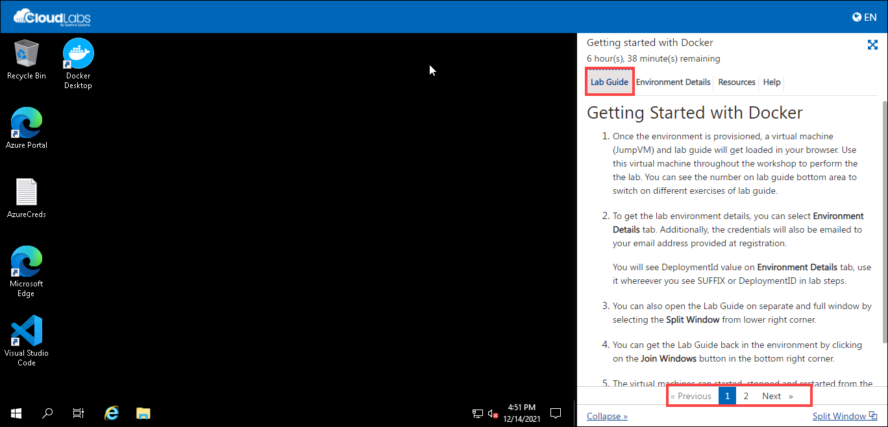
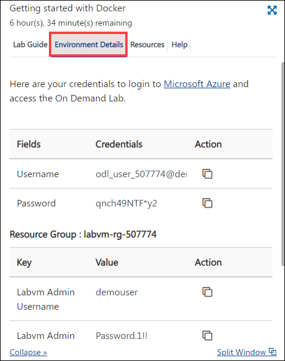
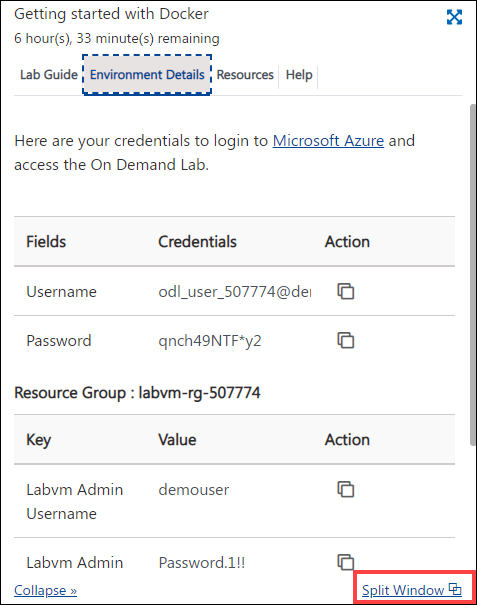
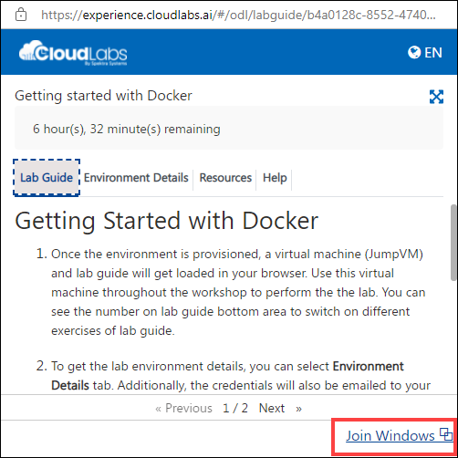
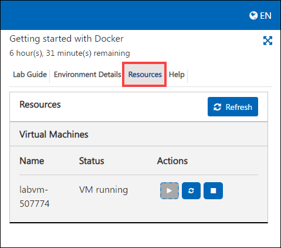

# Getting Started with Docker

1. Once the environment is provisioned, a virtual machine (JumpVM) and lab guide will get loaded in your browser. Use this virtual machine throughout the workshop to perform the the lab. You can see the number on lab guide bottom area to switch on different exercises of lab guide.

    

1. To get the lab environment details, you can select **Environment Details** tab. Additionally, the credentials will also be emailed to your email address provided at registration. 

    

    > You will see DeploymentId value on **Environment Details** tab, use it whereever you see SUFFIX or DeploymentID in lab steps.

1. You can also open the Lab Guide on separate and full window by selecting the **Split Window** from lower right corner. 

   

1. You can get the Lab Guide back in the environment by clicking on the **Join Windows** button in the bottom right corner.

   
   
1. The virtual machines can started, stopped and restarted from the **Virtual Machines** tab.

    
 
  
1. In the environment click on ok if you recevie a prompt regarding windows deprecation.

   

1. If prompted accept the service agreement and start the **Docker desktop**.

