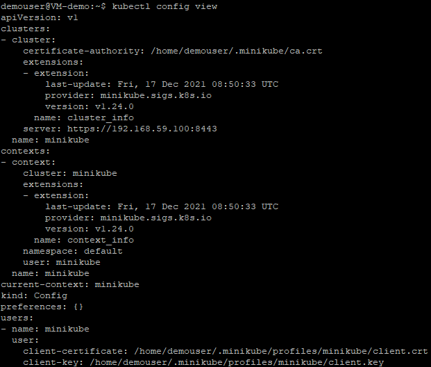

# Exercise 1: Exploring basic kubectl commands

In this exercise, we will look at the cluster's nodes that can be used to host our applications. To conduct commands against Kubernetes clusters, we'll use the Kubernetes command-line tool **kubectl**.

You can use **kubectl** to deploy applications, inspect and manage cluster resources, and view logs.

   
1. Execute the following command to check the version of **kubectl** that will be used to conduct commands on Kubernetes clusters.
   
   ```
   kubectl version
   ```
   
   
1. Run the below command to view the **cluster events** in kubectl.

   ```
   View cluster events
   ```
   
   
1. Run the following command to view the **kubectl** configuration and observe the output details.
   
   ```
   kubectl config view
   ```
   
   
1. Run the below command to get the kubernetes cluster information. **kubectl cluster-info** command is used to display the cluster information in kubectl.
   
   ```
   kubectl cluster-info
   ```
   
   
1. Execute the below command to get the **nodes** inside the kubectl cluster and observe the output.

    ```
    kubectl get nodes
    ```
    
   
1. Execute the below command to create a namespace called **Demo** using **kubectl create** command. You will be prompted with an output message **namespace/demo created**.

   ```
   kubectl create namespace demo
   ```
   
   
1. Run the following query and observe the created namespace inside the cluster.

   ```
   kubectl get namespaces
   ```
   
   
  
### Summary

In this exercise, we explored on Kubectl commands which are used to interact and manage Kubernetes objects and the cluster.
  

