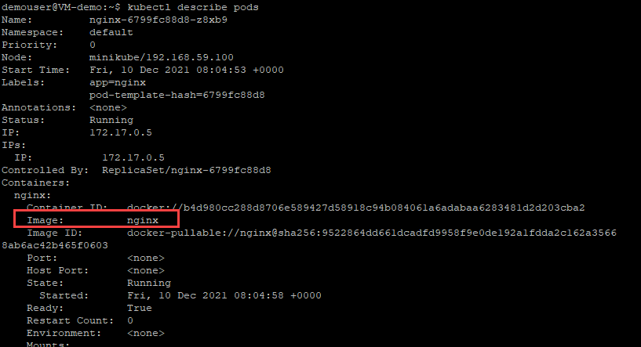
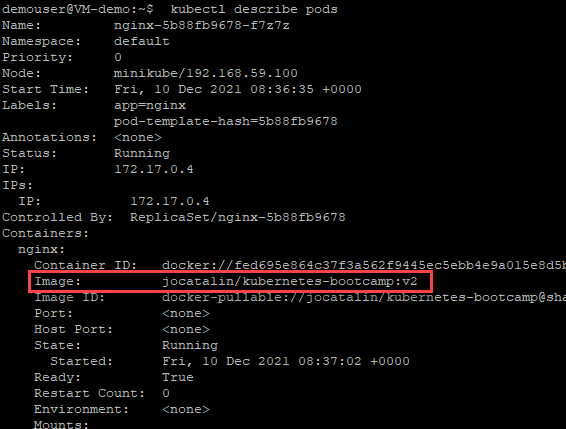

# Exercise 5: Perform a rolling update on App

Users expect applications to be available all the time and developers are expected to deploy new versions of them several times a day. In Kubernetes this is done with **rolling updates**. Rolling updates allow **Deployments update** to take place with zero downtime by incrementally updating pods instances with new ones. We are going to perform basic rolling update to our image in this exercise.

1. Execute the below command and observe the current image version of the app in the **Image** field. The **describe pods** command is used to get the pod details.
   
   ```
   kubectl describe pods
   ```
   After running the above command, observe the version of the app in the **Image** section of the output.
   
   
   
1. Run the following query to set the nginx pods to use the **nginx:v2** image instead of the **nginx** image.
   
   ```
   kubectl set image deployments/nginx nginx=jocatalin/kubernetes-bootcamp:v2
   ```
   After running the above query, you will recieve an output message saying **deployment.apps/nginx image updated** as shown in the below screenshot.
   
   
   
1. Execute the below command to find the exposed **IP address** and **Port**. We are using **describe service** command to check the service details and notice that all pods are running the latest version (v2).

   ```
   kubectl describe services/nginx
   ```
   After running the above command, observe the version of the app in the **Image** section of the output.
   
   
   
1. You can also confirm the updated image version by running the **rollout status** command as shown below. You can perform a rolling update to update the images, configuration, labels, annotations, and resource limits/requests of the workloads in your clusters.

   ```
   kubectl rollout status deployments/nginx
   ```
   
   
1. Run the below command to view the current image version of the app. Observe the output after running the command.

   ```
   kubectl describe pods
   ```
   
   
1. Run the below command. we are using the **rollout undo** command to roll back the deployment to your last working version.

   ```
   kubectl rollout undo deployments/nginx
   ```
   
   
1. Run the following command to view the updated image version of the app. 

   ```
   kubectl describe pods
   ```
   
   
### Summary

In this exercise, we learned about the **Rolling updates** which are designed to update your workloads without downtime.
