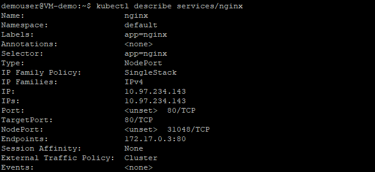
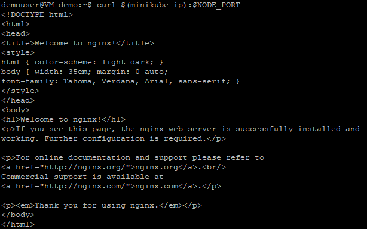
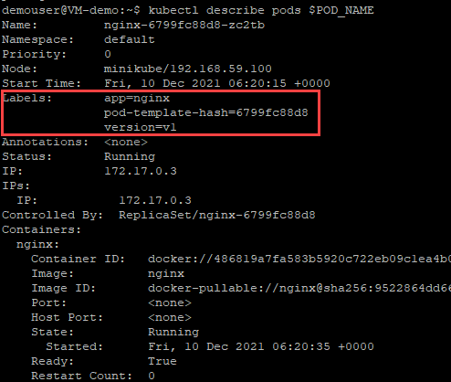
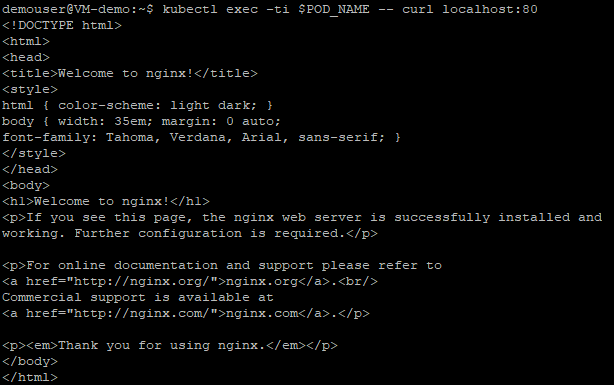

# Exercise 3: Using a service to expose Your App

In this Exercise, we are going to learn about **Service** in Kubernetes, understand how to label objects related to a service, expose an application outside a Kubernetes cluster and using a service.

A Kubernetes service is a logical abstraction for a deployed group of pods in a cluster which all perform the same function.

Since pods are ephemeral, a service enables a group of pods, which provide specific functions to be assigned a name and unique IP address (clusterIP). As long as the service is running that IP address, it will not change. Services also define policies for their access.

1. Execute the following command to list the current **Services** from our cluster inside kubernetes.

   ```
   kubectl get services
   ```
   Observe in the output window that we have a service called **kubernetes** that is created by default when the cluster is started. 

   
   
1. Run the following command to find out the port that was opened externally. We will run the **Describe service** command to find the port.

   ```
   kubectl describe services/nginx
   ```
   
   
1. Run the below command to store the value of node port inside an environment variable. We are creating an environment variable called **NODE_PORT** that has the value of the Node port assigned.

   ```
   export NODE_PORT=$(kubectl get services/nginx -o go-template='{{(index .spec.ports 0).nodePort}}')
   ```
   Please note that the above command will not give any output after running successfully.
   
1. Execute the below command to see the value of **NODE_PORT**.
   
   ```
   echo NODE_PORT=$NODE_PORT
   ```
   
   
1. Execute the following command. We are using the following command to expose the app outside of the cluster using the **IP address** of the Node and the externally exposed port.

   ```
   curl $(minikube ip):$NODE_PORT
   ```
   
   
1. Run the below command to get the name of the pod and store it in the **POD_NAME** environment variable.

   ```
   export POD_NAME=$(kubectl get pods -o go-template --template '{{range .items}}{{.metadata.name}}{{"\n"}}{{end}}')
   ```
   Please note that the above command will not give any output after running successfully.
   
1. Execute the following command to view the value of **POD_NAME**.

   ```
   echo Name of the Pod: $POD_NAME
   ```
   
   
1. Run the following command to apply a new label to the pods. we use the **label** command followed by the **object type**, **object name** and the **new label** to apply a label to the pods.

   ```
   kubectl label pods $POD_NAME version=v1
   ```
   
   
1. Execute the below command to view the new version of label to our **Pod**. We can check it with the **describe pod** command.

   ```
   kubectl describe pods $POD_NAME
   ```
   
   
1. Run the below command to ensure that the app is still running within the pod.

   ```
   kubectl exec -ti $POD_NAME -- curl localhost:80
   ```
   
   
### Summary

In this exercise, we learned to expose an app using kubernetes services.
