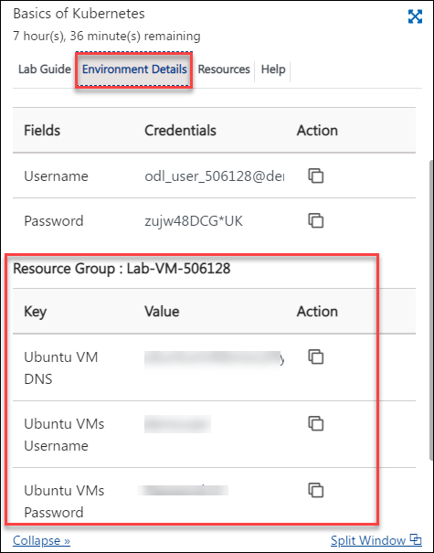
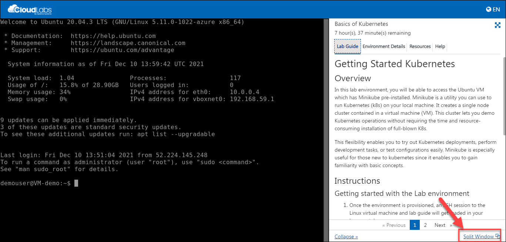
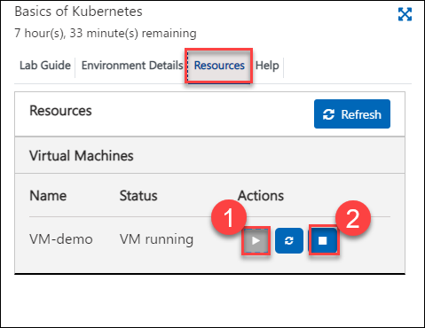
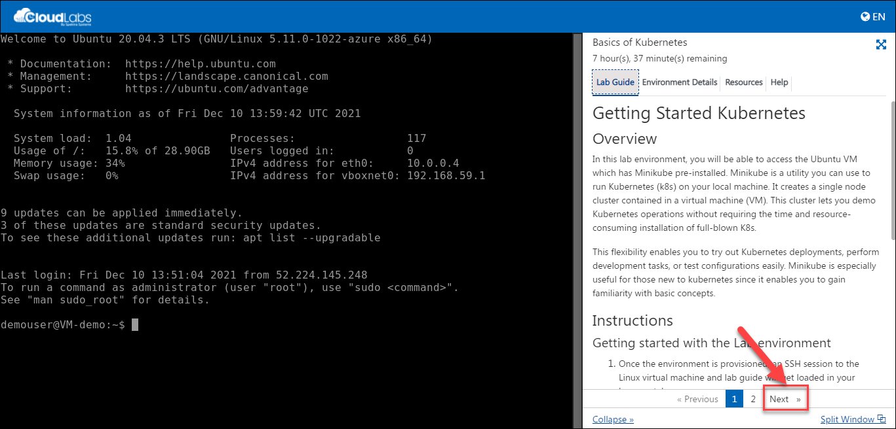

# Getting Started Kubernetes

## Overview

In this lab environment, you will be able to access the Ubuntu VM which has Minikube pre-installed. Minikube is a utility you can use to run Kubernetes (k8s) on your local machine. It creates a single node cluster contained in a virtual machine (VM). This cluster lets you demo Kubernetes operations without requiring the time and resource-consuming installation of full-blown K8s.

This flexibility enables you to try out Kubernetes deployments, perform development tasks, or test configurations easily. Minikube is especially useful for those new to kubernetes since it enables you to gain familiarity with basic concepts.

## Instructions

### Getting started with the Lab environment

1. Once the environment is provisioned, an SSH session to the Linux virtual machine and lab guide will get loaded in your browser tab. 
   
   

1. To get the lab environment details, you can select the **Environment Details** tab. Additionally, the credentials will also be sent to your email address provided during registration.

   
   
1. You can also open the Lab Guide on a separate full window by selecting the **Split Window** button on the bottom right corner.

   

1. You can **start(1)** or **stop(2)** the Virtual Machine from the **Resources** tab.

   
   
1. Now, click on the **Next** from lower right corner to move on next page.
   
    

