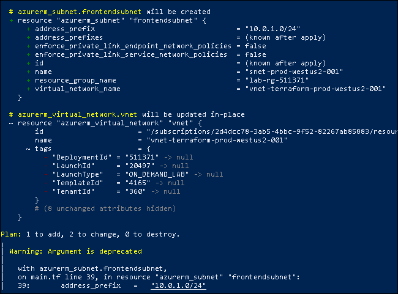
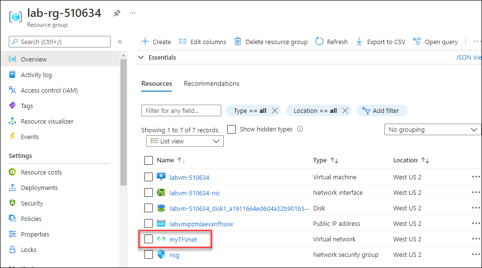
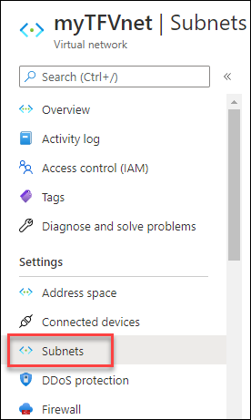
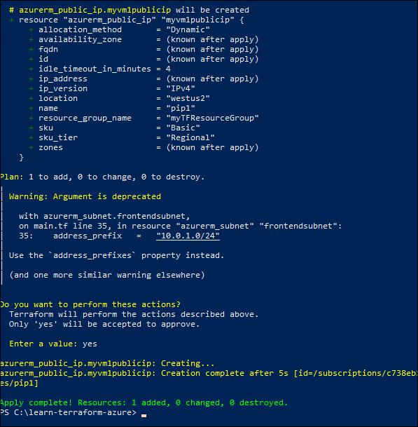

# Exercise 3: Create a Subnet and Public IP Address using terraform

In this exercise, you will create a Subnet and Public IP address using Terraform.


## Task 1: Create Subnet using Terraform

In this task, you will create a subnet using Terraform.


1. Minimize the Powershell window and navigate to the path **C:\learn-terraform-azure** in the file explorer.

1. In your **main.tf** file, copy and paste the resource block given below to create a subnet and save the file.

   ```
     resource   "azurerm_subnet"   "frontendsubnet"   { 
         name   =   "snet-prod-westus2-001" 
         resource_group_name   =    azurerm_resource_group.rg.name 
         virtual_network_name   =   azurerm_virtual_network.vnet.name 
         address_prefix   =   "10.0.1.0/24" 
     } 
   ```
   > **Info** : To create a new Azure Subnet, you have to specify the name of the resource group and Vnet to contain the Subnet. By referencing the resource group and Vnet, you establish a dependency between the resources. Terraform ensures that resources are created in proper order by constructing a dependency graph for your configuration.

1. After changing the configuration, run the below command to see how Terraform will apply this change to your infrastructure. Enter **yes** to the prompt to confirm the changes.

    ```
      terraform apply
    ```
 
   
   
1. To validate the Virtual network, navigate back to the **Azure Portal** and click on **Resource groups** from Navigate panel.

1. On the **Resource groups** tab, click on **lab-rg-<inject key="DeploymentID" enableCopy="false"/>**.

1. Now, under **Resources**, click on the virtual network named as **myTFVnet**.

    
    
1. Select **Subnets** from the left navigation menu of the page.

    
    
1. On the **Subnets** page, you will be able to see the newly created subnet **frontendSubnet**.

    
    
1. Now, you have successfully created a subnet using Terraform.


# Task 2: Create Public IP Address using Terraform.

In this task, you will create a new Public IP Address using Terraform.

     
1. Now, minimize the windows browser and navigate to the path **C:\learn-terraform-azure** in the file explorer.

1. In your **main.tf** file, copy and paste the resource block given below to create a Public IP Address and save the file.

     ```
        # create public IP Address
        resource   "azurerm_public_ip"   "myvm1publicip"   { 
          name   =   "pip1" 
          location   =   "westus2" 
          resource_group_name   =   azurerm_resource_group.rg.name 
          allocation_method   =   "Dynamic" 
          sku   =   "Basic" 
        }
      ```
      
1. After changing the configuration, navigate back to the **Windows PowerShell** and run the below command to see how Terraform will apply this change to your infrastructure. Enter **yes** to the prompt to confirm the changes.

    ```
       terraform apply
    ```
    
      
      
1. Now, you have successfully created a **Public IP Address** named as **pip1** using Terraform.

1. To validate the **Public IP Address**, navigate back to the **Azure Portal** and click on **Resource groups** from Navigate panel.

1. On the **Resource groups** tab, click on **lab-rg-<inject key="DeploymentID" enableCopy="false"/>**.

1. Now, under **Resources**, scroll down to see the Public IP Address **pip1**.

     


## Summary

- Created a Subnet using Terraform and validated the resource from Azure Portal.
- Created Public IP Address using Terraform and validated the resource from Azure Portal.
