# Exercise

1. In your VM, double click on the **Azure Portal** icon to sign in. You can get your Azure user credentials in the **Environment Details** tab.

   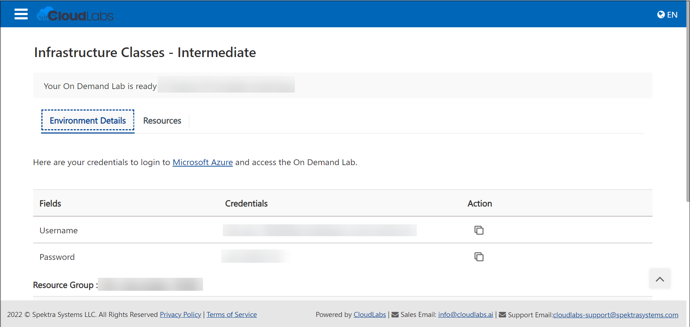
  
1. On the Sign-in tab, enter your username and click **Next**.

   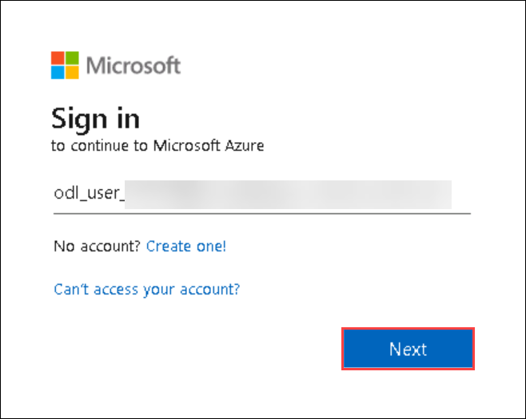

1. Enter the password for your username and click **Sign-in**.

   

1. On the **Help us protect your account** tab, click **Skip for now (14 days until this is required)**.

   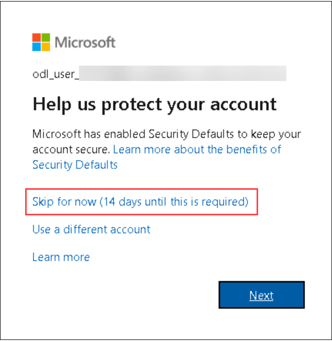

1. On the **Stay signed in?** tab, click **Yes**.

   
   
1. In the Azure portal, search for Virtual Machines and verify that there are two virtual machines, **DC01** and **WindowsClient**.

   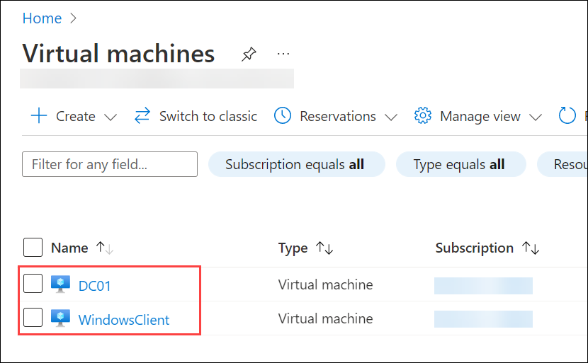
   
1. Click on **DC01** and verify that the **Private IP Address** is **10.0.0.4**.

   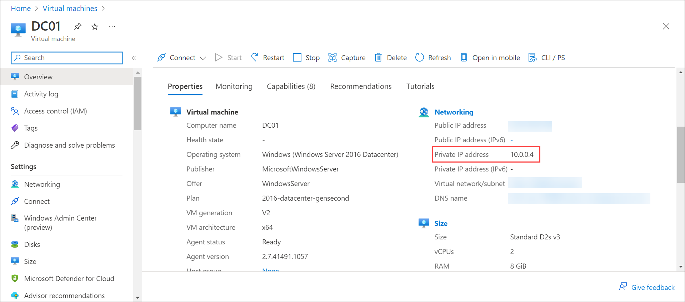
   
1. Switch back to Virtual Machines, click on **WindowsClient** and verify that the **Private IP Address** is **10.0.0.5**.

   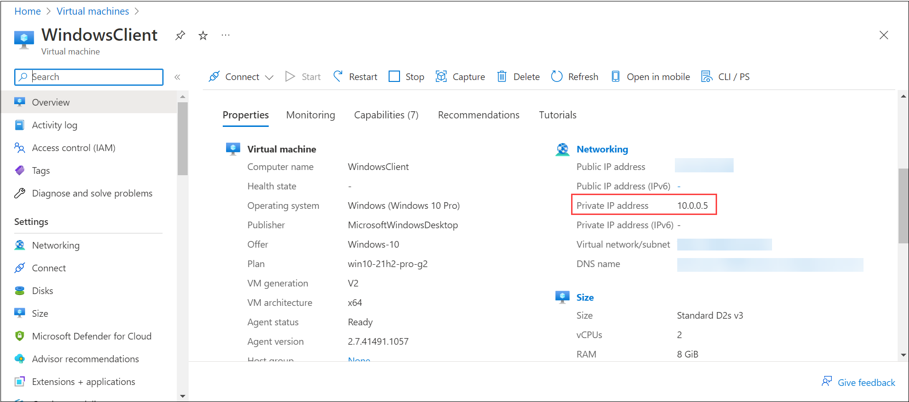
   
1. In your VM, search for **Server Manager** and on the Dashboard click on **Add roles and features**.
   
   
   
1. Select **Role-based or feature-based installation** as the installation type and click **Next**.
   
   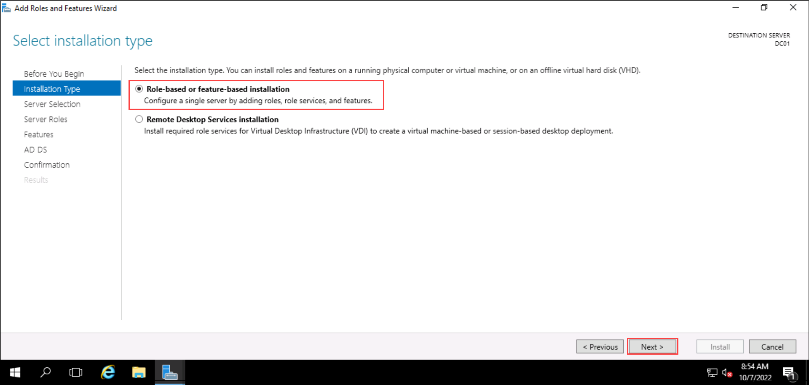
   
1. In **Server Selection**, select your current server **DC01** as the destination server and click **Next**.

   
   
1. In **Server Roles**, check the box for **Web Server (IIS)** and click **Add Features**.

   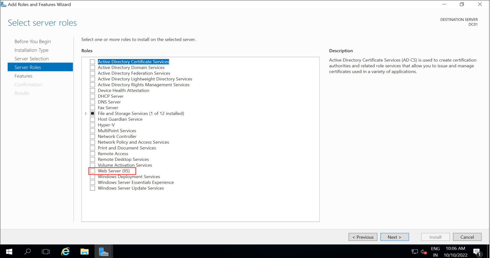
   
   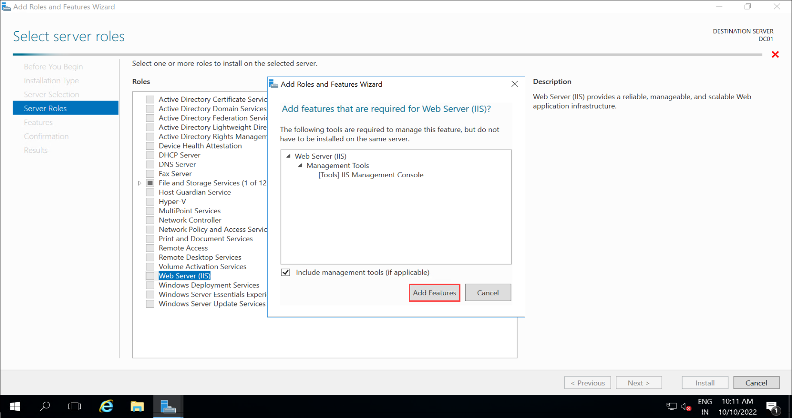
   
1. In **Select Features**, expand **.NET Framework 4.6 Features**, check the box for **ASP.NET 4.6**. In **.NET Framework 4.6 Features**, expand **WCF Services**, check the box for **HTTP Activation** and click **Add Features**.

   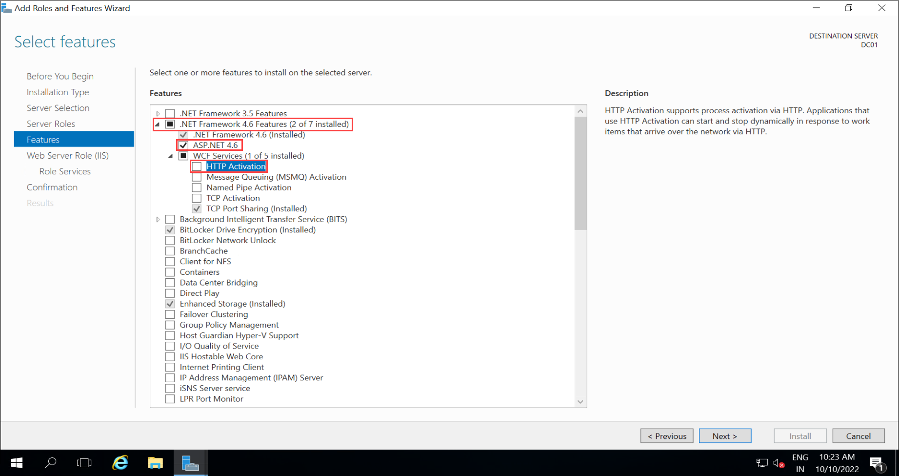
   
   
   
1. In **Select Features**, expand **.NET Framework 3.5 Features**, check the box for **HTTP Activation** and click **Add Features**.

   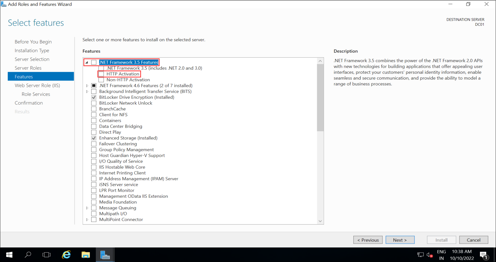
   
   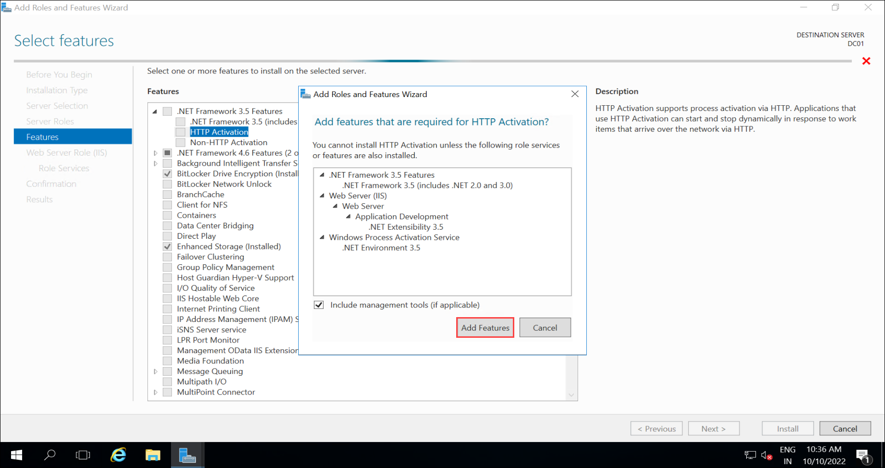
   
1. In **Select Features**, review the selected features and click **Next**.

   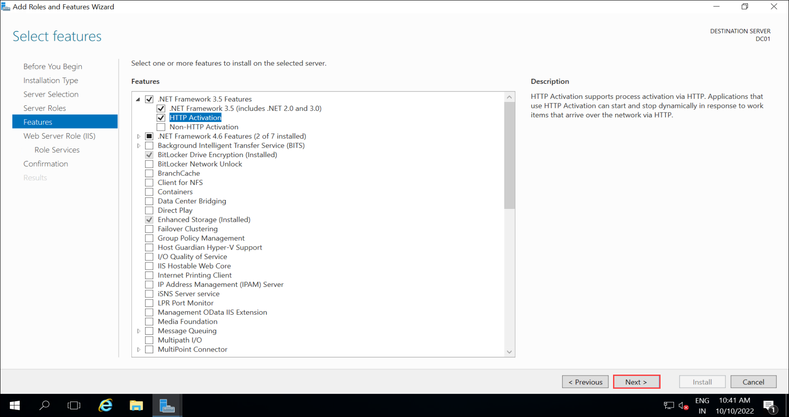
   
1. In **Web Server Role (IIS)**, go through the overview of Web Server Role (IIS) and click **Next**.

   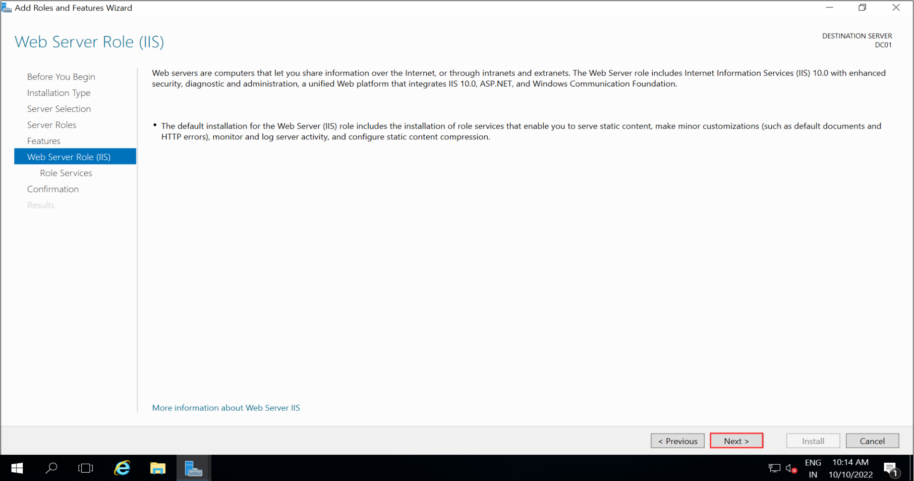
   
1. In **Select Role Services**, expand **Security** and check the box for **Windows Authentication**.

   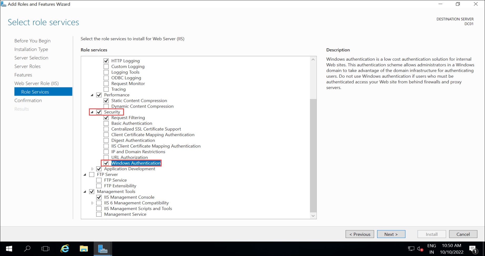
   
1. In **Select Role Services**, expand **Application Development** and chekc the box for **ASP.NET 3.5**.
   
   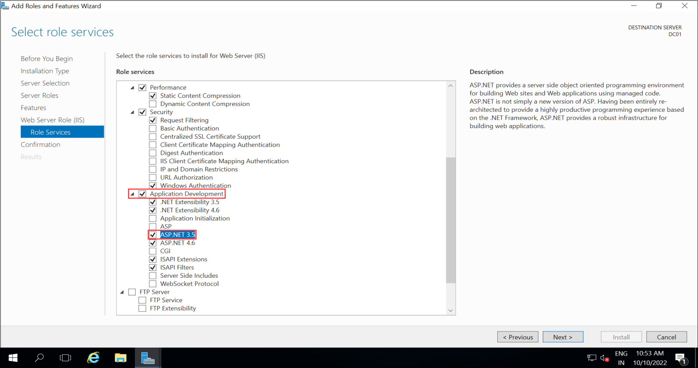
   
1. In **Select Role Services**, verify that the following services are selected and click **Next**.

   * Common HTTP Features
      * Default Document
      * Directory Browsing
      * HTTP Errors
      * Static Content
   * Securiy
      * Request Filtering
      * Windows Authentication
   * Application Development
      * .NET Extensibility 3.5
      * .NET Extensibility 4.6
      * ASP.NET 3.5
      * ASP.NET 4.6
      * ISAPI Extensions
      * ISAPI Filters
    * Management Tools
      * IIS Management Console
   
   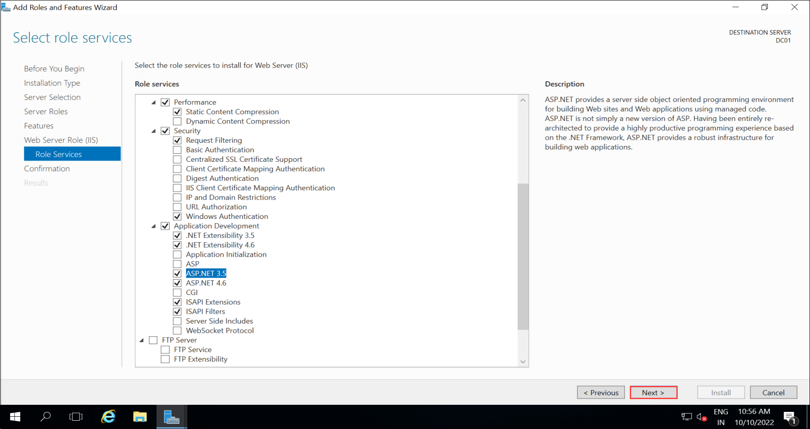
   
1. Confirm installation selections in the **Confirmation** tab and click **Install**.

   
   
1. Wait for the feature installation to complete and click **Close**.

   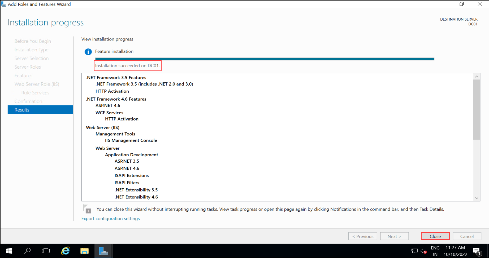
   
1. In **Server Manager**, verify that the **IIS** feature is installed.

   
   
1. In Azure portal, search for Virtual Machines and connect to your **WindowsClient** virtual machine through **RDP**.

1. In your **WindowsClient** VM, open Microsoft Edge, search for **http://10.0.0.4** and verify that the Web Server that you installed on your DC01 is running.

   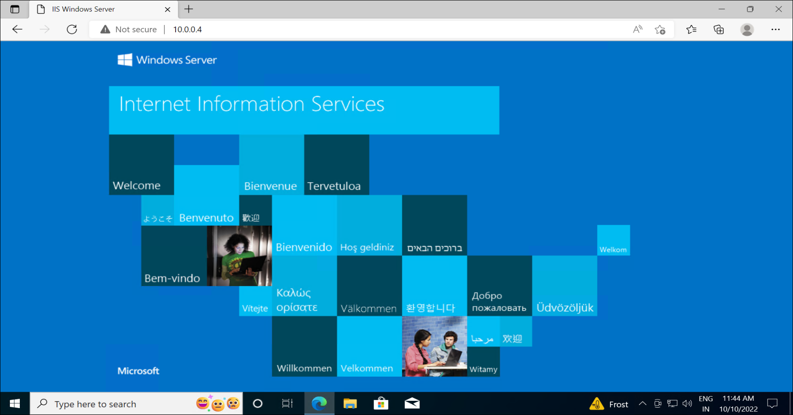
