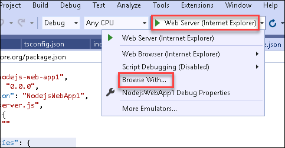
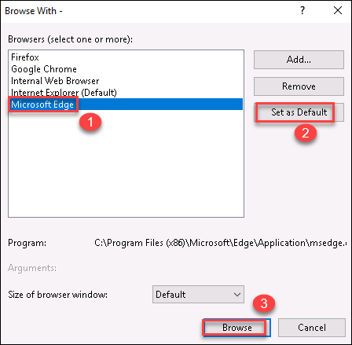

## Task 6: Run the React app

1. In the **Debug toolbar**, select either **Web Server (Microsoft Edge)** or **Web Server (Google Chrome)** as the debug target.
   
   

2. If the preferred debug target is set to different target such as **Web Server(Internet Explorer), select **Browse With** from the debug target dropdown list. 
   
   
    
3. Select your default browser target as **Microsoft Edge** in the list, select **Set as Default and then select **Browse**
   
   

4. To run the app, press **F5** or select the green arrow button, or select **Debug > Start Debugging**.

5. A Node.js console window opens that shows the debugger listening port and Visual Studio starts the app on a browser which displays a sample message by launching the startup file, server.js.
   
   
    
6. Close the browser and console windows.
