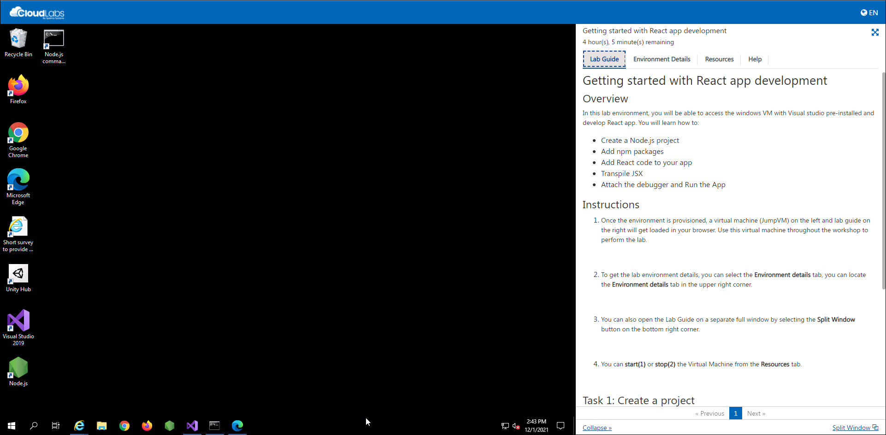
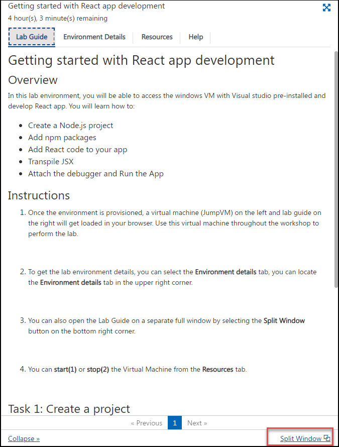
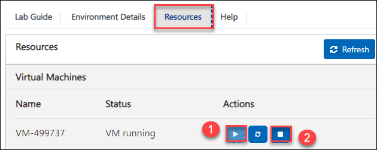
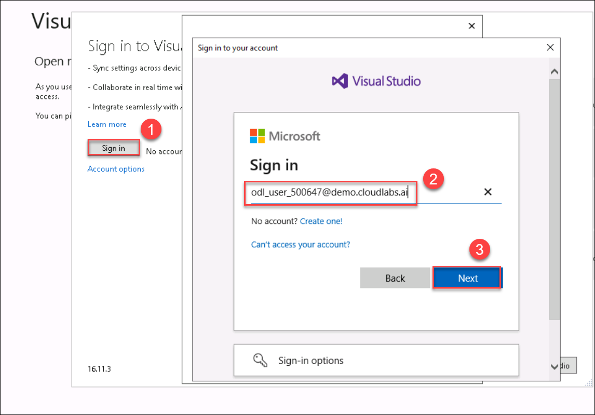
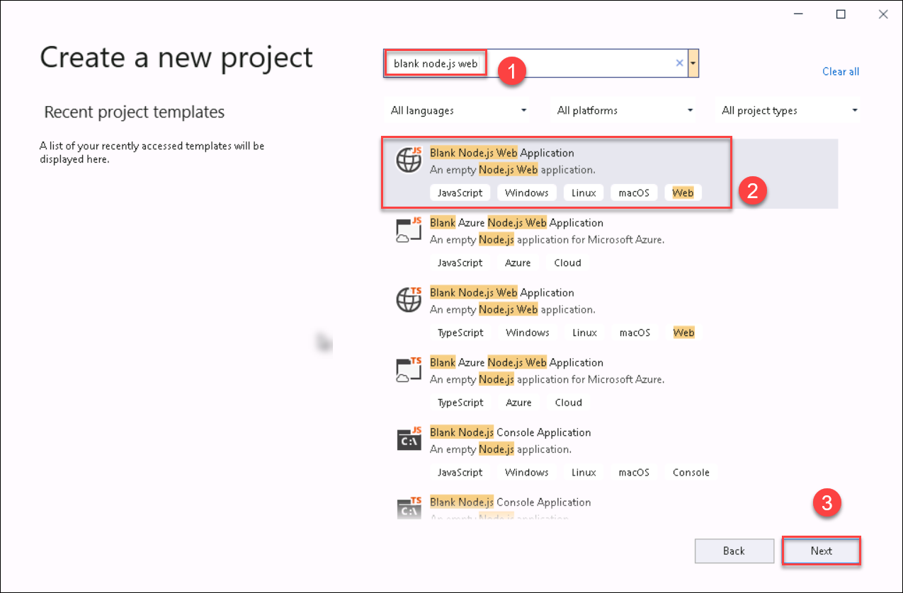
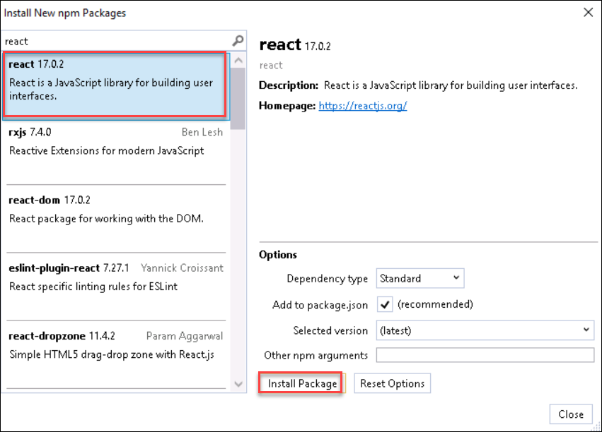
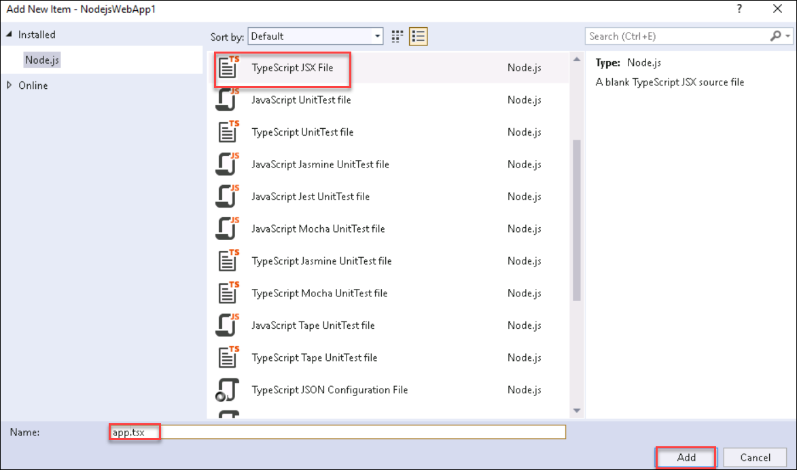
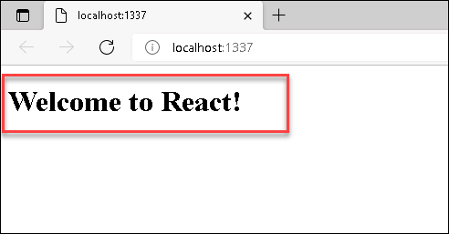

# Getting started with React app development

## Overview

In this lab environment, you will create a Node.js web app project from a Visual Studio template. Then, you will create a simple app using React.
You will learn how to:

- Create a Node.js project
- Add npm packages
- Add React code to your app
- Transpile JSX
- Attach the debugger and Run the App

## Instructions

1. Once the environment is provisioned, a virtual machine (JumpVM) on the left and lab guide on the right will get loaded in your browser. Use this virtual machine throughout the workshop to perform the lab.

   

2. To get the lab environment details, you can select the **Environment details** tab, you can locate the **Environment details** tab in the upper right corner.
   
   

3. You can also open the Lab Guide on a separate full window by selecting the **Split Window** button on the bottom right corner.
   
   
 
4. You can **start(1)** or **stop(2)** the Virtual Machine from the **Resources** tab.

   
   
## Key concepts

Before you begin, here's a quick introduction some key concepts:

**Node.js**: Node.js is a server-side JavaScript runtime environment that executes JavaScript code.

**npm**: The default package manager for Node.js is npm. A package manager makes it easier to publish and share Node.js source code libraries. The npm package manager simplifies library installation, updating, and uninstallation.

**React**: React is a front-end framework for creating a user interface (UI).

**JSX**: JSX is a JavaScript syntax extension typically used with React to describe UI elements. You must transpile JSX code to plain JavaScript before it can run in a browser.

**webpack**: Webpack bundles JavaScript files so they can run in a browser, and can also transform or package other resources and assets. Webpack can specify a compiler, such as Babel or TypeScript, to transpile JSX or TypeScript code to plain JavaScript.
   
## Task 1: Create a Node.js project

Visual Studio with the Node.js development workload is pre-installed for you.

1. In the virtual machine, double click on the **Visual Studio** shortcut on the desktop.
   
   
   
2. This will open up Visual Studio, click on **Signin** and login using the credentials provided to you from the Environment details tab.

   
   
3. Verify your account is appearing under **All accounts** and select **close**.

   

4. On the Visual Studio page select **Create a new project**
   
   
   
5. Type node.js in the search box and choose **Blank Node.js Web Application - JavaScript** from the list.
  
   
   
6. In the **Configure your new project** dialog box, leave the default value for project name and select **Create**.
   
   
   
7. Look at the project structure in **Solution Explorer** in the right pane 
 
   
   
## Task 2 : Add npm Packages

This app requires the following npm modules to run correctly:

- react
- react-dom
- express
- path
- ts-loader
- typescript
- webpack
- webpack-cli
  
1. To install package in the **Solution Explorer**, right-click the **npm** node and select **Install New npm Packages**.
    
   

2. In the **Install New npm Packages** dialog box, search for the **react** package, and select **Install Package** to install it.
   
   
 
   In the Install New npm Packages dialog box, you can choose to install the most current package version or to specify a version. If you choose to install the current versions, but run into unexpected errors later, try installing the exact package versions listed in the next steps.

3. The **Output** window in the Visual Studio lower pane shows package installation progress. Open the **Output window** by selecting **View > Output** or pressing Ctrl+Alt+O.    In the Show output from field of the Output window, select **Npm**.

4. After the react package is installed verify that the react package appears under the **npm** node in **Solution Explorer**.

5. Instead of using the UI to search for and add the rest of the packages one at a time, you can paste the required package code into **package.json** file to install the required packages with the specified version, you will perform it in the next step.

6. From Solution Explorer, open **package.json** in the Visual Studio editor. Add the following **dependencies** section before the end of the file.If the file already has a dependencies section, replace it with the preceding JSON code
   
   ```
   "dependencies": {
   "express": "^4.17.1",
   "path": "^0.12.7",
   "react": "^17.0.2",
   "react-dom": "^17.0.2",
   "ts-loader": "^9.2.6",
   "typescript": "^4.5.2",
   "webpack": "^5.64.4",
   "webpack-cli": "^4.9.1"
   },
   ```
7. Press Ctrl+S or select **File->Save** to save the changes made to package.json file.

8. In **Solution Explorer**, right-click the **npm** node in your project and select **Install npm Packages**. This option runs the npm install command directly to install all the packages listed in **packages.json**.
   
   
 
9. Select the **Output** window in the lower pane to see installation progress. Installation might take a few minutes, and you might not see results immediately. Make sure that you select **Npm** in the Show output from field in the Output window.

10. After installation, the npm modules appear in the npm node in Solution Explorer.

    
 
 ## Task 3: Add project files and React code to your app
 
 For this app, you will be adding the following new project files in the project root.
 - app.tsx
 - webpack-config.js
 - index.html
 - tsconfig.json
 
 1. In the **Solution Explorer**, right-click on the project name and select **Add > New Item** option.
    
    
 
 2. In the **Add New Item** dialog box choose **TypeScript JSX File**, type the name **app.tsx**, and select **Add or OK**.
     
    
     
 3. Repeat these steps to add a **JavaScript file** named **webpack-config.js**.

 4. Repeat these steps to add an **HTML file** named **index.html**.

 5. Repeat these steps to add a **TypeScript JSON Configuration File** named **tsconfig.json**.
 
 6. In the next few steps, you will add the required app code for your application.
 
 7. In Solution Explorer, open **server.js** file and replace the existing code with the following code:
 
    ```
    'use strict';
     var path = require('path');
     var express = require('express');
     var app = express();
     var staticPath = path.join(__dirname, '/');
     app.use(express.static(staticPath));

     // Allows you to set port in the project properties.
     app.set('port', process.env.PORT || 3000);
     var server = app.listen(app.get('port'), function() {
     console.log('listening');
     });
    ```
    Note: The preceding code uses Express to start Node.js as your web application server. The code sets the port to the port number configured in the project properties, which by default is 1337. If you need to open the project properties, right-click the project name in Solution Explorer and select Properties.

8. Open **app.tsx** file and add the following code which uses JSX syntax and React to display a message
   
   ```
   var React = require('react');
   var ReactDOM = require('react-dom');
   ReactDOM.render(
    <h1>Hello, world!</h1>,
    document.getElementById('root')
   );
   ReactDOM.render(<Hello />, document.getElementById('root'));
   ```
 
 9. Open **index.html** and replace the **body** section with the following code:
    ```
    <body>
    <div id="root"></div>
    <!-- scripts -->
    <script src="./dist/app-bundle.js"></script>
    </body>
    ```
 This HTML page loads app-bundle.js, which contains the JSX and React code transpiled to plain JavaScript. Currently, app-bundle.js is an empty file. In the next section, you configure options to transpile the code.
 
## Task 4 : Configure webpack and TypeScript compiler options

Next, you will add webpack configuration code to **webpack-config.js** file. Youwill  add a simple webpack configuration that specifies an input file, app.tsx, and an output file, app-bundle.js, for bundling and transpiling JSX to plain JavaScript. For transpiling, you also configure some TypeScript compiler options. This basic configuration code is an introduction to **webpack and the TypeScript compiler**.

1. In Solution Explorer, open **webpack-config.js** file and add the following code.The webpack configuration code instructs webpack to use the TypeScript loader to transpile the JSX.

   ```
   module.exports = {
    devtool: 'source-map',
    entry: "./app.tsx",
    mode: "development",
    output: {
        filename: "./app-bundle.js"
    },
    resolve: {
        extensions: ['.Webpack.js', '.web.js', '.ts', '.js', '.jsx', '.tsx']
    },
    module: {
        rules: [
            {
                test: /\.tsx$/,
                exclude: /(node_modules|bower_components)/,
                use: {
                    loader: 'ts-loader'
                }
            }
        ]
    }
   }
   ```
2. Open **tsconfig.json** file and replace the contents with the following code, which specifies the TypeScript compiler options.
   The code specifies app.tsx as the source file.

   ```
   {
   "compilerOptions": {
    "noImplicitAny": false,
    "module": "commonjs",
    "noEmitOnError": true,
    "removeComments": false,
    "sourceMap": true,
    "target": "es5",
    "jsx": "react"
   },
   "exclude": [
    "node_modules"
   ],
   "files": [
    "app.tsx"
   ]
   }
   ```
3. Select **File** menu and click on **Save All** to save all changes.
 
## Task 5 Transpire the JSX

1. In Solution Explorer, right-click the project name and select **Open Command Prompt Here**.
 
   
   
2. In the command prompt, enter the following webpack command:
   ```
   node_modules\.bin\webpack ./app.tsx --config webpack-config.js
   ```
3. The command prompt window shows the result as shown in the screenshot.
   
   
   
   Note: If you see any errors instead of the preceding output, you must resolve them before your app will work. If your npm package versions are different than the versions  specified in this lab, that can cause errors. One way to fix errors is to use the exact versions shown in the earlier step.

4. In Solution Explorer, right-click the project node and select **Add->Existing Folder**

5. Select the **dist** folder, and then select **Select Folder**. Visual Studio adds the dist folder, which contains app-bundle.js and app-bundle.js.map, to the project.

6. Open **app-bundle.js** file to see the transpiled JavaScript code.

7. If prompted whether to reload externally modified files, select **Yes to All**.

8. Anytime you make changes to **app.tsx** file, you must **rerun** the webpack command. To automate this step, you will **add a build script** to transpile the JSX in the next steps.

9. Open **package.json** file and add the following **scripts** section after the **dependencies** section:
   ```
   "scripts": {
   "build": "webpack-cli ./app.tsx --config webpack-config.js"
   }
   ```
  Visual Studio versions starting with **Visual Studio 2019** require a build script. Instead of transpiling JSX at the command line, as shown above you can transpile JSX when building from Visual Studio.

10. Select **File** menu and click on **Save** to save the changes made to package.json file.

## Task 6: Run the React app

1. In the **Debug toolbar**, select either **Web Server (Microsoft Edge)** or **Web Server (Google Chrome)** as the debug target.
   
   

2. If the preferred debug target is set to different target such as **Web Server(Internet Explorer), select **Browse With** from the debug target dropdown list. 
   
   
    
3. Select your default browser target as **Microsoft Edge** in the list, select **Set as Default and then select **Browse**
   
   

4. To run the app, press **F5** or select the green arrow button, or select **Debug > Start Debugging**.

5. A Node.js console window opens that shows the debugger listening port and Visual Studio starts the app on a browser by launching the startup file, server.js.
   
   
    
6. Close the browser and console windows.

## Summary
 
In this lab, you learned how to create a React app from Visual studio, run the application and display a simple message.


   

