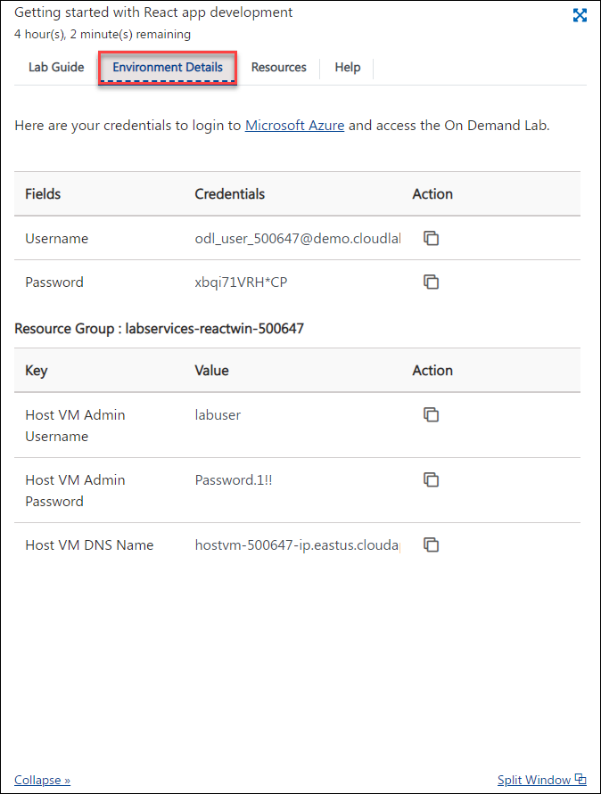
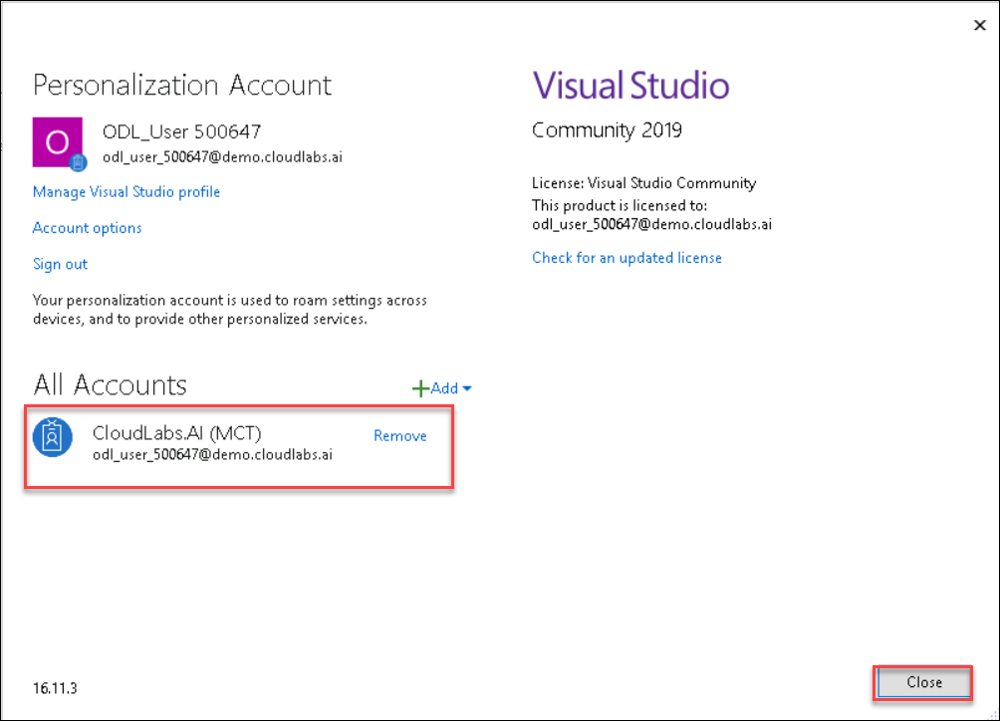
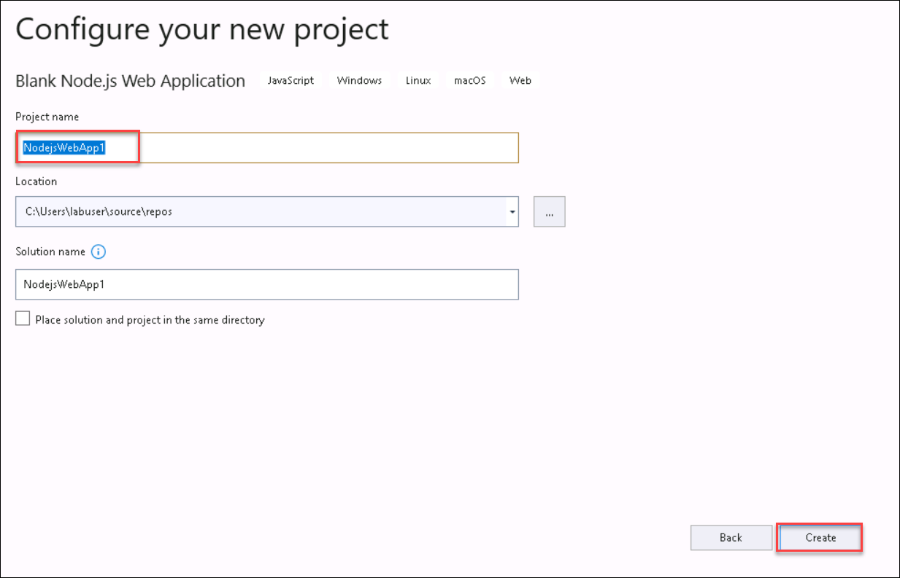

# Getting started with React app development

## Overview

In this lab environment, you will create a Node.js web app project from a Visual Studio template. Then, you will create a simple app using React.
You will learn how to:

- Create a Node.js project
- Add npm packages
- Add React code to your app
- Transpile JSX
- Attach the debugger and Run the App

## Instructions

1. Once the environment is provisioned, a virtual machine (JumpVM) on the left and lab guide on the right will get loaded in your browser. Use this virtual machine throughout the workshop to perform the lab.

   

2. To get the lab environment details, you can select the **Environment details** tab, you can locate the **Environment details** tab in the upper right corner.
   
   

3. You can also open the Lab Guide on a separate full window by selecting the **Split Window** button on the bottom right corner.
   
   
 
4. You can **start(1)** or **stop(2)** the Virtual Machine from the **Resources** tab.

   
   
## Key concepts

Before you begin, here's a quick introduction some key concepts:

**Node.js**: Node.js is a server-side JavaScript runtime environment that executes JavaScript code.

**npm**: The default package manager for Node.js is npm. A package manager makes it easier to publish and share Node.js source code libraries. The npm package manager simplifies library installation, updating, and uninstallation.

**React**: React is a front-end framework for creating a user interface (UI).

**JSX**: JSX is a JavaScript syntax extension typically used with React to describe UI elements. You must transpile JSX code to plain JavaScript before it can run in a browser.

**webpack**: Webpack bundles JavaScript files so they can run in a browser, and can also transform or package other resources and assets. Webpack can specify a compiler, such as Babel or TypeScript, to transpile JSX or TypeScript code to plain JavaScript.
   
## Task 1: Create a project

Visual Studio with the Node.js development workload is pre-installed for you.

1. In the virtual machine, double click on the **Visual Studio** shortcut on the desktop.
   
   
   
2. This will open up Visual Studio, click on **Signin** and login using the credentials provided to you from the Environment details tab.

   
   
3. Verify your account is appearing under **All accounts** and select **close**.

   

4. On the Visual Studio page select **Create a new project**
   
   
   
5. Type node.js in the search box and choose **Blank Node.js Web Application - JavaScript** from the list.
  
   
   
6. In the **Configure your new project** dialog box, select **Create**.
   
   
   
7. Look at the project structure in Solution Explorer in the right pane 
 
   
   
## Task 2 : Add npm Packages

This app requires the following npm modules to run correctly:

- react
- react-dom
- express
- path
- ts-loader
- typescript
- webpack
- webpack-cli
  
1. To install package in the **Solution Explorer**, right-click the **npm** node and select **Install New npm Packages**.
    
   

2. In the **Install New npm Packages** dialog box, search for the **react** package, and select **Install Package** to install it.
   
   
 
   In the Install New npm Packages dialog box, you can choose to install the most current package version or to specify a version. If you choose to install the current versions, but run into unexpected errors later, try installing the exact package versions listed in the next steps.

3. The **Output** window in the Visual Studio lower pane shows package installation progress. Open the **Output window** by selecting **View > Output** or pressing Ctrl+Alt+O.    In the Show output from field of the Output window, select **Npm**.

4. After the react package is installed verify that the react package appears under the **npm** node in **Solution Explorer**.

5. Instead of using the UI to search for and add the rest of the packages one at a time, you can paste the required package code into **package.json** file to install the required packages with the specified version, you will perform it in the next step.

6. From Solution Explorer, open **package.json** in the Visual Studio editor. Add the following **dependencies** section before the end of the file.If the file already has a dependencies section, replace it with the preceding JSON code
   
   ```
   "dependencies": {
   "express": "^4.17.1",
   "path": "^0.12.7",
   "react": "^17.0.2",
   "react-dom": "^17.0.2",
   "ts-loader": "^9.2.6",
   "typescript": "^4.5.2",
   "webpack": "^5.64.4",
   "webpack-cli": "^4.9.1"
   },
   ```
7. Press Ctrl+S or select **File->Save** to save the changes made to package.json file.

8. In **Solution Explorer**, right-click the **npm** node in your project and select **Install npm Packages**. This option runs the npm install command directly to install all the packages listed in **packages.json**.
   
   
 
9. Select the **Output** window in the lower pane to see installation progress. Installation might take a few minutes, and you might not see results immediately. Make sure that you select **Npm** in the Show output from field in the Output window.

10. After installation, the npm modules appear in the npm node in Solution Explorer.

    
 
   
 ## Summary
 
 In this environment, you have learned how to create a React app from Visual studio and run the application.


   

