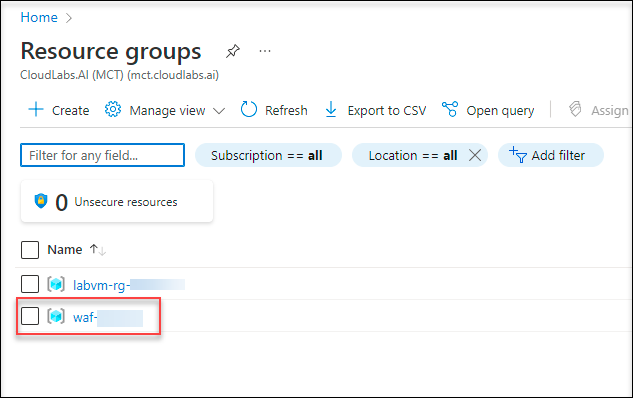
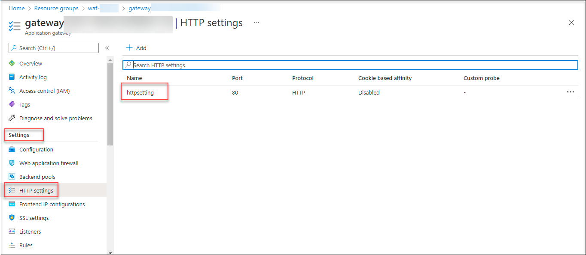
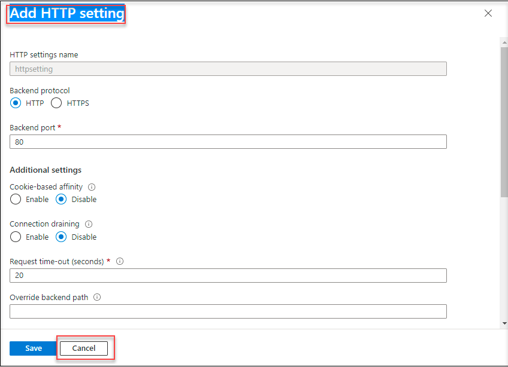
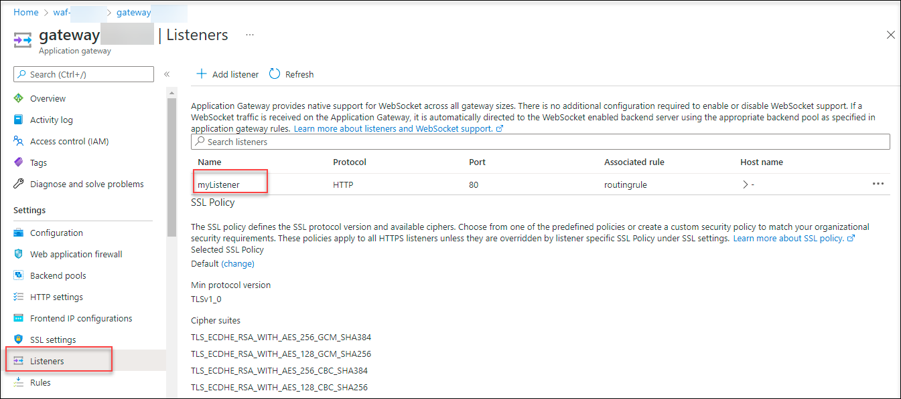
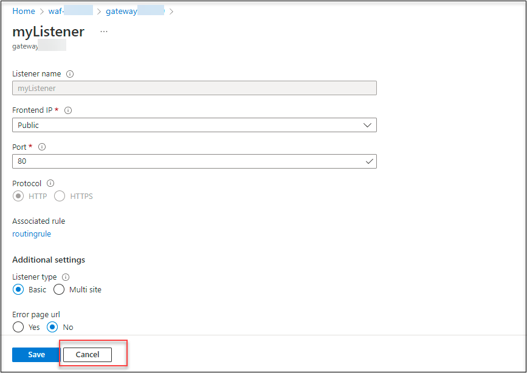
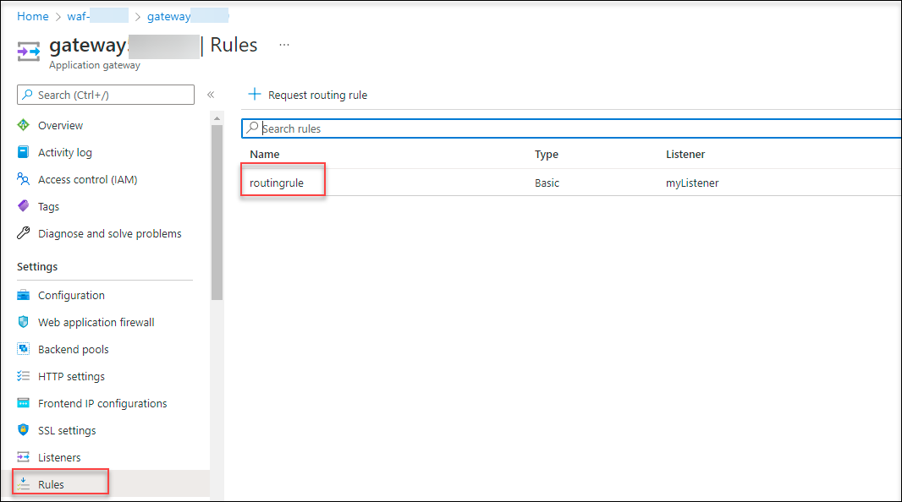
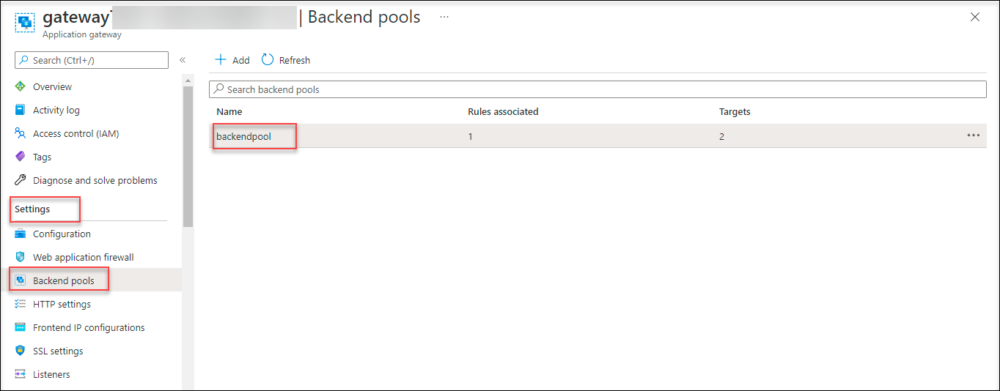
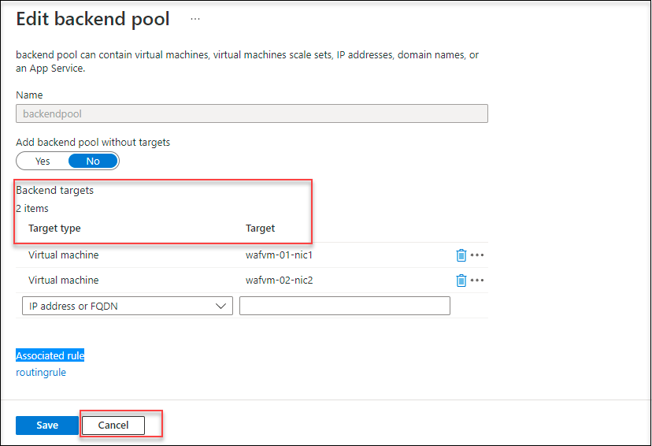

# Task 1 : View the Application Gateway

## Overview

Azure Application Gateway is a web traffic load balancer that enables you to manage traffic to your web applications. Application Gateway can make routing decisions based on additional attributes of an HTTP request, for example URI path or host headers. With Azure Application Gateway, you direct your application web traffic to specific resources by assigning listeners to ports, creating rules, and adding resources to a backend pool.

Backend pools can be composed of NICs, virtual machine scale sets, public IPs, internal IPs, fully qualified domain names (FQDN), and multi-tenant back-ends. The backend pool is used to route requests to the backend servers that will respond.

In this task, you will view the backend pool with your application gateway and then added backend targets to the backend pool.

1. Navigate to [Azure Portal](https://portal.azure.com) and login with the credentails provided.

1. On the home page, select **resource group**.

     

1. Under the resource group tab, select the resource group **waf-DID**.

     

1. On the resource group page of **waf-DID**, select the application gateway with the name **gateway-DID**.

     

1. On the application gatway overview page, under **settings**, select the **HTTP Settings** and select **httpsetting**.

     

1. On the **Add HTTP setting**, review the settings and click on **Cancel**.

     

1. On the application gateway overview, under **settings**, select the **Listeners** and select **MyListener**.

     

1. On the **MyListener** page review the settings and click on **Cancel**.

     

1. Under **Settings**, select **Rules**.

1. On the **application gateway**, select **routingrule**.

      

1. On the **routingrule** page, review the settings for the **Listener**.

      
      
1. On the routingrule page, verify the settings and click on **Backend Target**.

1. Review the details of the backend target and click on **Cancel**.

      

1. On the application gateway page, under **settings**, select the **Backend pools** and select the **backendpool**.

      

1. On that page, review the **Backend targets** aand click on **Cancel**.

      

# Proceed to Task 2 : Create and link a Web Application Firewall policy

