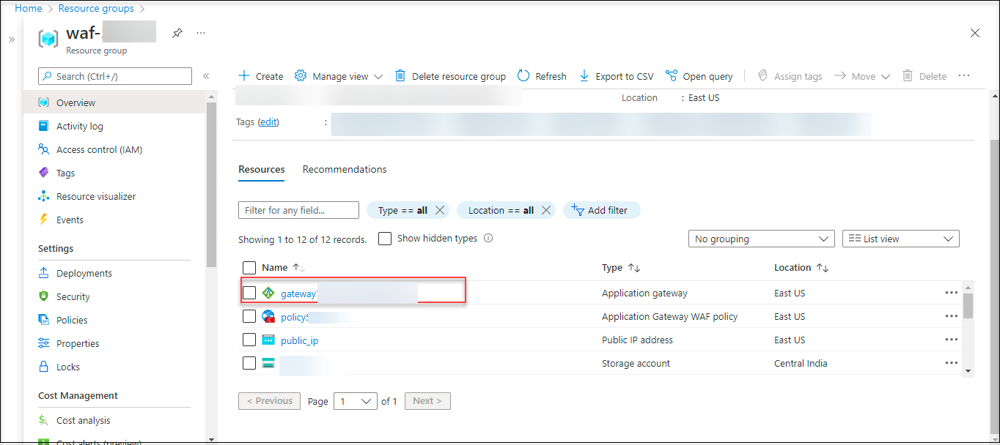
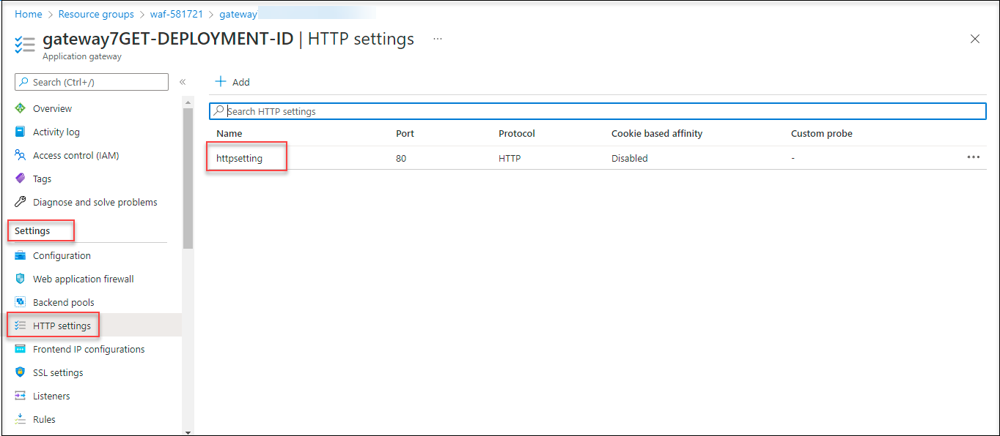
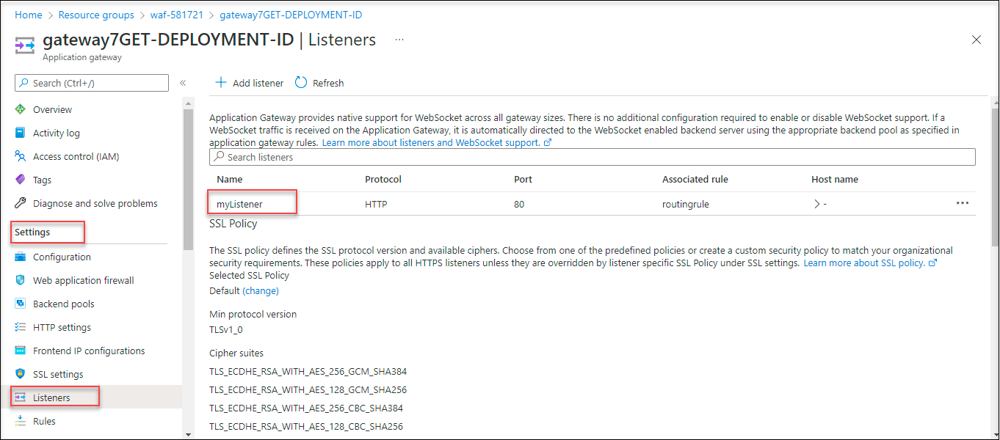
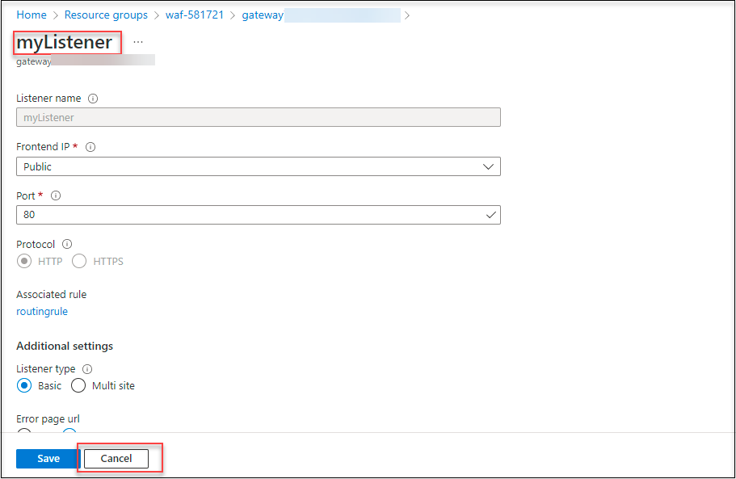
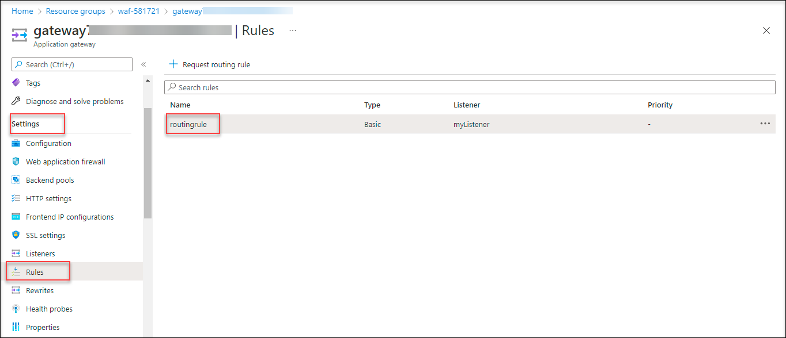
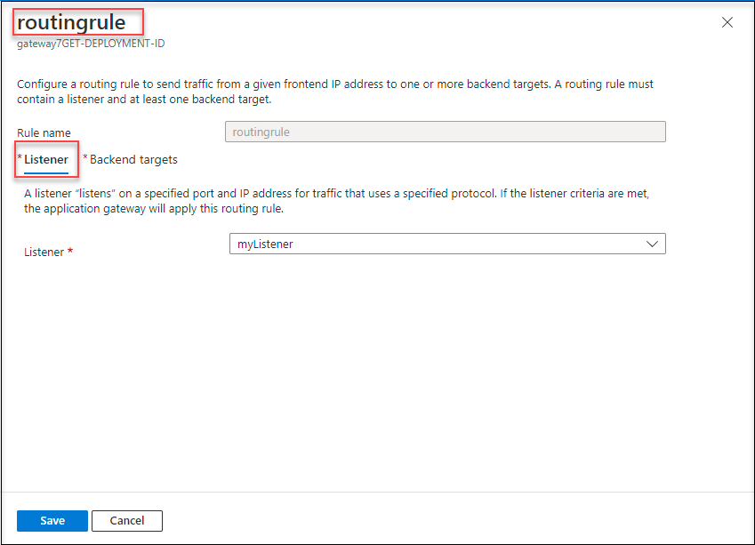
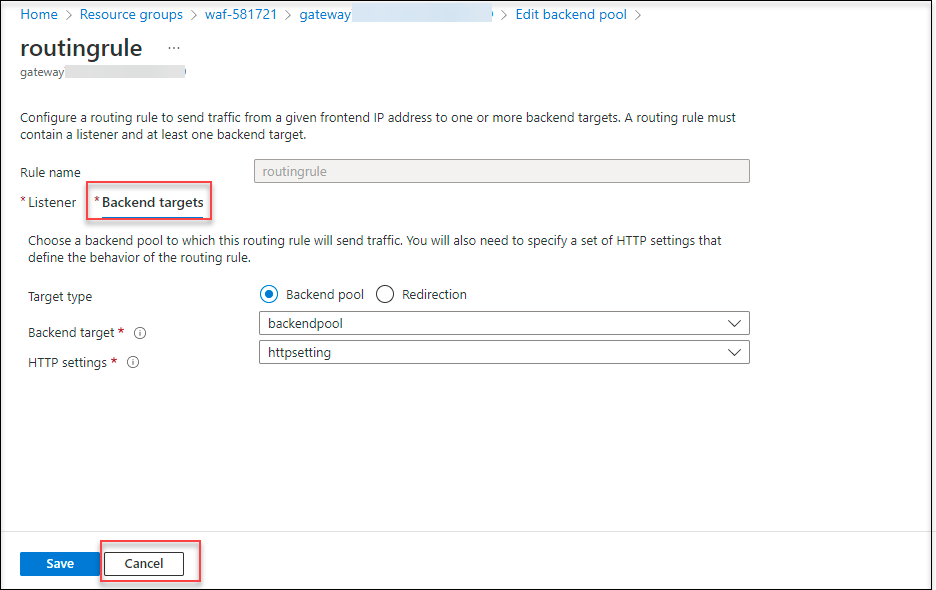

# Task 1 : View the Application Gateway

## Overview

Azure Application Gateway is a web traffic load balancer that enables you to manage traffic to your web applications. Application Gateway can make routing decisions based on additional attributes of an HTTP request, for example URI path or host headers. With Azure Application Gateway, you direct your application web traffic to specific resources by assigning listeners to ports, creating rules, and adding resources to a backend pool.

In this task, you will learn how to create application gateway through azure portal.

1. Navigate to [Azure Portal](https://portal.azure.com) and login with the credentails provided.

1. On the home page, select **resource group**.

     

1. Under the resource group tab, select **waf-DID**.

     

1. On the resource group page of **waf-DID**, select the **gateway-DID**.

     

1. On the overview page, verify the details such as **Frontend public IP addres**, **Virtual Network/Subnets**.

     

1. On the left side of the portal, under **settings**, select the **HTTP Settings**.

1. On the gatewayDID|HTTP settings page, select **httpsetting**.

     

1. On the **Add HTTP setting**, review the settings and click on **Cancel**.

     

1. On the left side of the portal, under **settings**, select the **Listeners**.

1. On the gatewayDID|Listeners page, select **MyListener**.

     

1. On the **MyListener** page review the settings and click on **Cancel**.

     

1. Under **Settings**, select **Rules**.

1. On the **gatewayDID| Rules**, select **routingrule**.

      

1. On the **routingrule** page, review the settings and click on **Cancel**.

      
      
1. On the routingrule page, verify the settings and click on **Backend Target**.

1. Review the details of the backend target and click on **Cancel**.

      

1. On the left side of the portal, under **settings**, select the **Backend pools**.

1. On the backend pools page, select the **backendpool**.

      

1. On that page, review the **Backend targets** aand click on **Cancel**.

      

# Proceed to Task 2 : Install IIS for testing

