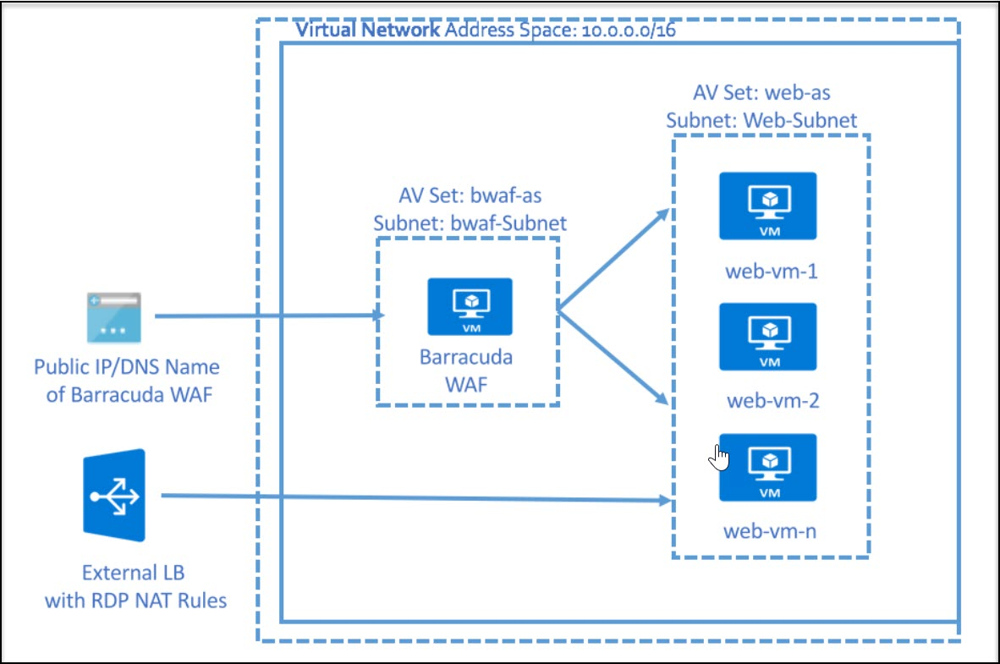

# Getting started with Barracuda CloudGen WAF on Azure

## Tasks Included

In this hands-on lab you will perform the following tasks:

- **Task 1: Accessing the Barracuda Dashboard**
- **Task 2: Getting started with the Azure Portal**
- **Task 3: Configuring Barracuda Firewall**

## Barracuda Web Application Firewall

The Barracuda Web Application Firewall inspects inbound web traffic and blocks SQL injections, Cross-Site Scripting, malware uploads & application DDoS, and other attacks targeted at your web applications. It also inspects the responses from the back-end web servers for Data Loss Prevention (DLP). The integrated access control engine enables administrators to create granular access control policies for Authentication, Authorization & Accounting (AAA), which gives organizations strong authentication and user control. The onboard L4/L7 Load Balancing capabilities enable organizations to quickly add back-end servers to scale deployments. Application acceleration capabilities, including SSL Offloading, caching, compression, and connection pooling, ensure faster web application content application delivery.

## Architecture Diagram

   

## Overview 

In this task, you will access the Barracuda Cloudgen WAF dashboard by using the Public Ip address.

## Task 1: Accessing the Barracuda Dashboard 

1. In the LabVM desktop, select the **Microsoft Edge** icon.
  
1. Open a new tab in the browser and copy-paste the **Barracuda WAF Public IP** : <inject key="bwafIP"></inject> . Append a **colon** and the port number **8000** to the IP address as shown below. This port is used by the **BWAF** management web interface. Press **Enter** key.

    

1. A page as shown below will appear.

    

    This is the **Barracuda End User License Agreement.**

1. Scroll down to the bottom of the page. enter the following information and then click **Accept**.
 
   * **Name**: ODLUser
   * **Email Address**: Provide your personal Email address

   
   
1. After clicking on Accept, you will be prompted to login which will be completed in Page No 4
 
 ### Proceed to Task 2 - Getting started with the Azure Portal

