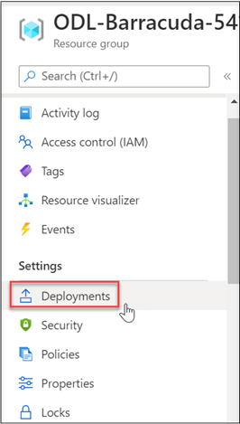
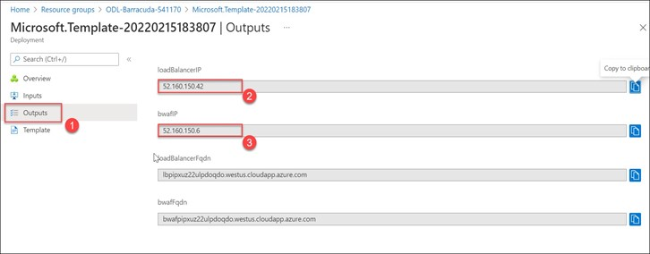
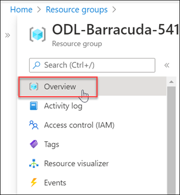
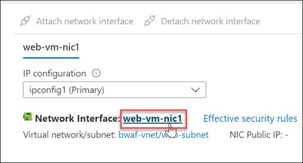
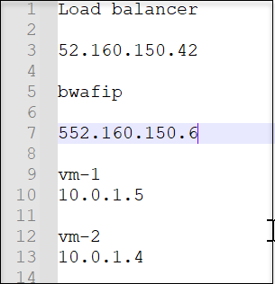

# Getting started with Barracuda on Azure

## Overview 

This document will help you in configuring the Barracuda Web Application firewall hosted on Azure for publishing IIS Based websites.

## Task 1: Getting started with the environment

1.	**Launch** the Edge browser and **Navigate** to https://portal.azure.com.

1.	**Login** with your Microsoft Azure credentials.

1.	To toggle **show/hide** the Portal menu options with icon, **Click** on the **Show Menu** button.

      

1.	**Click** on the **Resource groups** button in the **Menu navigation bar**, to view the Resource groups blade.
 
      

1.	Select the Resource Group in which you deployed the quick start template.

      
 
1.	From **Settings**, select **Deployments**.

      

1.	Select the latest **deployment** available on this resource group.

      
 
1.	In the Deployment blade, Click on the **Outputs** section (1). You will see the **Public IP address** of **Barracuda WAF VM** (3) and **Load Balancer(2)**.

      

1.	Click the **Copy icon** to copy the **Public IP address**. Create a new text document in **Notepad** or **Notepad++** and paste both IP addresses to it as **Load Balancer Public Ip** and **Barracuda WAF Public IP**.
 
      

1.	Navigate back to the Resource groups and select your **Resource Group**.

      
 
1.	On the Resource group blade, click on **Overview**.

      

1.	Select the **web-vm1** virtual machine from the resource list.

      
 
1.	On the virtual machine blade, scroll down to the **Settings** section, click on **Networking**

      

1.	Select the **web-vm-nic1** Network Interfaces.

      
 
1.	In the Network Interfaces blade, you can see the **Private IP address** of **web-vm1**. Save this IP address to the notepad as **web-vm1 private IP**.

      

1.	Repeat steps **11 to 13** to obtain the **Private IP address** of **web-vm2** as well by selecting
**web-vm2** in step **11**. Now, you will have all the following IP addresses in your notepad.

      
   
1. Click on **Next** from the bottom right corner and follow the instructions to perform the lab.
