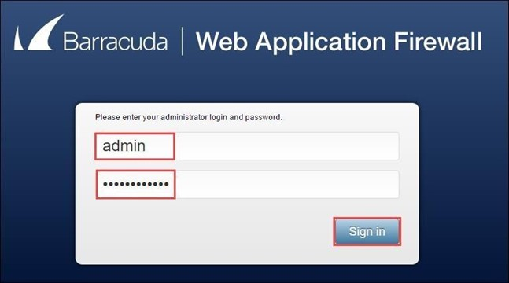
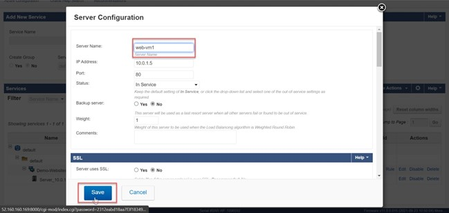

## Task 3: Configuiring Barracuda Firewall   
 
1. In the **Sign-In page** of Barracuda, use the following credentials:

   - Username : <inject key="Barracuda Username"></inject> 
   - Password : <inject key="Barracuda Password"></inject> 

        **Note**: Refer the Environment Details tab for **Barracuda Username** and **Barracuda Password** under **Resource Group : barracuda-XXXX**.

   Click on **Sign in**.

    

1. Now, you will be able to see the management portal of **Barracuda**.

    

1. Click on **Services** in the Basic menu.

    

1. In the **ADD NEW SERVICE** section, configure as below:

   - Service Name: **Demo-Websites** (Or your custom service name)
   - Type : **HTTP**
   - Virtual IP Address : Leave the default. (This is the private IP address of **bwaf-vm1** VM.)
   - Port : Leave the default
   - Real Servers : Copy and paste web-vm1 Private IP from the notepad.
   - Create Group : Leave the default
   - Service Groups : Leave the default
    
   After configuration, click **Add**.
 
    

1. If the Sign-In page of **Barracuda** Prompted, use the following credentials:

   - Username : <inject key="Barracuda Username"></inject> 
   - Password : <inject key="Barracuda Password"></inject>

        **Note**: Refer the Environment Details tab for **Barracuda Username** and **Barracuda Password** under **Resource Group : barracuda-XXXX**.

    Click on **Sign in**.
 
    

1. Now, you can see that tha **Services** section is updated with the configuration you provided. Click on **Edit** against **Server_10.0.1.5_80**.

    
    
1. In the **Server Configuration** page, provide the **Server Name** as **web-vm1**. Click on **Save**.

    
 
1. The page will be refreshed, and the web server **Server_10.0.1.5_80** will be renamed as **web-vm1**. Now, click on Server against the **Demo-Websites** service.
  
    

1. In the window that appears, configure as follows :
   
   - **Server Name** : ```web-vm2``` 
   - **IP Address** : ```10.0.1.4``` 
  
    Keep the default for others and click **Add**
  
    

1. Again, the page will be refreshed and **web-vm2** will be added to the service **Demo-Websites**.

    

1. Now, to configure load balancing of **web-vm1** and **web-vm2**, click on **Edit** against **Demo-Websites**.

    

1. In the window that comes up, scroll down to see the **Load Balance** section. You can choose the **Load Balancing Algorithm**, **Persistence Method** and **Failover Method**.

    For more details, go to the link https://campus.barracuda.com/product/webapplicationfirewall/article/WAF/ConfigLoadBalanci ng/

    

1. Click on **Save** after any configuration change.

    

1. Open a new tab in the browser. Copy **Barracuda WAF Public IP** from the notepad and paste it in the URL box. Press **Enter** key. By default, this use port **80**.

    

1. As you can see, the request will be forwarded to the backend web servers as configured.

    

1. Now, navigate back to the **Management portal of Barracuda Web Application Firewall**. Click on **Access Logs**.

    

1. You should see that the request you made to the firewall is logged. Click on **Details** to see more about the request.

    

1.	Now you can update the website at the backend servers as per your requirements and configure similar services via Barracuda. Follow Barracuda documentation to learn more about configuring Barracuda web application firewall (https://campus.barracuda.com/product/webapplicationfirewall)

1. Click on Next from the bottom right corner and follow the instructions to perform the lab.
