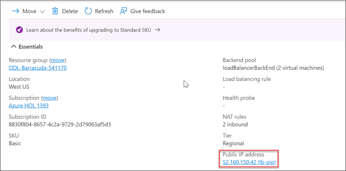
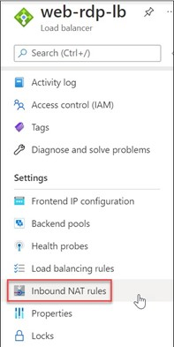
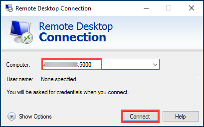
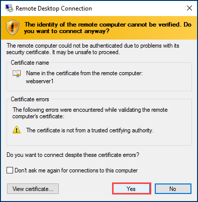

# 04 - Accessing Web VMs via RDP

## Overview

In this task, You will access Web VMs via RDP

## Task 1: Accessing Web VMs via RDP

### Instructions

1. Launch a **browser** and Navigate to https://portal.azure.com.

1.	Login with your MicrosoftAzure credentials.

1.	To toggle **show/hide** the Portal menu options with icon, **Click** on the **Show Menu** button.

      
 
1.	Click on the **Resource groups** button in the **Menu navigation** bar, to view the Resource groups blade.

      

1. Select the **ODL-Barracuda-XXXX** resource group in the resource groups blade.

      
 
1.	From the list of resources, select **web RDP-lb**.

      

1.	In the **Overview** blade, you can see the **Public IP address** of the load balancer.

      

1.	Click on **Inbound NAT rules** in **Settings**.

      

1.	Make a note of the NAT port number for the VM you’d want to access via RDP.

      

1.	In your PC, go to **Start Menu>Run**. Type **mstsc** and click **OK**. The **Remote Desktop** Connection window will appear. Copy **webrdp-lb** public IP : <inject key="loadBalancerIP"></inject> and paste it in the text box against **Computer** followed by a **colon** and the **port number** noted from previous step.

      Now, your **Remote Desktop Connection** window should look like this:

      

1. Click **Connect**.

1.	In the following window, provide the **Username** as `.\barracudauser` and **Password** as <inject key="Barracuda Password"></inject> and Click **OK**.

      

1.	Click **Yes** on the security page.
 
      

1.	This should open the remote desktop to the virtual machine.

      

