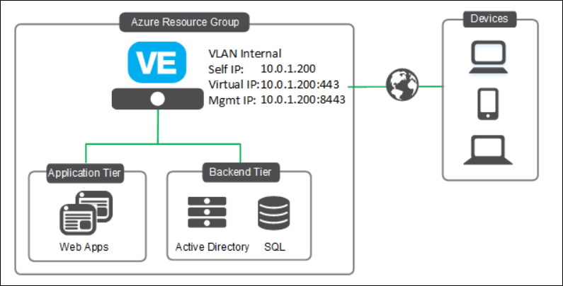
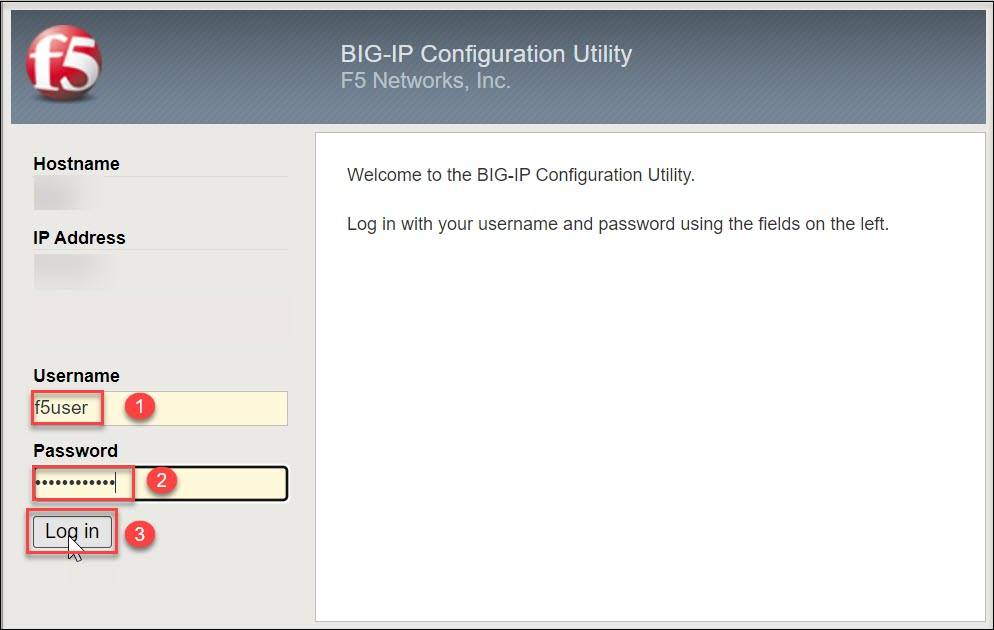

# Getting started with F5 Advanced WAF on Azure

## Tasks Included

In this hands-on lab you will perform the following tasks:

- **Task 1: Accessing the F5 Dashboard**
- **Task 2: Getting started with the Azure Portal**
- **Task 3: Configuring F5 Advanced Web Application firewall**

## F5 Web Application Firewall
F5 Advanced WAF is an application-layer security platform protecting against application attacks. The industry-leading F5 Advanced WAF provides robust web application firewall protection by securing applications against threats including layer 7 DDoS attacks, malicious bot traffic, all OWASP top 10 threats and API protocol vulnerabilities.The F5 Advanced WAF leverages behavioral analytics, automated learning capabilities, and risk-based policies to secure your website, mobile apps, and APIs—whether in a native or hybrid Azure environment

## Architecture Diagram
   
    
## Overview 

In this task, you will access the F5 Advanced WAF dashboard by using the Public Ip address.

## Task 1: Accessing the F5 Dashboard

1. In the LabVM desktop, select the **Microsoft Edge** icon.
  
1. Open a new tab in the browser and log in to the BIG-IP Configuration utility by using **https** with the **F5 Advanced WAF Public IP**: <inject key="F5IP"></inject>. Append a **colon** and the port number **8443** to the IP address as shown below. This port 8443 allows management traffic to reach BIG-IP VE. Press **Enter** key.

    
    
1. A page shown below will apear. Click on **Advanced** on the web page.

    
     
1. Click on the link **Continue to XXXXXX(unsafe)** on the page as shown below. 

    
    
1. You will be redirected to the **F5 Advanced WAF** Login page.

    
    
1. Enter the following F5 Portal username and password and then click on **Log in**.  

   * **F5 Portal Username**:  <inject key="F5 Portal Username"></inject> 
   * **F5 Portal Password**:  <inject key="F5 Portal Password"></inject>

        **Note**: Refer to the **Environment Details** tab for any other lab credentials/details.
        
    
 
1. Now, you will be able to see the F5 dashboard. 
 
    
 
   ### Proceed to Task 2 - Getting started with the Azure Portal

    
  

