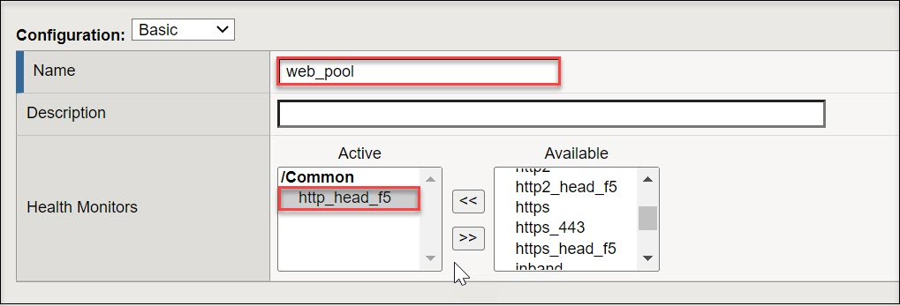

# 03: Configuring F5 Advanced Web Application firewall

## Overview

In this task, you will configure the F5 Advanced Web Application firewall hosted on Azure for publishing IIS Based websites.

## Task 1: Configuring F5 Advanced Web Application firewall  

### Exercise 1: Creating a pool and adding members to it
Traffic goes through BIG-IP VE to a pool. Your application servers should be members of this pool.

1. Switch back to F5 WAF Tab, On the **Main** tab, click **Local Traffic -> Pools -> Pool List**.

    
    
1. Click **Create** to create the Pool.    
        
    

1. In the **Name** field, type **web_pool**. Names must begin with a letter, be fewer than 63 characters, and can contain only letters, numbers, and the underscore (_) character. For **Health Monitors**, move **http_head_f5** from the **Available** to the **Active list**.

      

1. In the **New Members** section, in the **Address field**, type the Private IP address which you copied in the previous task **(1)**. In the **Service Port** field, type **80** as service port **(2)** and Click **Add** **(3)**.

      **Note**: The list now contains the member **(4)**
        
    Click **Finished** **(5)**.
   
    
    
### Exercise 2: Creating a virtual server
A virtual server listens for packets destined for the external IP address. You must create a virtual server that points to the pool you created.

1. 
