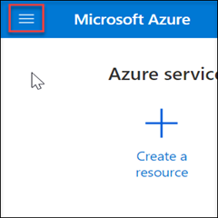

# Getting Started with Azure Portal

## Overview

In this task, you will view the pre-deployed resources in the **fortiGate**-XXXX RG and virtaul machines.

## Task

1. To toggle **show/hide** the Portal menu options with icon, **Click** on the **Show Menu** button.
 
    
       
2. **Click** on the **Resource groups** button in the **Menu navigation bar** to view the Resource groups blade.

    
    
3. Select the **fortiGate-XXXX** resource group in the resource groups blade.

    
    
4. On the Resource group blade, click on **Overview**.

    

5. Select the **fortigatevm-XXXX** virtual machine from the resource list.

    
    
6. On the virtual machine blade, scroll down to the **Settings** section, click on **Networking**.

    
    
7. Select the **fortigatevm-xxxx-Nic1** Network Interfaces.

    
    
8. In the Network Interfaces blade, you can see the Private IP address of fortigatevm-XXXX. Copy the value of the Private IP address. You will need it in the next task.

    
    
9. Repeat steps 5 to 8 to obtain the Private IP address of apache-vm as well by selecting **apache-vm** in step 5.

10. Navigate back to the Resource groups and select your Resource Group

    
    
11. On the Resource group blade, click on **Overview**.

    
    
12. Explore through pre-deployed resources from the resource list.

13. Click on Next to continue to the next section of the lab.
    
    

