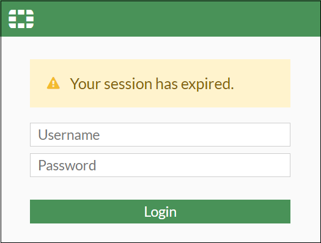
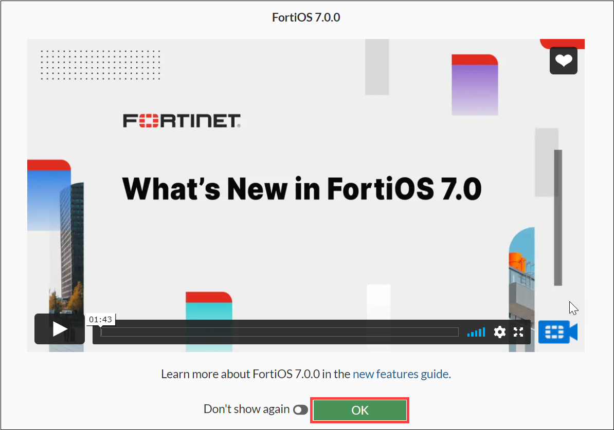
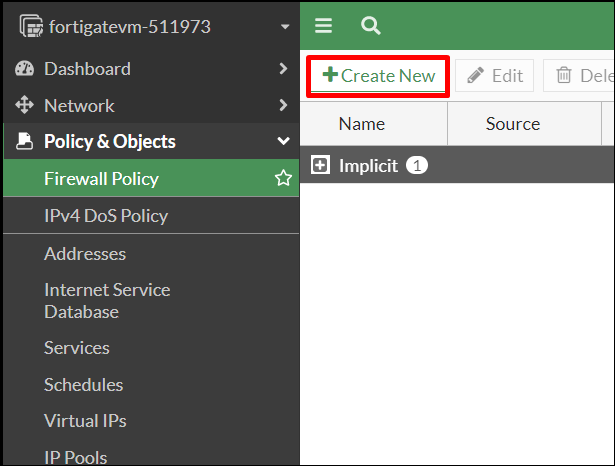
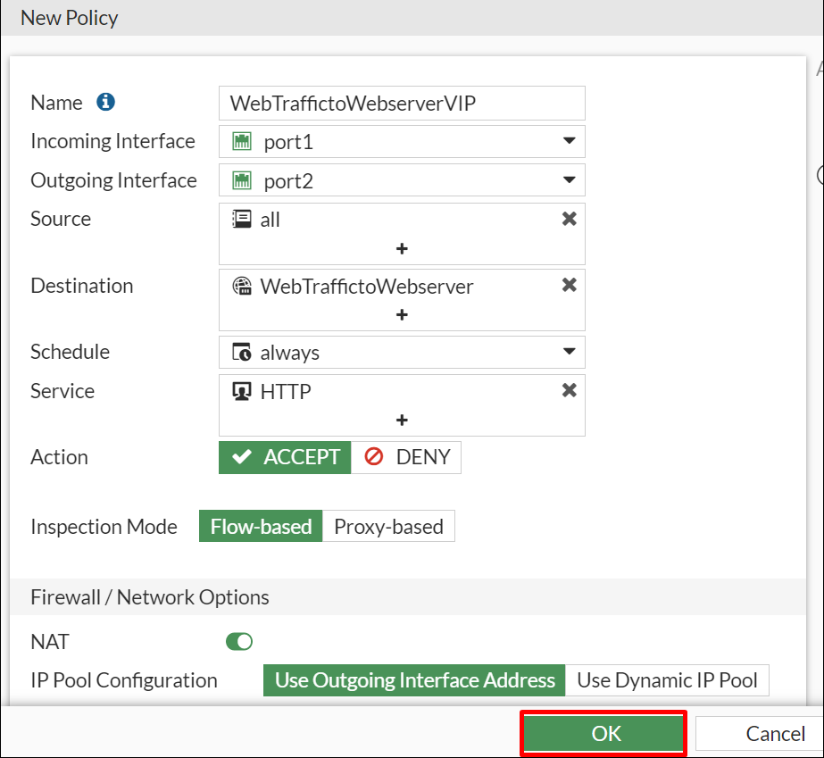

# 04 - Configuring FortiGate for Web Traffic

## Overview

In this task, you will try to access the webserver via FortiGate's FQDN, configure Firewall policies on the FortiGate-VM firewall via the FortiGate dashboard, and then add Virtual IPs to provide secured access from your device to the webserver hosted in Azure and protected by the FortiGate.

## Task 1: Access the Webserver

1. Open a new tab in the browser and attempt to access the webserver via http to the same FQDN as the FortiGate.

    * <inject key="ApacheFQDN"></inject>

    
    
2. You won't be able to access the webserver because the FortiGate is not yet configured to respond to port 80.

## Task 2: Configuring an Apache webserver through FortiGate dashboard

1. Navigate back to the FortiGate dashboard and log in with the user credentials given below if the session has expired and click on **Login**.

    * **Username**:  <inject key="AdminUsername"></inject>
    * **Password**:  <inject key="AdminPassword"></inject>

    
    
2. Click on **OK** to bypass “What’s New in FortiOS 7.0".

    

3. On the FortiGate dashboard click on the **Policy & Objects** drop-down and select **Virtual IPs**.
    
    
    
2. Click on the  **Create New** button and select **Virtual IP** from the drop-down.

    
    
3. Create a new virtual IP to forward traffic for interface **port1** by entering the following values and then click on **OK**.
    
    * Name:  **WebTraffictoWebserver**
    * Interface:  **port1**
    * External IP Address/Range:  **10.0.1.4**
    * Map to IPv4 Address/Range:  **10.0.3.4**
    * Enable **Port Forwarding**
    * Protocol:  **TCP**
    * External service port:  **80**
    * Map to IPv4 port:  **80**

    
    
4. Under **Policy & Objects** on the dashboard, click on **Firewall Policy** and then **Create New**.

    

5. Create a new Firewall policy to access the webserver by entering the following values and then click **OK**. 
    
    >**NOTE**: This new policy will allow all traffic in port1 and out port2.

    * Name:  **WebTraffictoWebserverVIP**
    * Incoming Interface:  **port1**
    * Outgoing Interface:  **port2**
    * Source:  **all**
    * Destination: **WebTrafficToWebserver**
    * Service: **HTTP**
    
    
    
## Summary

In this task, you tried to access the webserver using FortiGate's FQDN, configured the Firewall policies on the FortiGate-VM firewall through the FortiGate dashboard, and then added Virtual IPs to provide secured access from your device to the webserver hosted in Azure.

Click on **Next** to continue to the next section of the lab.
