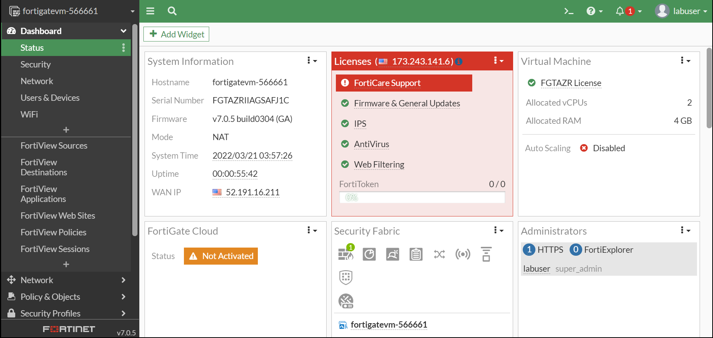
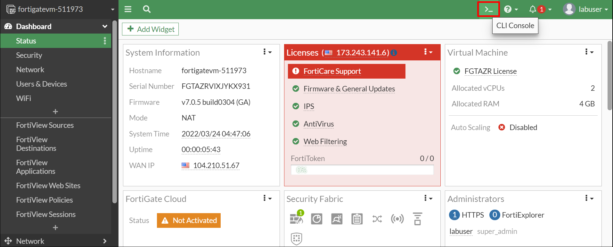
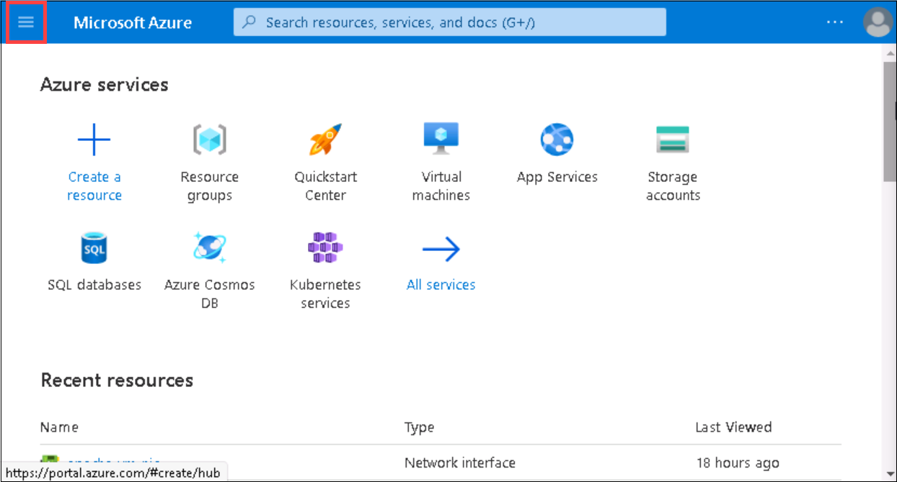
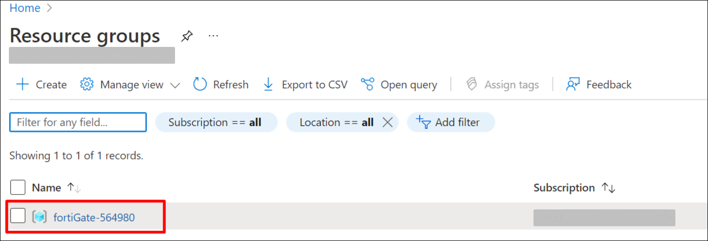
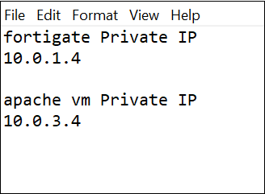
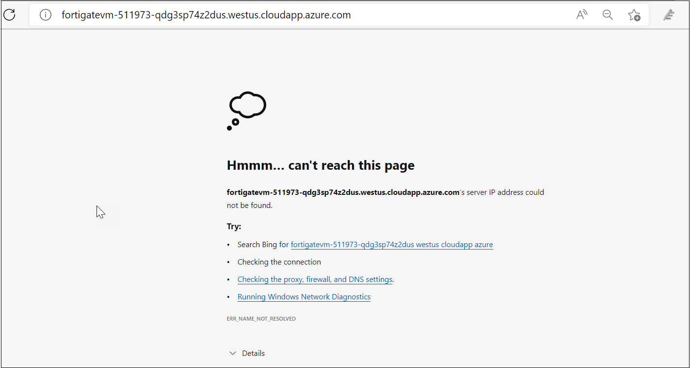

# Getting started with FortiGate Next-Generation Firewall - A Single VM

## Tasks Included

* **01 - Accessing the FortiGate Dashboard**      
* **02 - Login to Azure Portal**
* **03 - Getting Started with Azure Portal**
* **04 - Configure FortiGate for Web Traffic**
* **05 - Access the Webserver**

## Overview

The FortiGate firewall enables enterprises to control their resources and applications in Microsoft Azure. FortiGate-VM offers a consistent security posture and protects connectivity across public and private clouds, while high-speed VPN connections protect data. This single FortiGate-VM setup is a basic setup to start exploring the capabilities of the next generation firewall. The central system will receive, using user-defined routing (UDR), all or specific traffic that needs inspection going to/coming from on-prem networks or the public internet.

## Architecture Diagram

  

# 01 - Accessing the FortiGate Dashboard 

## Overview 

In this task, you will access the FortiGate dashboard through the internet by using the FortiGate FQDN and connect to the Apache webserver via the CLI Console.

## Task 1: Accessing the FortiGate Dashboard 

1. In the LabVM desktop, select the **Microsoft Edge** icon and in a new tab copy-paste the FortiGateFQDN <inject key="FortiGateFQDN"></inject>
     
2. A page shown below will appear. Click on **Advanced** on the web page.

    
     
3. Click on the link **Continue to fortigatevm-XXXXX** on the page as shown below. 

    
     
4. You will be redirected to the page shown below with empty **Username** and **Password** text boxes. Enter the following username/password and then click on **Login**.
     
    * **Username**:  <inject key="AdminUsername"></inject>
    * **Password**:  <inject key="AdminPassword"></inject>

    
     
5. A **FortiGate Setup** page appears as shown below. Click on **Begin**

    
     
6. A **Dashboard Setup** page appears as shown below. Keep the **Optimal** option as default and click on **OK**

    
    
7. Click on **OK** to bypass “What’s New in FortiOS 7.0".

     

8. The **FortiGate** dashboard will appear as shown below.

    
     
## Task 2: Connect to the Apache webserver
     
1. To connect to the Apache webserver, click on the **CLI Console** on the FortiGate dashboard as shown below.
     
    
     
2. Connect to the webserver host via the CLI Console by copying the following command & password in the console. Click ENTER on your keyboard for executing the commands.
     
    * **exec ssh fortigateuser@10.0.3.4**<copy>
    * **fortigateuser@10.0.3.4's password**:  <inject key="AdminPassword"></inject>
     
    
     
3. Minimize the CLI Console.
 
    
    

  
# 02 - Log-in to the Azure portal

## Overview

In this task, you will log in to Microsoft Azure using your credentials and access the Azure Portal dashboard.

1. In the LabVM desktop, select the **Azure Portal** icon to access the Azure Portal.

2. On the **Sign in to Microsoft Azure** blade, you will see a login screen, in which enter the following email/username and then click on **Next**.

    * **Azure Username/Email**:  <inject key="AzureAdUserEmail"></inject> 
    * **Azure Password**:  <inject key="AzureAdUserPassword"></inject>
    
        **Note**: Refer to the **Environment Details** tab for any other lab credentials/details.
        
    
    
    
    
3. If you see the pop-up like below, click **Skip for now(14 days until this is required)**.

    
    
4. If you see the pop-up **Stay signed in?** Click **No**.

    
    
5. If you see the pop-up **You have free Azure Advisor recommendations!** close the window to continue the lab.

6. If a **Welcome to Microsoft Azure** popup window appears, click **Maybe Later** to skip the tour.

    
    
7. Now will now see the Azure Portal Dashboard.

  

# Getting Started with Azure Portal

## Overview

In this task, you will navigate to your resource group, note down the Private IPs of the virtual machines in a notepad, and view the pre-deployed resources. 

1. On the Azure Portal, click on **Show portal menu**.
 
    
       
2. **Click** on the **Resource groups** button in the **Menu navigation bar** to view the Resource groups blade.

    
    
3. Select the **fortiGate-<inject key="DeploymentID"></inject>** resource group in the resource groups blade.

    
    
4. On the Resource group blade, click on **Overview**.

    

5. Select the **fortigatevm-<inject key="DeploymentID"></inject>** virtual machine from the resource list.

    
    
6. On the virtual machine blade, scroll down to the **Settings** section, and click on **Networking**.

    
    
7. Select the **fortigatevm-xxxx-Nic1** Network Interfaces.

    
    
8. In the Network Interfaces blade, you can see the Private IP address of **fortigatevm-<inject key="DeploymentID"></inject>**. Copy the value of the Private IP address. 

    
    
9. Repeat steps 5 to 8 to obtain the Private IP address of apache-vm as well by selecting **apache-vm** in step 5.

10. Copy the private IPs of both the virtual machines in a notepad. You will need them in the next task.

    
  
   >You can also find the Private IP address in the Environment details page
  
11. Navigate back to the Resource groups and select your Resource Group

    
    
12. On the Resource group blade, click on **Overview**.

    
    
13. Explore through pre-deployed resources from the resource list.

  
    
# 04 - Configuring FortiGate for Web Traffic

## Overview

In this task, you will try to access the webserver via FortiGate's FQDN, configure Firewall policies on the FortiGate-VM firewall via the FortiGate dashboard, and then add Virtual IPs to provide secured access from your device to the webserver hosted in Azure and protected by the FortiGate.

## Task 1: Access the Webserver

1. Open a new tab in the browser and attempt to access the webserver via http to the same FQDN as the FortiGate.

    * <inject key="ApacheFQDN"></inject>

    
    
2. You won't be able to access the webserver because the FortiGate is not yet configured to respond to port 80.

## Task 2: Configuring an Apache webserver through FortiGate dashboard

1. Navigate back to the FortiGate dashboard and log in with the user credentials given below if the session has expired and click on **Login**.

    * **Username**:  <inject key="AdminUsername"></inject>
    * **Password**:  <inject key="AdminPassword"></inject>

    
    
2. Click on **OK** to bypass “What’s New in FortiOS 7.0".

    

3. On the FortiGate dashboard click on the **Policy & Objects** drop-down and select **Virtual IPs**.
    
    
    
2. Click on the  **Create New** button and select **Virtual IP** from the drop-down.

    
    
3. Create a new virtual IP to forward traffic for interface **port1** by entering the following values and then click on **OK**.
    
    * Name:  **WebTraffictoWebserver**
    * Interface:  **port1**
    * External IP Address/Range:  **10.0.1.4**
    * Map to IPv4 Address/Range:  **10.0.3.4**
    * Enable **Port Forwarding**
    * Protocol:  **TCP**
    * External service port:  **80**
    * Map to IPv4 port:  **80**

    
    
4. Under **Policy & Objects** on the dashboard, click on **Firewall Policy** and then **Create New**.

    

5. Create a new Firewall policy to access the webserver by entering the following values and then click **OK**. 
    
    >**NOTE**: This new policy will allow all traffic in port1 and out port2.

    * Name:  **WebTraffictoWebserverVIP**
    * Incoming Interface:  **port1**
    * Outgoing Interface:  **port2**
    * Source:  **all**
    * Destination: **WebTrafficToWebserver**
    * Service: **HTTP**
    
    

# 05 - Access the Webserver

## Overview 

In this task, you will access the Apache webserver hosted in Azure via the internet using the FQDN which was configured in the previous exercise by providing the Virtual IPs of the webserver.  

## Task: Connect to the Webserver

1. Open a new tab in the browser and copy-paste the following FQDN to access the Apache webserver.

    * <inject key="ApacheFQDN"></inject>
    
2. You should be able to see the Apache webserver in the browser.

       
    
## Summary

In this task, you accessed the Apache webserver through the internet using the Apache-VM's FQDN.
