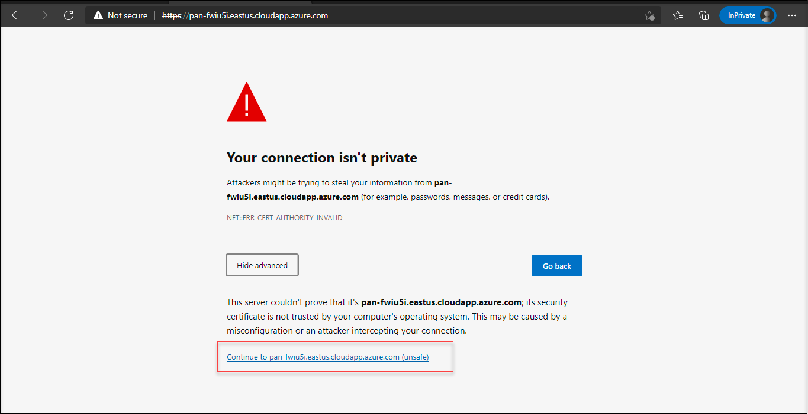

# Getting started with PaloAlto VMseries Firewall

## Tasks Included

In this hands-on lab you will perform the following tasks:

- **Task 1: Getting started with the PaloAlto VMseries Firewall Dashboard**
- **Task 2: Getting started with the Azure Portal**
- **Task 3: View the Application Command Center(ACC)**
- **Task 4: View the Object, Network, and Device Tabs and Security Policies**
- **Task 5: Explore the various options in Monitor tab**
- **Task 6: View the static content on web server**

# Task 1: Getting started with the PaloAlto VMseries Firewall Dashboard

## Overview

In this lab, you will be able to access the paloAlto Network Dashboard and explore various options in it.

1. Let us start by logging into the **PaloAlto VMseries Firewall** page. Copy the link for **PaloAltoVMseriesURL** : <inject key="PaloAltoVMseriesURL"></inject>, open it in a new tab in your browser.

1. If the page is showing like **Your connection isn't private**, on that page click on **Advanced**.
    
    
     
1. Select the link under the **Advanced**.

    
   
1. On the page that loads up, enter the **PaloaltoUsername** : <inject key="PaloaltoUsername"></inject>, **PaloaltoPassword** : <inject key="PaloaltoPassword"></inject>  and click on Log in.

1. Now, you will be redirected to the dashboard to the **PaloAlto VMseries Firewall**.

1. The dashboard provides a detailed visual summary of the device status.

     
     
> Note: Since it is a new firewall, it doesn't have any traffic yet and can view the dashboard at the end.

# Proceed to Task 2: View the Application Command Center(ACC)
