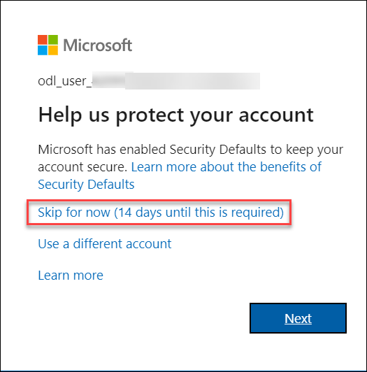

## Task 2: Getting started with the Azure Portal

## Overview

In this task, you can view the pre-deployed resources that are needed for this lab.

1. Open a New tab, and sign in to the **Azure Portal** (<http://portal.azure.com>).

1. On **Sign in to Microsoft Azure** blade, you will see a login screen, in that enter the following email/username and then click on **Next**.

   * **Azure Username/Email**:  <inject key="Username"></inject>
   * **Azure Password**:  <inject key="Password"></inject>

**Note**: Refer to the **Environment Details** tab for any other lab credentials/details.

1. If you see the pop-up like below, click **Skip for now(14 days until this is required)**.

    

1. If you see the pop-up **Stay Signed in?** click **Yes**.

    

1. If a **Welcome to Microsoft Azure** popup window appears, click **Maybe Later** to skip the tour.

    

1. To toggle **show/hide** the Portal menu options with icon, Click on the **Show Menu** button.

     

1. Click on the **Resource groups** button in the Menu navigation bar, to view the Resource groups blade.

1. On the Resource group blade, select the resource group with **paloalto-DID**.

1. You can able to view the deployed resources in that resource group **paloalto-DID**.

     

### Proceed to Task 3: View the Application Command Center(ACC)
