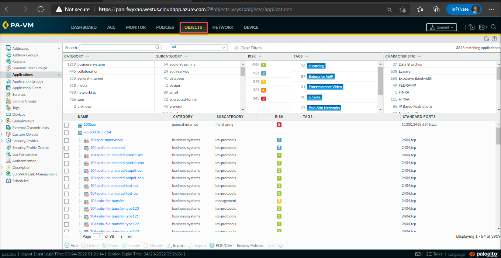
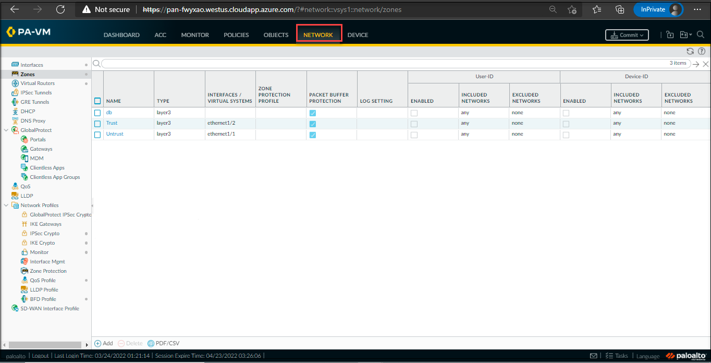
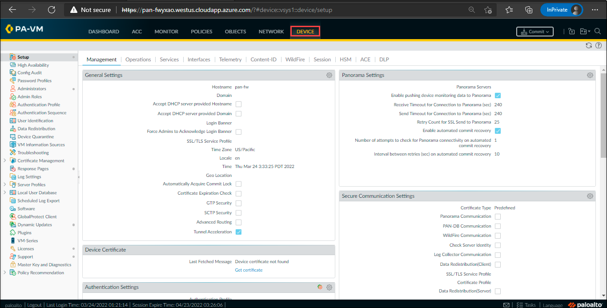
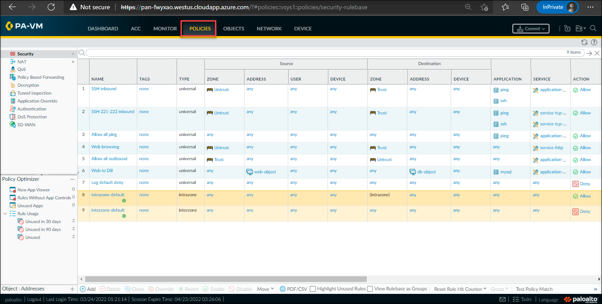

## Task 3 : To view the Object, Network and Device Tabs and Security Policies

### Overview

In this task, you will learn about the various management capabilities such as Object tab, Network tab and Device tab and security policies.
  
1. The Object tab allows to manage the building blocks for creating policies such as address objects, custom application and security profiles.

1. Select the **Object** tab and verify the various options.
    
    

1. The Network tab allows to create and manage interfaces, security zones, VLANs and other elements that are related to enable connectivity.

1. Click on the **Network** tab and explore the options.

    

1. The Device tab manages the configuration items such as DNS, service routes and also allows you to manage high availability, users, software and content updates.

1. Select the **Device** tab, to view the options.

     
      
1. Now select the **Policies** tab, where you will define all of your policies. The default view will be the security policies for all, which is the application based and the content.
    
     
    
1. You can also add the policies such as NAT, Decryption and Qos to the existing policies.

